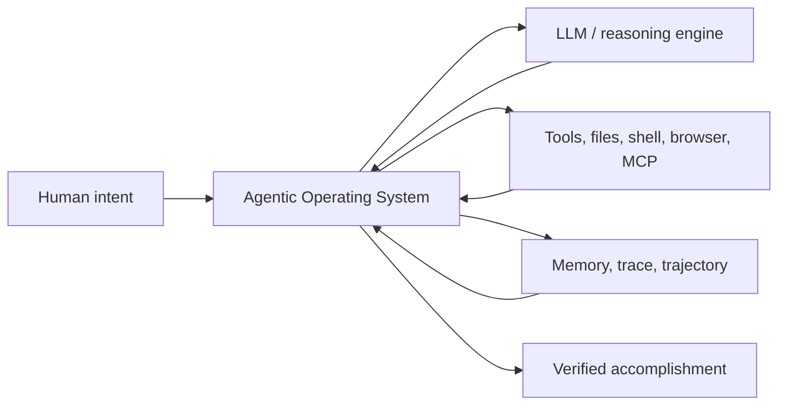
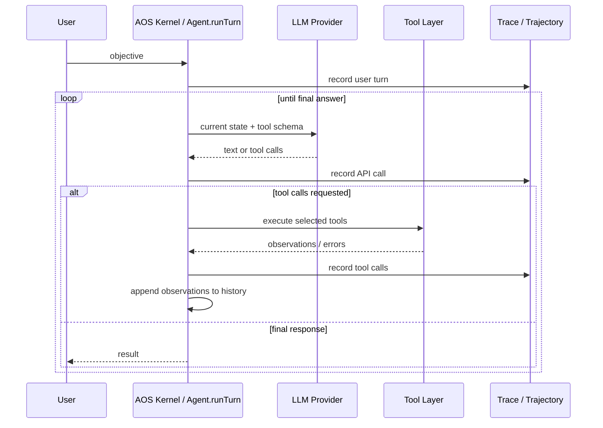
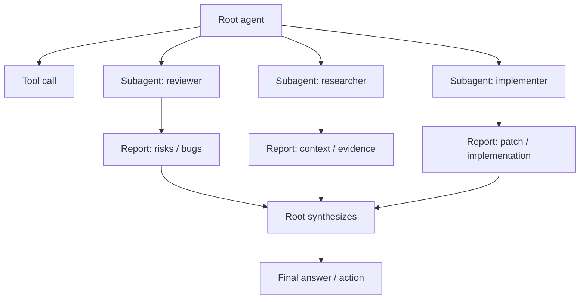
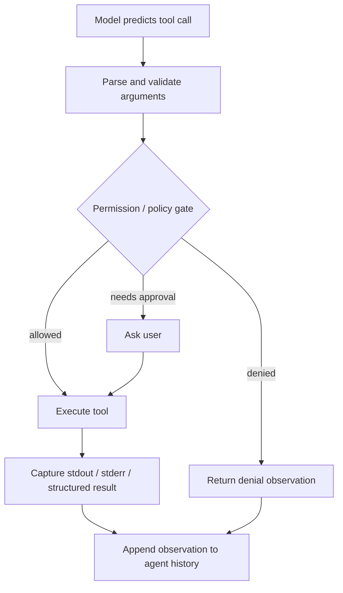
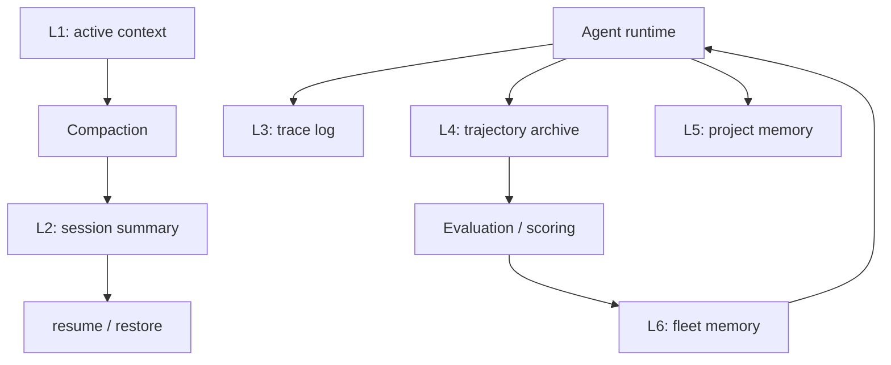
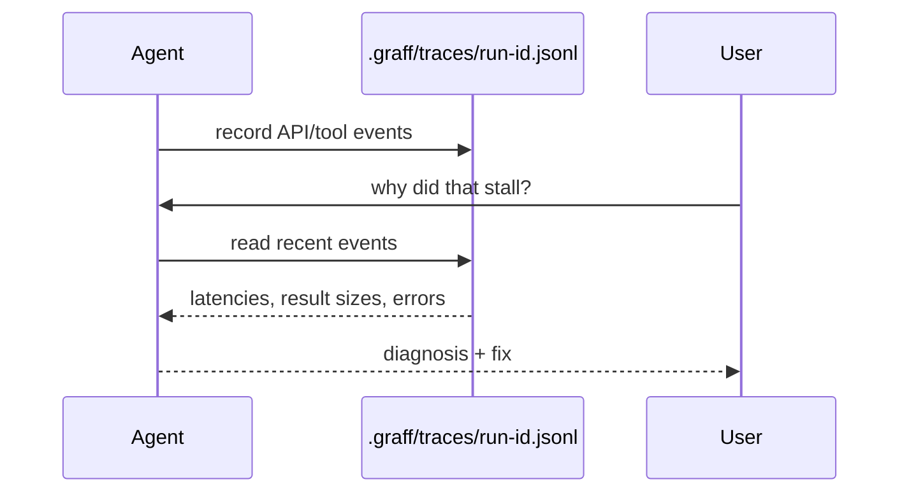
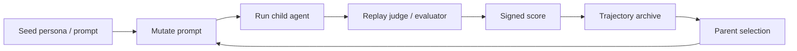
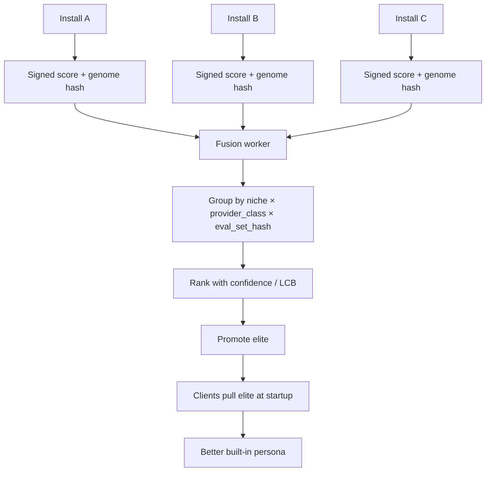

# The Agentic Operating System
## From Generative AI to Autonomous Orchestration

**Status:** Working architectural draft
**Scope:** A general framework for agent runtimes, grounded in Codegraff's current architecture
**Core claim:** The next useful abstraction is not “a chatbot with tools.” It is an operating system for agentic execution.

---

## Abstract

Large language models are powerful reasoning engines, but an LLM by itself is not an agent. A model call is stateless: it receives bytes, predicts bytes, and returns. Agency emerges only when that model is embedded inside a runtime that can preserve state, execute tools, observe results, recover from failure, manage memory, spawn workers, and improve its own behavior over time.

This document calls that runtime an **Agentic Operating System** (**AOS**).

An AOS is the layer that turns a passive model into an active computational process. It is responsible for converting human intent into coordinated action. In the same way that a traditional operating system turns CPU instructions into files, processes, devices, sockets, permissions, and persistence, an Agentic Operating System turns model intelligence into tasks, tool calls, subagents, traces, memory, evaluations, and self-improving behavioral policies.

Codegraff is an early concrete example of this pattern. Its core agent loop, subagent/workflow system, tool and MCP layer, context compaction, trace files, trajectory archive, and Darwin-Gödel-style prompt evolution together form the skeleton of an AOS.

---

## 1. Why the chatbot abstraction is too small

The default interface for LLMs is still the chatbot: a user writes a message, the model writes a response. This is useful, but it hides the more important architectural question: **what is responsible for turning a response into progress?**

A chatbot can suggest a command. An agentic runtime can run it, inspect the output, decide whether it succeeded, and continue.

A chatbot can summarize a bug. An agentic runtime can search the repository, open the relevant files, patch the code, run tests, inspect failures, and retry.

A chatbot can describe a plan. An agentic runtime can maintain that plan as live state, distribute pieces to subagents, merge their reports, and verify the result.

The chatbot paradigm has four major constraints:

1. **Statelessness** — The model does not persist state on its own. Conversation history is simulated state, not durable memory.
2. **Passivity** — The model cannot act unless an external runtime executes its tool-use intent.
3. **Linear context** — Long sessions eventually collide with the context window unless the runtime compacts, persists, or retrieves memory.
4. **No native self-improvement loop** — The model may produce better answers, but the runtime does not automatically preserve and redeploy better behaviors.

An AOS addresses these constraints by making orchestration a first-class system responsibility.

---

## 2. Definition: what an Agentic OS is and is not

An **Agentic Operating System** is not the LLM itself.

It is the runtime around the LLM that provides:

- an execution loop,
- tool dispatch,
- state and memory management,
- process/subagent orchestration,
- permission boundaries,
- tracing and profiling,
- persistence and recovery,
- evaluation and scoring,
- and, eventually, self-modification.

A concise definition:

> An Agentic Operating System is a runtime that turns stateless model calls into persistent, tool-using, multi-process, self-profiling, self-improving computational agents.

The LLM supplies cognition. The AOS supplies embodiment.



---

## 3. Codegraff as an AOS case study

Codegraff's design maps naturally onto operating-system concepts.

| Traditional OS concept | Agentic OS concept | Codegraff example |
|---|---|---|
| Kernel | Agent execution loop | `Agent.runTurn` |
| Process | Agent instance | root agent or subagent |
| Child process | Isolated worker agent | `subagent`, `workflowTask` |
| Syscall | Tool call | `bash`, `read_file`, `edit_file`, MCP tools |
| Device driver | Tool/MCP adapter | built-in tools, `mcp.zig` |
| Scheduler | Workflow/fanout orchestration | `workflow`, parallel subagents |
| Memory manager | Context/history manager | compaction, session save/resume |
| Filesystem | Durable context substrate | repo files, `.harness/`, trace files |
| Profiler | Execution trace | `.graff/traces/<run-id>.jsonl` |
| Process tree | Agent trajectory | `.graff/trajectories/<run-id>.jsonl` |
| Program binary | Agent genome | system prompt / persona prompt |
| Package update | Fleet elite pull | `pullElites` |

This framing matters because it gives us a vocabulary for improving agent systems. Instead of asking only “is the model smart enough?”, we can ask:

- Is the scheduler good?
- Are tool results represented cleanly?
- Is memory stable and cheap?
- Are failures observable?
- Can the agent recover from transport errors?
- Can better policies be evaluated and promoted?
- Can we evolve specialized behaviors per niche and model class?

Those are operating-system questions.

---

## 4. The cognitive kernel

The kernel of an AOS is the loop that repeatedly gives the model state, receives intent, executes that intent, observes the result, and continues until the task is complete.

In Codegraff, this is structurally the `Agent` loop:

1. Build a provider-specific request body from the current message history and tool schema.
2. Send the request to the model provider.
3. Parse the response.
4. If the response is final text, complete the turn.
5. If the response contains tool calls, execute them.
6. Append tool results to history.
7. Re-enter the loop.



This is why a single visible “answer” may require many hidden model calls. The user experiences one task. The kernel executes a state machine.

---

## 5. Processes, subagents, and workflows

A chatbot has one stream of thought. An AOS can spawn workers.

In Codegraff, a subagent is not a magical separate species. It is the same `Agent` abstraction instantiated with:

- a fresh arena,
- an empty history,
- a self-contained task prompt,
- an optional system-prompt override,
- inherited provider/client configuration,
- and restricted capabilities.

That gives Codegraff a process model.



This is a major reason smaller or cheaper models can appear more capable inside a good harness. The model does not need to hold every branch of reasoning in one context. The AOS can externalize work into isolated subprocesses and feed back only the useful reports.

The tradeoff is overhead: subagents require additional model calls and duplicated context. So the scheduler matters. A good AOS should know when to fan out and when to stay single-threaded.

---

## 6. Tools as peripherals

An operating system is useful because it mediates access to devices. An Agentic OS is useful because it mediates access to tools.

For an LLM, a tool call is only a prediction. The runtime must turn that prediction into action.

Tool handling requires:

- schema exposure,
- argument parsing,
- permission checks,
- execution,
- timeout handling,
- cancellation,
- result capture,
- error normalization,
- and history reinsertion.



MCP extends this idea by making external tools look like standardized drivers. The AOS does not need to know every possible capability ahead of time. It needs a protocol for discovering and invoking capabilities safely.

---

## 7. Memory architecture

The LLM's context window is not memory. It is working memory.

An AOS needs multiple memory tiers:

| Tier | Role | Example |
|---|---|---|
| L1 working memory | Current prompt/history inside the model context | active messages |
| L2 session memory | Durable state for the current run | `last.session.json` |
| L3 trace memory | Profiling and debugging history | `.graff/traces/<run-id>.jsonl` |
| L4 trajectory memory | Evolutionary lineage and scores | `.graff/trajectories/<run-id>.jsonl` |
| L5 project/user memory | Cross-session task knowledge | proposed `.harness/memory/` |
| L6 fleet memory | Shared behavioral improvements | promoted personas/elites |



A key design rule from Codegraff's memory docs is that memory should not mutate the cached prefix every turn. Retrieved memory should enter as append-only context, usually through a tool result or user-turn appendage. That preserves provider KV-cache efficiency and avoids making every turn pay for a changing system prompt.

---

## 8. Tracing, profiling, and self-debugging

An AOS must be observable. If the agent is a process, then we need process telemetry.

Codegraff writes a run-exclusive trace to `.graff/traces/<run-id>.jsonl`. The trace records API calls, tool calls, latency, byte counts, context token counts, errors, and correlation identity. This lets the agent inspect its own execution behavior without colliding with another process.

That creates a feedback loop:



This is an important AOS property: the runtime gives the model evidence about its own behavior. Without that, the model can only guess why it failed.

A practical note: trace integrity matters. If trace files become malformed or binary, the self-debugging loop fails. For an AOS, logs are not auxiliary. They are part of the cognitive substrate.

---

## 9. The evolutionary layer: Darwin-Gödel agents

The most interesting extension of the AOS idea is self-improvement.

Traditional neural evolution, such as NEAT, evolves weights and topology. That becomes expensive at modern model scale because model weights are huge and evaluation is costly.

An Agentic OS can move evolution to a cheaper layer: **the behavioral program around the model**.

In Codegraff, the simplest genome is the system prompt or persona prompt. A prompt can be fingerprinted, archived, mutated, evaluated, scored, and promoted.



The Darwin-Gödel framing has two sides:

- **Darwinian search:** generate behavioral variants and keep the ones that perform better.
- **Gödelian self-modification:** make improvements explicit, durable, and redeployable as part of the agent's own operating logic.

The crucial move is that we are not evolving billions of weights. We are evolving compact, high-level behavioral policies.

---

## 10. Fleet evolution and MAP-Elites

A single machine can evolve prompts locally, but a fleet can do something stronger. Every installation can generate and score variants during normal use. A central worker can aggregate only the cheap metadata: prompt hash, score, niche, provider class, eval-set hash, and signed provenance.

The expensive inference stays with each user's provider. The central system does ranking, not reasoning.



MAP-Elites prevents one global prompt from dominating every use case. Instead, the archive keeps separate champions per behavioral niche and model tier.

Examples of niches:

- reviewer,
- researcher,
- implementer,
- skeptic,
- debugging specialist,
- documentation writer,
- benchmark runner.

This is the AOS equivalent of speciation in NEAT: protect useful specialization instead of forcing all innovations to compete in one undifferentiated population.

---

## 11. NEAT to AOS: the conceptual bridge

The NEAT paper is useful here because it explains why open-ended improvement needs more than naive mutation.

| NEAT idea | AOS / Codegraff analogue |
|---|---|
| Genome | System prompt / persona / behavioral policy |
| Historical marking | Prompt fingerprint / lineage hash |
| Mutation | Prompt rewrite or policy change |
| Crossover | Future recombination of structured prompt/policy sections |
| Speciation | Niches, provider classes, eval-set cells |
| Fitness | Replay judge, tests, task success, efficiency |
| Innovation protection | Do not promote from one lucky score; aggregate by cell and confidence |
| Minimal start | Seed prompt, then incremental behavioral additions |
| Complexification | Evolve richer tool policies, memory policies, and workflows |

The compute advantage comes from moving evolution upward. Instead of searching over model weights, the AOS searches over instructions, workflows, memory designs, and tool-use strategies.

---

## 12. Failure modes and design cautions

The AOS framing is powerful, but it also exposes real failure modes.

### 12.1 Tool-output overload

A broad search can return hundreds of thousands of bytes. If the runtime dumps all of that into context, the next model call may become slow, expensive, or unstable. A good AOS needs output caps, summarization, and search discipline.

### 12.2 Weak or missing eval identity

Evolution only works if scores are comparable. A score without a stable `eval_set_hash` is hard to aggregate. Fleet promotion should prefer pinned, deterministic evaluation suites over vague organic success signals.

### 12.3 Prompt-only genomes may plateau

Prompt mutation is a good base case, but eventually the genome should become structured:

```text
genome =
  prompt policy
  tool-use policy
  memory design
  decomposition policy
  verification policy
  communication policy
```

Structured genomes make crossover and targeted mutation easier.

### 12.4 Logs are part of cognition

If traces are missing, malformed, or unreadable, the agent loses self-observation. Observability is not just a developer feature; it is part of the runtime's intelligence loop.

### 12.5 The scheduler can waste intelligence

Subagents are powerful but not free. Over-fanout burns tokens. Under-fanout overloads the root context. Scheduling policy is one of the core optimization surfaces for an AOS.

---

## 13. Roadmap: from prompt evolution to full AOS evolution

The base case is prompt evolution. The broader target is runtime evolution.

A staged roadmap:

1. **Prompt genome** — evolve system prompts/personas.
2. **Pinned evaluation** — require stable eval identities for promotable scores.
3. **Structured prompt genome** — split prompts into behavior sections.
4. **Tool policy genome** — evolve when and how tools are used.
5. **Memory design genome** — evolve retrieval/update policies.
6. **Scheduler genome** — evolve when to spawn subagents or workflows.
7. **Crossover** — recombine successful policies across lineages.
8. **Fleet promotion** — promote reliable elites per niche/model/eval cell.
9. **Self-hosted improvement** — let agents propose, test, and deploy runtime changes under strict evaluation gates.

The long-term goal is not merely an agent that answers better. It is an execution environment that improves how agents are constructed.

---

## 14. Conclusion

The Agentic Operating System is the missing abstraction between raw model intelligence and real digital work.

A model can reason. An AOS can execute.

A model can propose. An AOS can verify.

A model can remember within a context window. An AOS can persist, compact, retrieve, and resume.

A model can be prompted. An AOS can evolve prompts, policies, workflows, and memory designs over time.

This reframes the central question. The future is not only about larger models. It is also about better runtimes around models: kernels for cognition, schedulers for subagents, drivers for tools, filesystems for memory, profilers for self-observation, and evolutionary mechanisms for improvement.

In that sense, Codegraff is not just a coding assistant. It is a prototype of an Agentic Operating System: a runtime where LLM cognition becomes persistent, inspectable, executable, and eventually self-improving.
