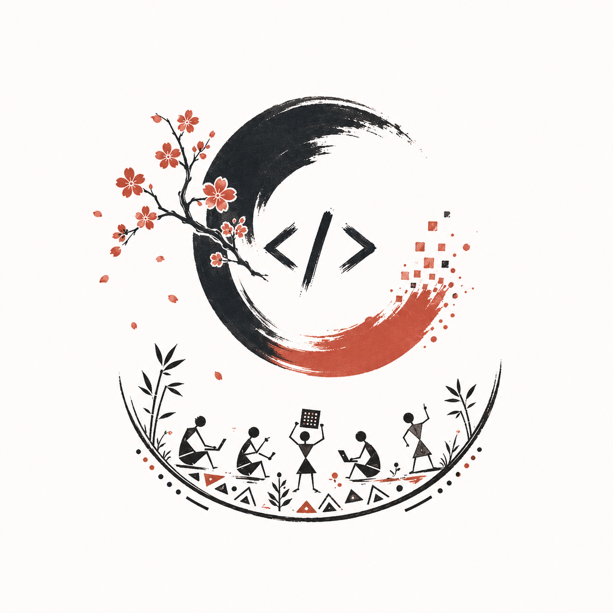
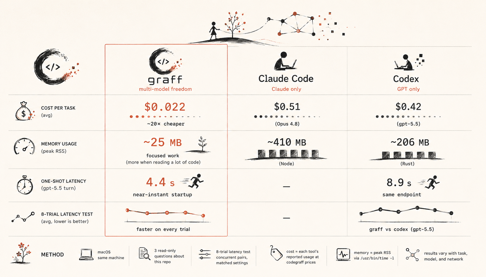

<p align="center">
  
</p>

<h1 align="center">graff</h1>

<p align="center">
  <strong>An AI that actually does the work. Not just talks about it.</strong>
</p>

<p align="center">
  Install it on your Mac, Linux, or Windows machine, sign in with the AI subscription you
  <em>already have</em>, and hand it real tasks. graff writes and runs code,
  automates the boring stuff, digs through your files, researches the web, and
  runs its own experiments, on its own, until the job is done.<br/>
  <strong>You don't chat with it. You give it work.</strong>
</p>

<p align="center">
  
  
  
  
</p>

```sh
curl -fsSL https://github.com/justrach/codegraff/releases/latest/download/install.sh | sh
```

<p align="center"><sub>Prefer a window? Grab the <a href="#install">desktop app</a>. Then just run <code>graff</code> and tell it what you need.</sub></p>

## What can I ask it?

If you could do it at a computer, you can ask graff to do it for you:

- *"Build me a little app to track my workouts."* It writes it, runs it, and shows you.
- *"Turn this folder of messy CSVs into one clean spreadsheet."*
- *"Figure out why my site is slow, then fix it."*
- *"Scrape these five pages and summarize them."*
- *"Run an experiment: try three versions of this and tell me which scores best."*

It works in your real terminal, on your real files, with the real internet, and it can spin up a whole team of sub-agents to work in parallel. It even keeps score of which approaches work and gets better over time.

> **Don't write code?** You don't have to. Say what you want in plain English; graff figures out the steps and does them.

---

## How it compares

<p align="center">
  
</p>

Run the same job on graff, Claude Code, and Codex (three read-only questions about this repo, plus an 8-trial latency test), and here is what it means for you:

**Your AI bill is a fraction.** graff runs the same task on whatever model fits your budget. On `deepseek-v4-pro` it averaged **$0.022 per task**, against Claude Code's **$0.51** (Opus 4.8) and Codex's **$0.42** (gpt-5.5). That is roughly **20× cheaper**, because Claude Code only runs Claude and Codex only runs GPT, while graff runs deepseek, kimi, glm, grok, minimax, gpt, claude, and more. On the *same* model the token usage is comparable, so the win is the freedom to pick a cheaper one, not a token trick.

**It stays out of your way.** graff is one 2.7 MB Zig binary. In these runs it used about **25 MB of memory** for focused work (more when it reads a lot of code), against Claude Code's steady **~410 MB** (Node) and Codex's **~206 MB** (Rust). Leave it running next to everything else and your laptop won't notice.

**Scripts and CI finish in half the time.** For one-shot runs (`graff -p`, the SDKs, a CI step), graff completed a gpt-5.5 turn in **4.4 s** versus Codex's **8.9 s** on the identical ChatGPT endpoint, on every single trial. That is graff's near-instant startup beating a heavier per-call launch. In a long interactive session the startup amortizes and both settle to model latency, so this is a one-shot and automation win, not a blanket "graff is faster."

<sub><b>Method:</b> macOS, same machine, read-only code questions on this repo. Cost is each tool's own reported usage at <a href="https://codegraff.com/docs/models">codegraff gateway prices</a>; memory is peak RSS via <code>/usr/bin/time -l</code>; latency is 8 concurrent graff/Codex pairs on a tool-free prompt with reasoning effort matched. Your numbers will vary with the task, the model, and the network. Reproduce it yourself: <a href="benchmarks/">benchmarks/</a>.</sub>

---
## Under the hood

<strong>the super simple harness.</strong> A minimal agentic coding harness in Zig 0.17 dev. One <strong>2.7&nbsp;MB</strong> binary, zero runtime dependencies. Talks to <strong>Anthropic</strong>, any <strong>OpenAI-compatible</strong> endpoint (DeepSeek, OpenAI, …), or your <strong>ChatGPT subscription</strong>.

```
user text ─→ POST ─→ model asks for tools?
                  ↑           │
                  │  results  ▼
                  └─ io.async ×N  (parallel: bash/files/subagents)
              … repeat until the model stops
```

A REPL that talks to the model directly over HTTPS (`std.http.Client`),
hand-rolls every JSON wire format (`std.json`), and runs tool calls (subagents
included) in parallel on the std.Io thread pool. It also compacts its own
context when the conversation gets long.

**Contents**

- [Install](#install) · [give it a key](#give-it-a-key) · [run it](#run-it)
- [Why](#why)
- [Code intelligence](#code-intelligence-token-efficient-by-default)
- [An evolutionary harness](#an-evolutionary-harness)
- [Providers & models](#providers--models)
- [CLI reference](#cli-reference)
- [REPL commands](#repl-commands)
- [Permission modes](#permission-modes)
- [SDKs: TypeScript & Python](#sdks-typescript--python)
- [Reference](#reference)
- [Coming soon](#coming-soon)

---

## Install

### Desktop app: macOS (Apple Silicon)

Prefer a window over a terminal? Download the latest signed, notarized build, drag it to Applications, and open it. The desktop app is **fully self-contained**: it bundles the `graff` agent, so there's nothing else to install to start coding, and it keeps itself up to date automatically. On first launch it drops two commands on your PATH: `codegraff <path>` (opens that folder in the app, `code`-style) and `graff` itself (the agent CLI, in your terminal), so the one install covers both the window and the command line. The terminal `graff` is symlinked into the app, so it auto-updates along with it. Not on Apple Silicon, or want a standalone CLI? Use the command-line install below.

<p align="center">
  <a href="https://github.com/justrach/codegraff/releases/download/v0.0.190/Codegraff.dmg"></a>
  <br/>
  <sub><a href="https://github.com/justrach/codegraff/releases/latest">or browse all releases</a></sub>
</p>

### Command line: macOS · Linux · Windows

Grab the latest prebuilt release binary: macOS builds are Developer ID signed
and Apple notarized; on any other platform the installer builds from source with
Zig `0.17.0-dev.813+2153f8143` (select it with `zigup`):

```sh
curl -fsSL https://github.com/justrach/codegraff/releases/latest/download/install.sh | sh
```

From a checkout, just run `./install.sh`. The binary lands in `~/bin` by default
(override with `HARNESS_DIR`). The installer appends that directory to your
`~/.zshrc` (and `~/.bashrc` / fish config when those are your shell or already
exist), so a new terminal finds `graff` — the usual "it installed but
`graff: command not found`" miss. Skip with `HARNESS_NO_PATH=1`. Open a new tab
or `source ~/.zshrc` once after install:

| tool      | purpose |
| --------- | ------- |
| `graff`   | the agent CLI + REPL: the one binary this script installs |
| `codedb`  | optional code-intelligence companion (structural search/outline/callers). graff auto-detects it and points at the [one-line install](https://github.com/justrach/codedb) if it's missing; everything else works without it |
| `kuri`    | optional [browser companion](https://github.com/justrach/kuri) backing `webfetch`'s markdown path, web crawling, and the kuri skill. Installed by default alongside graff; opt out with `HARNESS_NO_KURI=1`, never fatal if it fails |

On Windows, grab `graff-x86_64-windows.tar.gz` (or `aarch64`) from the
[latest release](https://github.com/justrach/codegraff/releases/latest), unpack
it, and put `graff.exe` on your `PATH`; the shell installer itself is
Unix-only and points Windows at WSL.

### Give it a key

Three ways, pick whichever is easiest:

```sh
graff login                     # free codegraff key (device-code OAuth, no signup forms)
graff login kimi                # Kimi Code subscription OAuth (device-code)
graff key set deepseek sk-...   # store ANY provider's key (macOS Keychain, else 0600 file)
export DEEPSEEK_API_KEY=sk-...  # or just an env var (env always wins)
```

Already logged into the Codex CLI? Skip this step. Your ChatGPT subscription is
picked up automatically from `${CODEX_HOME:-~/.codex}/auth.json`. Or run
`graff login codex`.

> **Note on `login`:** `graff login` is the free codegraff key, `graff login
> codex` is the ChatGPT-subscription OAuth, and `graff login kimi` is Kimi
> Code's device-code OAuth. **Every other provider** (deepseek, openai,
> anthropic, xai, zai, minimax, xiaomi) is a key: set it with
> `graff key set <provider> <key>` or its `<PROVIDER>_API_KEY` env var, then
> select a model with `--model` / `/model`. See [Providers & models](#providers--models).

### Run it

```sh
graff                            # starts on the first provider you have a key for
graff --model deepseek-reasoner  # or pin one explicitly
```

First things to try once you're at the `›` prompt:

```
› what's in this directory? summarize the build setup.
› /model sonnet                  # fuzzy-switches to claude-sonnet-4-6
› spawn three subagents to summarize src/, count TODOs, and check git status, in parallel
› ultracode audit this repo for error-handling gaps   # codeword → multi-agent workflow mode
› /help                          # everything else
```

---

## Why

Measured, not vibes: arm64 macOS, ReleaseFast; methodology and the budgets each
change is held to live in [architecture.md](architecture.md):

| metric                      | measured                                        |
| --------------------------- | ----------------------------------------------- |
| binary                      | **2.74 MB**, self-contained with zero runtime dependencies |
| cold start                  | **~1.8 ms**                                     |
| full agentic turn           | **12 MB** peak RSS, ~4% CPU (network-bound)     |
| 8 parallel subagents        | **+0.4 MB each** (15 MB total)                  |
| tool output into history    | one 4 KB handle, whatever the result's size: a 500 MB python child process never touches the harness's footprint |

Benchmarked against the Rust codegraff ([justrach/codegraff](https://github.com/justrach/codegraff),
39 MB binary, 934 crates) on the *same model through the same endpoint*,
interleaved 3×: turn speed was a dead tie (2.94 s vs 2.93 s; the network and
the model dominate the turn), but the Zig harness ran in **4.3× less memory**
(11.3 MB vs 48.5 MB), starts roughly 3× faster, and is about 14× smaller on disk. An agent
CLI rarely wins on turn speed; it can win on the cost of being there.

---

## Code intelligence: token-efficient by default

The fastest way to blow a context window is to read whole files into it. graff
ships with a built-in **`codedb`** tool: read-only, structural code
intelligence over a local index of the repo
([github.com/justrach/codedb](https://github.com/justrach/codedb)), and the
system prompt steers the model to reach for it *before* `grep` or
whole-file reads. Instead of paying for a 2,000-line file to find one function,
the model asks for exactly the shape it needs:

```
codedb outline src/main.zig          # just the symbol map, functions/types, no bodies
codedb symbol switchProvider --body  # one function, by name
codedb callers recordUsage           # who calls it (call sites, not files)
codedb search "parse SSE"            # indexed search, ranked hits, not a grep dump
codedb context "add a new provider"  # task-shaped orientation across the codebase
```

Why this keeps token cost low:

- **Structural slices, not files.** `outline`/`symbol`/`callers`/`deps` return a
  function map or a single definition, tens of lines where a `read_file` would
  spend thousands. The index is queried, not the raw bytes streamed into history.
- **It's free and indexed; the metered tools come second.** The system prompt
  encodes an explicit search order: try the free, indexed `codedb` first;
  fall to (metered) `muonry`/raw search only for literal/regex or non-indexed
  files. The cheap path is the default path.
- **Hard output cap.** A query is truncated at **64 KB** with a marker that nudges
  the model back toward targeted queries (`outline`, `symbol --body`) rather than
  whole-file reads, so even a broad search can't balloon the context.
- **Same index powers the `@` file picker** (`codedb glob`), so attaching a file
  by name never shells out to a directory walk.

Pure-Zig client to a pure-Zig server, zero dependencies on either side. Allowed
subcommands: `search · symbol · callers · find · outline · read · tree ·
context · word · deps · glob · ls · file · hot`. Not installed? The tool says so
and points at the one-line install; everything else keeps working without it.

---

## An evolutionary harness

graff doesn't just run an agent; it records every run as a node in a
**Darwin Gödel Machine-style archive tree** ([arXiv:2505.22954](https://arxiv.org/abs/2505.22954)),
so the harness itself is the substrate for agent self-improvement. Each run
writes a unique `.graff/trajectories/<run-id>.jsonl`; archive readers aggregate
the directory, so concurrent processes never share a truncate/append cursor:

- **A lineage tree, not a flat log.** Interactive root turns form a spine (each
  turn's parent is the previous one); every subagent and workflow task hangs off
  the turn that spawned it. Each node carries a **fingerprint of the system prompt
  it ran with** (`prompt_sha` = first 8 bytes of SHA-256), so prompt mutations (
  `set_system_prompt` on the spine, per-child `system_prompt` overrides on the
  fan-out) show up as hash changes along edges. A lineage can be replayed or
  scored offline.
- **Personas are variants.** Subagents pick a persona with `agent` (built-ins:
  `reviewer · researcher · implementer · skeptic`, plus anything in
  `.harness/agents/`) or take a custom `system_prompt`; either way the
  trajectory records the lineage, so you can mine *which agent variant actually
  worked*.
- **A fitness ledger with integrity.** The `score` channel appends evaluation
  records (`prompt_sha`, `score`, `parent_sha`; the lineage edge DGM parent
  selection counts children with). Because the archive lives in the working
  directory, a forged `score` row could manufacture fitness, so every score the
  harness writes is **HMAC-signed** (keyed by `GRAFF_SCORE_KEY_FILE`, a secret
  outside the cwd that the evolving agent's confined tools can't reach). Readers
  recompute the HMAC and reject unsigned or forged rows. Signing is opt-in and
  backward-compatible (no key → unsigned, accepted as before).
- **Tool-use is mined too.** Each agent logs its tool calls (name + error flag,
  in order): the process signal behind "which tool combinations work",
  joinable to scores via `prompt_sha`.
- **Consent-scoped fleet loop.** Learning contributes prompt-free aggregate
  fitness by default, announced once per machine; `/privacy local` opts out
  entirely, and individually reviewed reusable templates need an exact
  per-artifact approval on top. `/trajectory` renders the current session's
  agent tree; see [docs/hyperagents.md](docs/hyperagents.md) for the full design.

For controlled local hill-climbing, `graff learn` adds a separate
parent → mutate → paired-evaluate → select loop with immutable evidence, manual
promotion by default, explicitly gated automatic promotion, atomic activation,
and rollback. It never treats trajectories or best-effort telemetry as promotion
authority. See [Local prompt-policy learning](docs/local-learning.md), including
the no-sandbox trust boundary and the collective-learning design that is **not**
yet an implemented remote authority.

---

## Providers & models

Direct API-key and OAuth providers across three wire formats. A
`ProviderSpec` table holds each built-in provider's
endpoint, auth style, env var, and default model; base URLs and key names come
from [models.dev](https://models.dev)'s `api.json` (snapshot 2026-06-10).

| Provider    | Wire format / auth          | Key env var          |
|-------------|-----------------------------|----------------------|
| `anthropic` | Anthropic Messages, x-api-key | `ANTHROPIC_API_KEY`  |
| `codegraff` | OpenAI chat, bearer         | `CODEGRAFF_API_KEY` (`cg_sk_...`) |
| `deepseek`  | OpenAI chat, bearer         | `DEEPSEEK_API_KEY`   |
| `openai`    | OpenAI chat, bearer         | `OPENAI_API_KEY`     |
| `minimax`   | Anthropic Messages, bearer  | `MINIMAX_API_KEY`    |
| `xiaomi` (MiMo) | OpenAI chat, bearer     | `XIAOMI_API_KEY`     |
| `kilo`      | OpenAI chat, bearer         | `KILO_API_KEY`       |
| `groq`      | OpenAI chat, bearer         | `GROQ_API_KEY`       |
| `mistral`   | OpenAI chat, bearer         | `MISTRAL_API_KEY`    |
| `kimi` | Live catalog-selected: native Kimi chat + bearer, or Anthropic beta Messages + x-api-key when declared | `graff login kimi` or `KIMI_API_KEY` |
| `xai` (grok) / `zai` (GLM) | OpenAI chat, bearer | `XAI_API_KEY` / `ZAI_API_KEY` (via `graff key set`) |
| `codex`     | Responses API, ChatGPT login | `${CODEX_HOME:-~/.codex}/auth.json` (no API key) |

**Using a specific provider directly** is always the same two steps: give it
the key, then name a model. For example, DeepSeek straight to `api.deepseek.com`:

```sh
graff key set deepseek sk-...          # or: export DEEPSEEK_API_KEY=sk-...
graff --model deepseek-reasoner        # models: deepseek-v4-pro · deepseek-v4-flash · deepseek-chat · deepseek-reasoner
```

The same pattern works for every API-key row above: swap in the provider id
and one of its models (`graff key set openai sk-...` → `--model gpt-...`,
`graff key set anthropic sk-ant-...` → `--model sonnet`, and so on).

To add one workspace-local OpenAI-compatible router without changing Graff,
create `.graff/.config.router`:

```json
{
  "id": "openrouter",
  "name": "OpenRouter",
  "base_url": "https://openrouter.ai/api/v1",
  "env_key": "OPENROUTER_API_KEY",
  "default_model": "anthropic/claude-sonnet-4"
}
```

`name` is optional. `takes_effort: true` is also available for routers that
accept OpenAI-style reasoning-effort requests. The file contains no secret;
use `export OPENROUTER_API_KEY=...` or `graff key set openrouter ...`.
Select it with `graff --model openrouter` or `/model openrouter`;
`graff models refresh` pulls its full catalog. Graff derives
`/chat/completions` and `/models` from `base_url`, caches that router's model
catalog in `.graff/.models.router`, and exposes it to the CLI and GUI schema.
Only one additional router is configured per workspace. `.graff/` is ignored
by Git in this repository.

A model is routed to the first provider (in the table order above) that both has
a key set **and** lists the model in the active catalog. Codex names, rollout
visibility, ordering, and context windows come from its account-scoped `/models`
endpoint, cached for five minutes with Graff's supported Codex protocol version
(a separately installed older Codex CLI cannot hide newer models). Baked Codex
rows are only the logged-out/offline fallback, currently including `gpt-5.6-sol`,
Terra, and Luna. Unknown `claude*` models
fall back to Anthropic; any other unknown model falls back to the codegraff
gateway, and `/model` prints a warning when that fallback fires, since a typo'd
name will be rejected by the API on the first request. The startup default is
the first provider with a key, on its default model. `/models` prints the full
table: context window, compaction point, provider, and which providers you have
keys for; `/model <name>` switches (a bare `/model` opens an interactive fuzzy
picker). `graff models refresh` forces a fresh Codex catalog request and refreshes
the Codegraff/workspace-router catalogs plus the independent models.dev
price/context metadata cache.

<details>
<summary><strong>Codex login (ChatGPT subscription)</strong> · <strong>why no Claude login</strong></summary>

<br/>

If you're logged into the Codex CLI, the harness reads the ChatGPT OAuth token
from `${CODEX_HOME:-~/.codex}/auth.json` at startup (the same on-disk-credential
trick used for the codegraff key) and prints `logged into Codex (ChatGPT account …)`. Switch to
it with `/model codex`; Graff selects the first visible model in your live,
account-scoped Codex catalog. This is a third wire format: the
**Responses API** against the ChatGPT backend
(`chatgpt.com/backend-api/codex/responses`), not `api.openai.com`, so it uses
your ChatGPT Pro/Plus subscription rather than a paid API key. Text, tool
calling, compaction, and `/save`/`/resume` all work on it. Not logged in?
`graff login codex` runs the PKCE browser flow itself.

Claude models route through a real `ANTHROPIC_API_KEY` or the codegraff gateway
only. There is deliberately no Claude-subscription login: reusing a Claude Code
OAuth token outside the official client violates Anthropic's terms of service.

Tool definitions are written once as comptime specs and rendered into both
formats (Anthropic `input_schema` vs OpenAI `function.parameters`) at compile
time. See `anthropicToolsJson` / `openaiToolsJson` in `src/main.zig`.

</details>

---

## CLI reference

```
usage:
  graff [flags]                    start the REPL
  graff [-p] "prompt"              one-shot: run the prompt, print the answer, exit
  graff login                      get a codegraff key (device-code OAuth)
  graff login codex [--refresh]    ChatGPT/Codex OAuth login (PKCE)
  graff key set <provider> <key>   store a key (macOS Keychain, else 0600 file)
  graff key list                   show which providers have keys
  graff mcp add <name> -- <cmd>     add an MCP server to .mcp.json
  graff mcp                         list configured MCP servers
  graff plugins                     list Cursor/Claude/Grok/Codex plugin trees (in place)
  graff learn <command>             local prompt-policy learning and rollback
  graff --schema                   print the machine-readable interface (SDK codegen)

flags:
  --model <name>            start on this model (same fuzzy resolution as /model)
  --subagent-model <name>   pin children/workflows/judges to this model on the root provider
  --subagent-provider <id>  route pinned workers through this explicit provider
  --allow-cross-provider-subagents
                            consent to worker prompts/code going to another provider
  --yolo                    skip all permission prompts for the session
  --no-local-tools          embedder mode: hard-disable the built-in bash/file/codedb
                            tools process-wide (see "Embedder mode" below)
  -p, --print               one-shot print mode (answer on stdout, tool progress on stderr)
  --timing                  show per-tool wall-clock on result lines (✓ (312ms) …)
  --cost                    show running session spend in the prompt ([model · 12k tok · $0.0042])
  --json                    structured stdio protocol (JSON in, JSONL events out, SDK transport)
  --max-model-calls N  cap provider calls across root, children, retries, titles, compaction, and judges (default 0 = unlimited)
  -h, --help       usage
  -V, --version    version
```

Unknown flags are an error (with a pointer to `--help`), missing model-flag
values are errors, and `--help`/`--version` are handled before subcommand
dispatch, so `graff login --help` prints usage instead of starting an OAuth
flow. With no key configured at all, startup fails with the three quickest fixes
spelled out rather than a bare env-var list.

`graff learn help` lists the local learning commands. Configuration, adapter
protocols, statistical gates, activation semantics, and security limitations are
specified in [docs/local-learning.md](docs/local-learning.md).

**One-shot mode** makes the harness scriptable without the SDK: `graff -p "how
many TODOs in src/?"` runs a full agentic turn (tools included), prints only the
final answer on stdout (progress lines go to stderr), and exits non-zero on
failure. There's no human to ask, so the permission gate denies anything not
already allowed. Pre-approve commands in `.harness/settings.json` or pass
`--yolo`.

---

## REPL commands

A bare `/` opens the whole list as a filterable full-screen menu (type to
narrow, Enter runs it); **Esc during a response interrupts the turn**:
generation stops (it works from the moment the request is sent, including a slow
provider connect), what already streamed stays in history with an
`[interrupted]` marker, and you're back at the prompt. A bare Esc at the prompt
clears the input line.

While a response streams you stay in control: besides Esc to interrupt,
**Ctrl-T (`^T`) folds/unfolds the live "Thinking" block** in place, and the mouse
wheel scrolls your terminal's own scrollback: the REPL doesn't grab the mouse, so
scrolling up to re-read earlier output works like any normal terminal (parity with
Claude Code). Folding the Thinking block is keyboard-only (`^T`). There is no
click-to-fold.

Streaming Markdown is rendered for terminal readability: heading levels get a
clear colored hierarchy; bullets, numbered items, nested lists, task checkboxes,
and blockquotes use terminal-native markers; bold and inline code drop their raw
delimiters; tables align; and fenced code stays copyable without decorative
prefixes on body lines.

The interactive UI uses Codegraff's accent-only **Ensō** palette: vermilion
coral marks the model, prompt, active selections, tools, and primary Markdown
structure; ordinary text and supporting metadata stay neutral. Success,
warning, and error colors remain semantic, the terminal background is never
overridden, and `NO_COLOR` is respected. The quiet `enso` thinking animation is
the stable default; `/animation random` restores per-request variety and the
other animation names remain available.

The full catalog, straight from the `/` menu (a bare `/` opens it as a
filterable full-screen picker; `/help` prints this same list in the REPL).
`/models` pings every keyed provider catalog live on each listing, so new
gateway rollouts appear without a restart.

```
/model <name>             switch model/provider, fuzzy match (e.g. "sonnet", "opus")
/models [health]          list known models, context windows, compaction points; health shows live state
/clear                    wipe the conversation and start fresh
/new                      start a fresh autosaved session
/rename <title>           set the current session title
/goal [30m] [text|pause|resume|status|clear]
                          set a standing objective and work it autonomously; an optional 30s/30m/2h budget paces the run; pause/resume steering, status shows state, clear removes it
/loop [30m] <prompt>      the same autonomous run as /goal, without adopting a standing objective
/review <target or instructions>
                          run one isolated read-only review pass; no edits, delegation, or workflows
/never [<text>|rm <id>]   standing constraints that ride every subagent brief and survive compaction; bare lists them, rm <id> retires one (alias /constraint)
/tell <session|all> <text>
                          message a running graff: <session> is a DM (only it hears, any folder); all broadcasts to every graff on this device; /sessions lists who's around
/peek <session>           see what a live co-resident session is doing right now (its transcript tail)
/routes [<set>|add <set> <frontier|mid|small> <provider/model>]
                          your own priced model lanes across providers: view the set and which seat wins each lane now
/plan                     toggle plan mode: read-only explore + propose; writes/edits denied
/ultracode                toggle persistent workflow mode; bare opens an on/off picker, or /ultracode on|off
/fallback [allow|remove|off]
                          opt-in cross-provider fallback for this workspace (same-provider rollout stays on)
/key [provider secret]    show API-key status; /key <provider> <secret> adds one live (+ Keychain)
/login [codegraff|codex|kimi]
                          OAuth sign-in (no key to paste); bare opens a picker (codex alias: oai)
/keepcontext              toggle keeping the conversation when /model switches wire format (default on)
/effort                   reasoning depth: low|medium|high|... (codex, deepseek, codegraff; persists)
/reasoning                alias for /effort
/fast                     codex only: priority service tier for lower latency (toggle, persists)
/thinking                 stream reasoning live vs spinner only (toggle, persists)
/title                    name the tab from your first prompt (AI session title; toggle, persists)
/strict                   toggle "every message is a tool" mode
/yolo                     toggle bash auto-approval (skip permission prompts)
/trace                    toggle this run's JSONL event trace (and show its path)
/privacy [local|aggregate|templates|examples]
                          control prompt-learning data egress for this session
/trajectory               show this session's agent tree: turns + spawned subagents
/agents                   list agent types: builtin personas + .harness/agents/*.md
/skills [add|remove <name>]
                          list SKILL.md playbooks + companion tools; add/remove enables or disables one
/plugins                  list Cursor/Claude/Grok/Codex plugin trees graff is reading in place
/hooks                    list lifecycle hooks and the built-in codedb guard
/doctor                   read-only health check: goal/todo invariants, and why steering will or will not be appended
/btw <question>           ask one side question about this conversation: billed, never added, rides the parent cache prefix
/compact                  compact history into a fresh context (OpenAI server-side when available)
/rewind [n]               list past prompts; /rewind <n> drops prompt n+after & reverts its file edits
/image <path>             attach an image to your next message (vision models only)
/images                   open image URLs from the last response (e.g. issue attachments) in your browser
/paste                    attach the clipboard image: macOS; also Ctrl-V (⌘V can't be captured)
/bash <command>           run a shell command directly
/save [name]              write the conversation to <name>.session.json (default: current)
/resume [name]            restore a saved conversation (no arg → interactive picker)
/sessions                 list saved sessions in the cwd
/todo                     show the current task list
/jobs                     list background jobs
/cost                     session token usage and cost
/usage                    alias for /cost
/debug                    live content-free observability HUD (turns, tokens, tools, last events)
/tools                    session tool balance: codedb-pro vs zigrep vs native usage, gate refusals, skew
/animation                pick the thinking animation; persists to settings
/theme [name]             pick a color theme; /theme off resets to your terminal default; persists
/fleet [on|off]           federated DGM contribution (propose/submit/elite_pull)
/mcp [add …]              list MCP servers/tools; /mcp add <name> <cmd> [args...] connects one live
/import-claude            copy Claude/Cursor MCP servers and skills into ~/.codegraff and this repo
/help                     list every command
exit | ctrl-d             quit (also /exit; ctrl-c on an empty line)
```

`/plan`, `/yolo`, and `/strict` change how the permission gate behaves for the
session. See [Permission modes](#permission-modes).

`/goal <objective>` sets a standing objective that steers every turn as a live
checklist, and starts working it right away: it runs turn after turn (plan, act,
verify) instead of pausing for confirmation between routine steps. `/goal pause`
stops the steering without losing the objective, `/goal resume` turns it back on,
and `/goal status` shows the objective and its current state.
`/loop <prompt>` is the same autonomous run for a one-off task, without adopting
a standing objective.
Either way the run stops on its own with a named outcome: accepted once the work
is done, idle when the model stops making tool progress without claiming
completion, cancelled or blocked when you step in or it needs you, exhausted when
a safety limit is hit, and expired when a time budget runs out.
Start with a duration to give the run one: `/goal 30m fix the flaky test` (also
`45s`, `2h`). Each continuation turn then tells the model where it stands: which
continuation it is on, how long the run has taken, how much of the budget is
left, and one phase hint (explore, implement, finish, wrap up).
Nothing is enforced except the stop itself, and the model is never cut off
mid-turn. Subagents spawned during a timed run are told the parent's remaining
time, minus a margin for the parent to integrate their results.
`/review <target or instructions>` is the deliberately narrower path for code
review: it suppresses goal/eval/ultracode steering, admits only local
read/search tools and read-only shell inspection, and runs with fresh
model-visible history. There are no implicit review-specific tool or model-call
limits; the ordinary invocation budget is unlimited by default, while explicit
`--max-tool-calls` and `--max-model-calls` settings still apply. Only the request
and final report join the parent transcript. Use a later, explicit turn to fix
accepted findings.

### Skills

A skill is a markdown playbook graff loads only when a task calls for it. Drop
one in `.harness/skills/<name>/SKILL.md` (or `~/.harness/skills/` for every
project), give it `name` and `description` frontmatter, and write the
instructions in the body. Skills already written for Claude Code, Cursor,
Grok, or Codex work as they are: `.claude/skills/`, `~/.cursor/skills-cursor/`,
`~/.grok/skills/`, plugin `skills/` and Claude `commands/*.md` trees, and
`~/.agents/skills/` are read in place (not copied). A Claude plugin works the
same way it does in Claude Code: `commands/`, a root `SKILL.md`, inline
`mcpServers`, and `${CLAUDE_PLUGIN_ROOT}` are honored. `/plugins` and
`graff plugins` list the trees; `/plugins load <name>` shows one.
`GRAFF_NO_PLUGINS=1` skips them.

Only the name and description enter the system prompt, so a large skill library
costs one line each. The model calls the `skill` tool to pull a body in when it
needs it, and a skill written mid-session is loadable straight away.

Two skills ship inside the binary: `skill-creator` (how to author and install
new skills) and `mcp-config` (how to inspect and change the MCP servers below).
`/skills` lists everything with its source, `/skills remove <name>` hides one,
and `/skills add <name>` brings it back. See
[docs/skills.md](docs/skills.md) for the full reference.

### MCP servers

Graff speaks both MCP transports directly: local stdio servers and remote
Streamable HTTP servers. Servers already configured for Claude, Cursor, or
Grok are read in place (plugin `mcp.json` / `.mcp.json`, `~/.claude.json`,
`~/.cursor/mcp.json`, `.cursor/mcp.json`) and fill names graff does not
already define; they still need `/mcp trust` or `--yolo`. Plugin manifests
may also declare `mcpServers` inline or as a path (Claude's shape).
`/plugins` and `graff plugins` show which plugin trees contributed. Smolify (`https://app.smol.ly/mcp`) is available as a
core documentation service; it needs no Node bridge or project configuration.
Its public-read schemas are bundled locally, so startup makes no Smolify
request. The anonymous transport initializes only after an approved tool call,
and recognizable credentials in arguments are blocked locally. Set
`GRAFF_NO_SMOLIFY=1` to remove its tool surface entirely. Authenticated and
write-capable tools are hidden unless the session explicitly opts in with
`GRAFF_SMOLIFY_ACCESS=full`. Other servers can be added from the shell or during
a session:

```sh
graff mcp add context7 -- npx -y @upstash/context7-mcp
graff mcp add mobbin --url https://api.mobbin.com/mcp
graff mcp login mobbin   # OAuth discovery + browser PKCE flow
graff mcp login smolify  # optional access to authenticated Smolify tools
GRAFF_SMOLIFY_ACCESS=full graff  # expose the authenticated/full catalog
# In the REPL: /mcp add mobbin --url https://api.mobbin.com/mcp
```

The equivalent `.mcp.json` URL entry is
`{"mcpServers":{"mobbin":{"url":"https://api.mobbin.com/mcp"}}}`. Remote
responses may use either `application/json` or `text/event-stream`; Graff keeps
`Mcp-Session-Id` state and sends `MCP-Protocol-Version` on requests.
For OAuth-protected endpoints, `graff mcp login <name>` performs protected
resource and authorization-server discovery, dynamic client registration, and
a browser PKCE flow. Tokens are stored outside the repository under
`~/.simple-harness-mcp` with user-only permissions and refreshed automatically.
Static HTTP headers can alternatively be added with
`--header 'Authorization=Bearer TOKEN'` (they are stored in `.mcp.json`, so
prefer a restricted token and do not commit that file).

The line editor supports ↑/↓ history (persisted to `~/.simple-harness-history`),
Tab completion (commands, and model names after `/model `), and emacs-style
editing (Ctrl-A/E/W/U/K, Option+Delete, word moves). The selected model is
remembered in `~/.simple-harness-model` and resumed next launch
(`--model <name>` overrides). If the remembered provider/model is absent from
the current catalog or its credentials are missing, graff falls back for that
session with a note, without overwriting the preference. If the preferred
provider later returns a clear authentication, access, removed-model, quota, or
credit failure before producing text or running tools, graff tries the next
configured provider and keeps the saved preference for a future launch. The
prompt is a small statusline:
`[model · Fast · Extra high · Plan · cwd /repo · 12345/800k tok (1%) · ⚡cached]`.
Fast stays immediately beside the model. Active reasoning/workflow modes are
visible at a glance: Low is green, Medium/Extra high/Ultra/Ultracode use the
Codegraff coral accent, High/Plan are yellow, and Max/Strict are red. YOLO is
reported
as an explicit warning when enabled instead of occupying the compact prompt.
Badges for unsupported settings are hidden instead of implying they apply. The
tail shows context used vs the compaction budget, last cache hit, and (for
metered providers) session spend.
Errors aim to be actionable: `/resume nope` says the session file wasn't found
and points at `/sessions`; an unknown `/foo` points at `/help`.

---

## Permission modes

By default graff **asks before doing anything that can change your machine.**
File writes (`write_file`/`edit_file`), MCP tool calls, and any bash command
that isn't read-only stop at a permission gate:

```
⚠ rm -rf build/
[y]es once · [a]lways allow "rm" (saved to .harness/settings.json) · [n]o ›
```

- **y** runs it once · **a** runs it *and* remembers the rule · **n** denies it
  (the model is told and picks another path).
- **Always** appends a prefix rule to `.harness/settings.json` under `"allow"`,
  so that command never prompts again, this session or a future one. Pre-seed
  that file by hand to allow commands up front (it lives next to your hooks; the
  harness preserves the rest of the file).
- Read-only commands are auto-allowed and never prompt: `ls cat head tail wc
  grep rg pwd which file`, `git status|diff|log|show`, `zig build|fmt`, but
  only while every path stays inside the working directory (`cat /etc/passwd`
  still asks), and only as a plain command. A pipe, redirect, `&&`, or `$(…)`
  always prompts, so a second command can't be smuggled past a prefix match.

Three session-wide modes change the gate. Set on the CLI, or flip them live in
the REPL:

| mode       | turn on              | what it does |
| ---------- | -------------------- | ------------ |
| **yolo**   | `--yolo` · `/yolo`   | Skip **every** prompt: bash, edits, and MCP all run without asking. For sandboxes, CI, and `-p`/`--json` runs where there's no human to answer. `--yolo` starts the session in it; `/yolo` toggles mid-session. |
| **plan**   | `/plan`              | Read-only: the model explores and *proposes* a plan; the gate hard-denies writes, edits, MCP, and any bash beyond the read-only seed (even your saved allow-list) until you `/plan` again to execute. The prompt shows a yellow `Plan` badge. |
| **strict** | `/strict`            | "Every message is a tool": the model must call exactly one tool per message and finish with `attempt_completion`. Useful for deterministic, scriptable agent loops. |

**One-shot mode** (`graff -p "…"` or `--json`) has no human to answer the
prompt, so the gate denies anything not already allowed. Pre-approve commands
in `.harness/settings.json` or pass `--yolo`.

### Hooks

Shell hooks in `.harness/settings.json` run at tool-call boundaries — your
own policy layer next to the built-in gate:

```json
{
  "hooks": {
    "pre_tool":  [{ "match": "write_file|edit_file",
                    "command": "./scripts/guard.sh",
                    "suggest": "the mcp edit tool",
                    "timeout_ms": 5000 }],
    "post_tool": [{ "match": "write_file", "command": "zig fmt ." }],
    "turn_end":  [{ "command": "./scripts/notify.sh" }]
  }
}
```

- **`match`** — tool name, `|`-separated list, or `*` (default). **`command`**
  runs via `/bin/sh -c` with the event JSON on stdin:
  `{"event","tool","input"}` (post_tool adds `"is_error"`,`"output"`).
- **`pre_tool`**: exit **2 blocks the call** — the hook's stderr becomes the
  tool error the model sees. Add **`suggest`** to name the sanctioned
  replacement; the denial becomes
  `blocked by pre_tool hook: <stderr> — use instead: <suggest>`, turning a
  blocked call into a one-call recovery instead of a guess-and-retry spiral.
  Any other exit code, timeout, or spawn failure allows — a broken hook never
  bricks the loop.
- **`post_tool`** runs sequentially after the call (a formatter finishes
  before the next tool runs); exit codes are ignored. **`turn_end`** fires
  once per completed turn. Default timeout 10 s (`timeout_ms` to change);
  stderr is capped at 4 KiB.

---

## SDKs: TypeScript & Python

graff is scriptable from your own code. `graff --json` is a structured stdio
protocol (JSON requests in, JSONL events out; `ask_user` is answered with a
structured `{"type":"answer","text":"...","cancelled":false}` line) and `graff --schema` prints the
machine-readable interface, and the **TypeScript and Python SDKs in
[`sdk/`](sdk/) are auto-generated from that schema**, so they never drift from
the binary. On every release tag a GitHub Action rebuilds, regenerates, fails if
the committed SDKs are stale, and publishes to npm (`@graff-new/sdk`) and PyPI
(`simple-harness-sdk`).

```python
# Python
from harness_sdk import Harness

with Harness(yolo=True, model="gpt-5.5") as h:
    print(h.ask("what is 2+2?"))
    for ev in h.chat("read foo.txt"):
        print(ev["type"], ev)
```

```ts
// TypeScript
import { Harness, runAgent } from "@graff-new/sdk";

// one-shot, streamed
for await (const ev of runAgent({ prompt: "summarize README.md", model: "gpt-5.5", yolo: true })) {
  if (ev.type === "text") process.stdout.write(ev.text);
  if (ev.type === "turn") console.log("\ncost $", ev.cost_usd);
}

// long-lived, multi-turn
const session = Harness.init({ model: "claude-opus-4-8", yolo: true }).session();
console.log(await session.ask("what files are here?"));
session.close();
```

Can't spawn a local process (edge runtimes, browsers, other machines)? Run
`graff serve` and both SDKs ship matching **remote clients** that drive it over
HTTP: `@graff-new/sdk/remote` (fetch-only: Workers/Deno/Bun/browsers) and
Python's `RemoteHarness` (stdlib only). Same method surface, same event stream.
See [`sdk/README.md`](sdk/README.md).

---

## Embedder mode: run the harness outside the sandbox

If you are embedding graff in a product, the safe shape is to run the agent loop
on your trusted backend and let it reach an isolated sandbox only through tool
calls. `--no-local-tools` is what makes that shape enforceable:

```bash
graff --json --no-local-tools --model gpt-5.5

# same thing, for a process whose argv you don't control:
GRAFF_NO_LOCAL_TOOLS=1 graff --json
```

With the gate on, `bash`, `bash_output`, `bash_kill`, `read_file`, `edit_file`,
`write_file` and `codedb` are hard-disabled for the whole process. It is a gate
in the binary, not a permission rule the model can talk its way past, and it
works in two layers because either one alone would be a promise rather than a
guarantee:

1. those tools are never advertised, so no provider is told they exist;
2. if a provider hallucinates one anyway, dispatch refuses it with a tool error
   naming the flag, before anything runs.

Subagents and workflow workers inherit the gate, since they run in the same
process. `--yolo` does not lift it.

**Where the coding tools come from.** Point graff at your sandbox as an MCP
server. MCP tools are untouched by the gate, which is the entire point: you
stand up a thin proxy that maps exec/read/write onto your microVM provider, and
the model gets those in place of the local ones.

```bash
graff mcp add sandbox --url https://sandbox-proxy.example.com/mcp
graff --json --no-local-tools
```

`webfetch` stays available (plain HTTP from your own host, with no sandbox to
escape), and so do the orchestration tools: `subagent`, `workflow`, the todo
list, and `eval`.

**Why it's worth the wiring.** The tenant provider key stays on your backend
instead of sitting inside the same VM where prompt-injected commands run, so a
hijacked agent can't read it. Run state lives with your supervisor rather than
in a disposable machine. And because the sandbox is now something a tool call
reaches rather than something the harness lives inside, your MCP proxy can
create the VM lazily, on the first call that actually needs one. Runs that
answer from model knowledge plus `webfetch` never boot a machine at all: they
get web-request economics, and no boot-and-provision tax on time to first token.

---

## Reference

<details>
<summary><strong>Tools & the permission gate</strong></summary>

<br/>

| Tool                 | Kind     | Implementation                                            |
|----------------------|----------|-----------------------------------------------------------|
| `bash`               | built-in | `std.process.run` → `/bin/sh -c`, stdout+stderr+exit code |
| `read_file`          | built-in | `Io.Dir.cwd().readFileAlloc` (256 KB cap)                 |
| `edit_file`          | built-in | exact string replace; unique match required unless `replace_all` |
| `write_file`         | built-in | `Io.Dir.cwd().writeFile`                                  |
| `codedb`             | built-in | shells out to [codedb](https://github.com/justrach/codedb): read-only code-intel (search/symbol/callers/outline/…) |
| `subagent`           | built-in | this same agent loop, recursively (root agent only)       |
| `workflow`           | built-in | phases of parallel subagents; `{{prev}}` carries results forward (root only) |
| `todo_write`/`_read` | meta     | mutate/read the agent's own task list                     |
| `ask_user`           | meta     | ask the human a question; their reply returns as the result |
| `attempt_completion` | meta     | carry the final answer out; ends the turn                 |
| `mcp__<server>__*`   | MCP      | tools discovered from `.mcp.json` servers (see below)     |

**Meta tools** act on the agent or the conversation, not the outside world, so
the orchestrator handles them inline rather than on a pool thread. `ask_user` +
`attempt_completion` make the human↔agent conversation fully tool-mediated: the
agent asks via a tool, the person's reply comes back as that tool's result, and
the agent finishes via another tool. In `/strict` mode the model is forced to
call a tool every turn, so *every* message is a tool call or tool result.

**Permission gate.** The gate (`gateTool`) covers `bash`, `write_file`,
`edit_file`, and MCP tool calls. A call that isn't pre-approved prompts at the
REPL: `[y]es once · [a]lways allow "<key>" (saved) · [n]o`. The approval key is
the command's first word for bash, the tool name for writes/MCP. "Always"
**persists**: it's written to `.harness/settings.json` in the cwd
(`{"allow": ["touch", "write_file", …]}`) and loaded back on every launch in
that project. Edit the file by hand to revoke or pre-approve. A small seed
allowlist (read-only basics like `ls`/`cat`/`rg`, plus `zig build`/`zig fmt` and
`git status`/`diff`/`log`/`show`) never prompts; `find` is deliberately excluded
(its `-exec`/`-delete` make it an exec tool). Commands containing chaining,
pipes, redirection, substitution, or newlines never match a prefix: they always
prompt. Approving an interpreter as a bash word (`python3`, `node`, …) prints a
heads-up that it grants arbitrary code execution.

**Path confinement.** `read_file`/`write_file`/`edit_file` are confined to the
working-directory subtree: no absolute paths, no `..`. This is structural (not
bypassed by `/yolo`): `read_file /etc/shadow` and `write_file ../../x` are
refused with an error. When the user explicitly names a sibling repository, the
root agent can continue there through permission-gated bash without relaunching;
it checks the target's git status first and quotes its path. Those external edits
are deliberately not tracked by `/rewind`, and subagents remain confined.

**bash is cwd-locked by default too.** A seed/approved command auto-runs only
when all its path arguments stay in the cwd (`escapesCwd` rejects absolute, `~`,
and `..` tokens). So `cat local.txt` runs free but `cat /etc/passwd` falls
through to a prompt at the root (you can still approve it per-call) and is denied
for subagents. `/yolo` lifts this.

**Subagents** have no stdin, so they're gated structurally, not by prompt: bash
is allowlist-only (unapproved → denied), file writes are allowed but
path-confined, and MCP isn't exposed to them at all. `/yolo` turns the prompt
gate off (path confinement stays).

</details>

<details>
<summary><strong>MCP servers</strong></summary>

<br/>

The harness is an MCP **client** (`src/mcp.zig`). Drop a `.mcp.json` in the
working directory and it spawns each server, speaks JSON-RPC 2.0 over stdio,
discovers their tools, and offers them to the model namespaced
`mcp__<server>__<tool>`:

```json
{
  "mcpServers": {
    "codedb":      { "command": "codedb", "args": ["mcp", "."] },
    "everything":  { "command": "npx", "args": ["-y", "@modelcontextprotocol/server-everything"] }
  }
}
```

Pointing it at `codedb mcp .` gives the agent 22 structural code-intelligence
tools: pure-Zig client to pure-Zig server, zero dependencies on either side.
`/mcp` lists what connected; `/mcp add <name> <cmd> [args…]` connects a server
live and saves it to `.mcp.json`. From a shell, use the Codex-style form
`graff mcp add <name> [--env KEY=VALUE ...] -- <cmd> [args…]`; for example,
`graff mcp add context7 -- npx -y @upstash/context7-mcp`. `graff mcp` lists the
servers already saved in `.mcp.json`. Workspace servers auto-connect only with
`--yolo` (trusted) or per-session consent.

One known companion is exempt from the workspace gate: if the `muonry` binary is
on PATH (the fast code-intelligence suite), the harness auto-connects it in
every workspace (it's a user-installed tool, not arbitrary repo config) and
injects its usage note so the model prefers `mcp__muonry__read`/`search` over
native navigation, falling back to the native tools whenever a call fails. Opt
out with `{"skills": {"muonry": false}}` in `.harness/settings.json`.

</details>

<details>
<summary><strong>ultracode & workflows: multi-agent fan-out</strong></summary>

<br/>

**ultracode: the multi-agent codeword.** Put the word **ultracode** anywhere in
a message and the harness augments that turn with a note steering the model into
multi-agent workflow mode: it prints `⚡ ultracode: multi-agent workflow mode
engaged`, records an `ultracode` trace event, and asks the model to fan the work
out across phases of parallel subagents (then synthesize) via the `workflow`
tool rather than doing it solo. It's a per-turn toggle: no flag, no mode to
remember, just the keyword.

**Workflows.** Dynamic workflows as data (inspired by pi-dynamic-workflows,
minus the JS sandbox): the model calls the `workflow` tool with a JSON plan of up
to 5 sequential phases, each holding up to 8 tasks that run in parallel as
isolated subagents. From phase 2 on, `{{prev}}` in a task prompt is replaced
with the labeled results of the previous phase (auto-appended if omitted), and
the final phase's results return to the root agent. Good for fan-out +
synthesis: audits, multi-perspective review, parallel research.

</details>

<details>
<summary><strong>Subagents</strong></summary>

<br/>

A subagent is just a tool whose executor is the same `Agent` loop with a fresh
history, its own arena, and a subagent-specific system prompt (`execSubagent`).
Because tool calls already fan out via `io.async`, the model spawning three
subagents in one response gets three agent loops running concurrently, each
making its own HTTPS calls through the shared (thread-safe) `std.http.Client`.
Absent an explicit pin, subagents default onto a provider-local worker tier
ladder one rung cheaper than the root model (codex/openai gpt-5.6 sol/flagship
-> terra -> luna; anthropic opus -> sonnet -> haiku; deepseek pro -> flash),
so a fan-out of file-reading researchers doesn't run on the flagship by
default. The ladder only ever resolves within the root's own provider; a root
model outside the ladder, or already at its cheapest rung, inherits unchanged.
`--no-subagent-tier` (or an explicit `--subagent-model`) opts out and restores
plain inherit-root. A model shape can also pin all direct children, workflow
workers/retries, and LLM judges to a specific model on the same
provider/account:

```sh
graff --model gpt-5.6-sol --subagent-model gpt-5.6-terra
# equivalent lower-precedence worker setting:
GRAFF_SUBAGENT_MODEL=gpt-5.6-terra graff --model gpt-5.6-sol
# force every worker onto the root model, ignoring the default ladder:
graff --model gpt-5.6-sol --no-subagent-tier
```

This keeps orchestration/synthesis on Sol and parallel execution on Terra
without silently crossing credential, billing, or data-boundary domains.
Cross-provider workers require an explicit provider and a separate consent
flag—for example, when both Codex and Kimi are available:

```sh
graff --model gpt-5.6-sol \
  --subagent-provider kimi --subagent-model k3 \
  --allow-cross-provider-subagents
```

Both of those are session-wide. A **persona** can pin itself in its
`.harness/agents/<name>.md` frontmatter, and a **single spawn** can override
either, so one fan-out can put reviewers on a frontier model and mechanical
workers on the cheap one:

```markdown
---
name: implementer
tier: mid              # a rung of the current provider's ladder — preferred,
                       # it stays correct when the root model changes
# model: gpt-5.6-terra # …or pin an exact name instead
effort: max            # reasoning depth for this worker (low|medium|high|xhigh|max);
                       # unpinned workers run at medium
isolation: worktree
---
```

```jsonc
// one subagent call, overriding everything above for that child only
{"description": "extract imports", "prompt": "…", "agent": "implementer", "tier": "small", "effort": "low"}
```

Precedence, highest first: **`model`/`tier` on the spawn → the persona's
`model:`/`tier:` frontmatter → `--subagent-model` → the default tier ladder →
the root model.** Within one level an exact `model` beats a `tier`. Reasoning
**effort** follows the same spawn → persona → default chain (default: medium)
but is an independent axis — an effort-only override keeps the persona's model
pin, so `effort: max` on a `model: gpt-5.6-luna` persona is exactly a "Luna
Max" worker. Pins are
provider-local — they pick a different model on the child's *current* provider
and never move work across a provider boundary, which stays with
`--subagent-provider` + `--allow-cross-provider-subagents`. A pin that cannot
be honored (unknown or ambiguous model name, a model this provider does not
serve, a tier this family has no rung for) is **ignored with a trace note and
the spawn still runs** on the session default — a fan-out never dies partway
through because a persona file names a model the catalog has since renamed.
Workflow phase tasks and pipeline stages deliberately do *not* take pins: the
fleet judges a phase's variants against each other and files the winner under
the prompt genome, so a phase with mixed models would attribute model effects
to the prompt.

The consent matters because worker prompts, selected code, and tool results go
to Kimi while root calls continue to go to Codex; telemetry/upload settings are
independent of that model traffic. Omitting the consent flag fails closed. Put
`ultracode` in a task (or run `/ultracode on`) when you want the root to
actively fan work out; the model split itself does not force delegation. If
`/model` later crosses to another provider, a provider-local pin follows the
current root until it is compatible again. An explicitly consented cross-
provider pin remains fixed.

- Depth capped at one level: subagents don't get the `subagent` tool.
- Subagents don't share the root agent's context, so the orchestrator must put
  everything needed into the prompt (the tool description tells it so).
- Progress lines (`[label] ⚙ bash …`) go to stderr via `std.debug.print`, which
  locks stderr and is safe from pool threads.
- Operational API traces and child trajectory nodes record the provider and
  model that actually handled each child.

</details>

<details>
<summary><strong>Sessions & compaction</strong></summary>

<br/>

**Session persistence.** `/save [name]` writes the conversation (messages +
provider + strict flag) to `<name>.session.json` in the cwd (default name
`last`); `/resume [name]` restores it (provider, model, and full history) in
any later run, and `/sessions` lists the saved ones. The stored message array is
already the provider-native wire shape, so resume is a verbatim restore and
works across providers (including codex's Responses-format items).

**Compaction**, client-side, provider-agnostic:

1. Every response's `usage` is recorded (`input+output+cache` tokens for
   Anthropic, `total_tokens` for OpenAI) and shown in the prompt.
2. Past the model's compaction threshold, 80% of its context window, from a
   comptime model table (`/models` prints it: 800k for the 1M-context models,
   160k for `claude-haiku-4-5`, 160k fallback for unknown models), or on
   `/compact`, the harness sends the history plus a handoff instruction *with no
   tools offered*, so the model must reply with a text summary covering goals,
   decisions, file paths, code state, and pending work.
3. History is replaced by a single user message embedding that summary, and the
   token counter resets.

If the summary request fails, history is left untouched.

</details>

<details>
<summary><strong>KV-cache efficiency (Manus lessons)</strong></summary>

<br/>

Following [Manus's context-engineering notes](https://manus.im/blog/Context-Engineering-for-AI-Agents-Lessons-from-Building-Manus),
the loop is built to keep the prompt prefix cacheable: the system prompt is
stable (no per-request timestamps), history is strictly append-only, and tool
definitions are rendered once at comptime so their order never shifts. On the
real Anthropic API the harness also sets an explicit `cache_control` breakpoint.
Cache reads are surfaced: `recordUsage` parses `cache_read_input_tokens`
(Anthropic) and `prompt_cache_hit_tokens` / `prompt_tokens_details.cached_tokens`
(OpenAI/DeepSeek), and every `api` trace line carries a `cache_read_tokens` field
so you can see the hit rate in the current `.graff/traces/<run-id>.jsonl`.

The one deliberate exception is `set_system_prompt` (--json protocol / SDK
`setSystemPrompt`): the system prompt is the *first* token of the cached prefix,
so mutating it, even appending, invalidates the KV-cache for the entire
conversation and the next request re-reads everything at full input price. Treat
it as a task-boundary operation: prefer the spawn-time
`--system-prompt`/`--append-system-prompt` flags, and never flip the prompt back
and forth inside an agent loop.

</details>

<details>
<summary><strong>Tracing & telemetry</strong></summary>

<br/>

**Tracing: the harness can debug itself.** Every API round trip (latency,
request/response bytes, context tokens) and every tool execution (duration,
result size, errors, root-vs-subagent) is appended as one JSON line to the
run's unique `.graff/traces/<run-id>.jsonl`. Every line carries the run id, PID,
and runtime session id; concurrent processes therefore remain independently
inspectable. API/tool rows also carry the active behavioral `turn` when one
exists. The system prompt tells the agent how to locate the file, so
"profile yourself" or "why was that slow?" makes it answer from data. `/trace`
toggles tracing and prints the exact path.

Startup also emits structured `startup_phase` receipts with cumulative and
per-phase milliseconds. Each turn emits a `recipe_outcome` keyed by an exact
recipe fingerprint: provider, model, effort, prompt, toolset, harness version,
and an observational task class, alongside success, latency, model/tool calls,
tool errors, uncached/cache-read tokens, and estimated cost. These records are
the data plane for task-aware recipe comparison; they do not silently switch
models or effort levels.

**Tool results are handles, not payload.** A result over the handle threshold
(4 KB by default, `GRAFF_TOOL_HANDLE_BYTES`) never enters the conversation
whole. Its complete bytes are written under `.graff/tool-results/` and what the
model gets back is a bounded preview, that file's absolute path, the byte count,
and a one-line shape hint measured from the payload — the line count, or the
top-level keys of a JSON result. The model then slices what it needs with
`read_file`, grep-style bash, or `codedb`, so one result costs one threshold of
context however large it is, and nothing is thrown away to keep it there. The
tool-time threshold is clamped under the send-time per-model result cap, which
therefore only ever fires on history graff did not produce (a session resumed
from an older build); when it does, the full bytes go to
`.graff/sessions/<session>/artifacts/` the same way, bounded per session and
reclaimed once the session file they belong to is gone. Responses
requests are explicitly capped at 16k output tokens (4k for compaction and 64
for titles), while compaction carries the latest clean ~8k-token user-turn
suffix forward verbatim. A shared atomic run budget allows at most four model
calls concurrently and one subagent level; set the total provider-call ceiling
with `--max-model-calls N` or the lower-precedence `GRAFF_MAX_MODEL_CALLS`.

**Behavioral trajectories are a separate experimental stream.** Each initialized
agent session can write an exclusively-created
`.graff/behavior/<run_id>.jsonl` with an ordered, attributable lifecycle
envelope. The local JSONL is never uploaded wholesale. Local capture defaults on
and is independently disabled with `GRAFF_BEHAVIOR_TRACE=off`. Set
`GRAFF_BEHAVIOR_TRACE=full` to additionally record tool names/arguments and
completed assistant text in that local file (opt-in and capped). That plaintext
file is never uploaded wholesale. Metadata upload still receives only a
separately built, content-free projection; exact rich fields require the
additional `GRAFF_BEHAVIOR_UPLOAD=content` opt-in.

When ordinary telemetry is enabled, Codegraff also defaults to one bounded,
end-of-run **field-allowlisted metadata** POST. A terminal `/v1/logs` path is
replaced with `/v1/behavior`; otherwise `/v1/behavior` is appended to the
configured base path. Query parameters are preserved and URL fragments omitted.
Disable it with `GRAFF_BEHAVIOR_UPLOAD=off` or either ordinary telemetry opt-out.
Only exact lowercase `metadata` or `content` values enable an explicit upload
mode; `content` opts into caller-supplied adapter content and unknown/case/
whitespace variants fail closed. `GRAFF_TELEMETRY_KEY` supplies an optional
bounded `x-harness-key` token to both OTLP and behavioral requests. Metadata mode
includes lifecycle/correlation fields, a controlled client class (`harness`,
`sdk-ts`, or `sdk-py`), an initial run-start provider/model/effort snapshot,
drop/completeness status, and content-free per-turn API/tool-category aggregates.
When rich capture is enabled, that allowlist can also carry rich-event
correlation, broad tool class, byte/duration/error counters, and truncation
flags—never exact tool names, arguments, results, or assistant text.
The local prompt fingerprint is omitted from default metadata because a
low-entropy prompt can be recovered by enumeration. It has no dedicated fields for prompts, generated text or hidden
reasoning, source code or diffs, filesystem paths or repository names, tool
arguments/results, commands, arbitrary environment values, or exact private MCP
names. Provider and model identifiers are included exactly as configured; Phase
1 does not inspect, classify, or redact those identifier values.

Most Phase 1 runs contain lifecycle events only. With
`GRAFF_BEHAVIOR_TRACE=full`, tool/action/text events are added locally and their
content-free projections become eligible for metadata upload; their exact
names, arguments, and text are sent only in explicit content mode.
The eval-driven loop (`--eval`/`--until`) is the first built-in caller of the
typed commitment/misprediction APIs, committing to a target before running
the scoring command and recording a misprediction only on a nonzero exit or a
missed target, with no command text, stdout, or stderr ever entering either
field. No other built-in adapter calls them.
Content mode adds fields supplied through those APIs, with no redactor or secret
scanner; the local prompt fingerprint remains excluded. This is not yet a
generic predict → act → verify → repair loop
or a behavioral score source. Individual collector rows are not publicly exposed;
public behavioral statistics are aggregate-only, and opted-in content rows expire
after 30 days. See [the schema, privacy policy, and current
limitations](docs/behavioral-trajectories.md).

**Telemetry, pseudonymous, opt-out, on by default.** *Every* build (release,
source, and dev) bakes in a default OTLP endpoint (pass `-Dtelemetry-endpoint=""`
to disable it at build time). A default session ships best-effort operational
OTLP/HTTP JSON POSTs to `<endpoint>/v1/logs` (at exit, plus mid-session batches)
and the metadata-only behavioral POST described above. **Opt out of both** with
`--no-telemetry` or `GRAFF_NO_TELEMETRY=1`; setting
`OTEL_EXPORTER_OTLP_ENDPOINT` (or `GRAFF_OTEL_ENDPOINT`) redirects both paths to
your own collector instead. `GRAFF_BEHAVIOR_UPLOAD=off` disables only the
behavioral POST.

It's *pseudonymous, not anonymous*: records carry a **random** per-install id
(`~/.simple-harness-install-id`, generated with `io.random`, not derived from your
name, host, or user) plus your request IP, version, OS, and arch. The
**operational OTLP payload** is counts, hashes, and tool names: a `session`
summary (duration, turns, API/tool call+error counts, models used,
workflow/ultracode counts), plus per-`workflow` and per-error records. When
learning privacy is `aggregate` or higher it also admits per-run/score records
keyed by a one-way **system-prompt fingerprint** with a tool-**name** sequence (for example,
`read_file, bash, edit_file`). It does not send prompts, code, file contents,
file paths, or tool arguments. The separately bounded behavioral payload follows
the metadata/content rules above; only explicit content mode permits opaque
adapter fields that may contain task content.

**Fleet / evolution signals default to `aggregate`,** and the first session that
could contribute says so once per machine. `/privacy` selects a session-scoped
learning ceiling: `local` sends nothing automatically (the bundled
`learn_candidate` tool can request one aggregate-only send); `aggregate` (the
default) permits signed grades and prompt-free fleet metadata; `templates`
additionally offers each private reusable persona/template for an exact preview
approval; and
`examples` reserves a future one-shot reviewed-example channel (raw example
upload is not implemented). `GRAFF_LEARNING_PRIVACY` or
`--learning-privacy` can select the same mode, while `GRAFF_FLEET=off` or
`/fleet off` remains a master kill switch. Template approvals never persist,
are not bypassed by `--yolo`, and are re-scanned at the final egress point.
Raw task prompts, bindings, code, paths, reports, tool results, and traces have
no fleet upload path. See [Learning privacy and consent](docs/learning-privacy.md).

</details>

<details>
<summary><strong>Project instructions (AGENTS.md / CLAUDE.md)</strong></summary>

<br/>

At startup the harness reads the first of `AGENTS.md`, `HARNESS.md`, or
`CLAUDE.md` it finds in the working directory and appends it to the root system
prompt (subagents keep the lean prompt). It prints `loaded project instructions
from AGENTS.md (N bytes)`. Because the system prompt stays frozen for the
session, this is KV-cache-friendly. Drop conventions, codewords, or do/don't
rules in `AGENTS.md` and the harness picks them up like any real coding agent.

</details>

<details>
<summary><strong>Install details, keys & SDKs</strong></summary>

<br/>

`install.sh` compiles `graff` (ReleaseFast) and installs it to `~/bin` (override
with `HARNESS_DIR=`); it builds the current checkout, or clones the repo if run
standalone. It detects the platform (Windows → WSL hint), checks for the pinned
Zig 0.17 development build, and appends the install dir to `~/.zshrc` /
`~/.bashrc` so `graff` is on PATH in the next terminal (`HARNESS_NO_PATH=1`
skips). Alternatively, run in place:

```sh
zig build run            # or: ./zig-out/bin/graff
zig build test           # the test suite (also run by CI, .github/workflows/ci.yml)
```

**Releases & verification.** Tagged releases ship a prebuilt **darwin-arm64**
binary that is **codesigned with a Developer ID certificate and notarized by
Apple**, so it runs without Gatekeeper prompts. Verify a download:

```sh
codesign --verify --strict --verbose=2 graff   # → valid on disk; satisfies its Designated Requirement
codesign -dv --verbose=4 graff 2>&1 | grep Authority
#   Authority=Developer ID Application: Rachit Pradhan (WWP9DLJ27P)
```

Keys can come from env vars, or be stored safely with `graff key set <provider>
<key>`. On macOS that's the login **Keychain** (service `simple-harness`),
elsewhere a `0600` `~/.simple-harness-keys.json`; the harness auto-loads them at
startup for any provider whose env var isn't set (env always wins). `graff key
list` shows which providers have a stored key. Providers
(OpenAI/Anthropic-format, matched to graff): anthropic, openai, deepseek,
**kimi**, **xai** (grok), **zai** (GLM), minimax, xiaomi, codegraff, plus the
codex & claude subscription logins.

`graff login` runs graff's codegraff device-code flow (a `user_code` to enter at
codegraff.com/cli/auth → poll → key, saved to `~/.simple-harness-codegraff.json`);
the codegraff key is also auto-picked-up from graff's own
`~/forge/.credentials.json` if present, so no env var is needed. `graff login
codex` runs the Codex/ChatGPT OAuth browser flow (PKCE → localhost callback →
token) and `graff login codex --refresh` refreshes it. `graff login kimi` runs
Kimi Code's device flow and stores its refreshable credential separately under
`~/.kimi/credentials/`. Kimi models, context sizes, thinking efforts, and
native-vs-Anthropic wire protocol are refreshed from the authenticated catalog
at startup; `--model kimi` follows the newest pure Kimi generation. Codex auth
lives in `~/.codex/auth.json`; set `CODEX_HOME` when reusing credentials from a
custom Codex CLI home.

**SDKs.** `graff --json` exposes a structured stdio protocol (JSON requests in,
JSONL events out) and `graff --schema` prints the machine-readable interface.
Together they are the foundation for the auto-generated TypeScript + Python SDKs
in [`sdk/`](sdk/) (regenerated on release by `sdk/generate.py` /
`.github/workflows/sdk.yml`).

`graff serve` puts that same protocol on HTTP for clients that can't spawn a
local process (edge runtimes, browsers, other machines): each session is a real
`graff --json` child, one non-answer POST is one protocol request, and the
response streams NDJSON events until that request's terminal event. `answer`
POSTs can be sent while the original stream is waiting on `ask_user`; they ack
immediately and the original stream continues to the `tool_result`/`turn`.
Bearer auth via `--token`/`HARNESS_SERVE_TOKEN` (required to bind beyond
loopback); CORS opens only when a token gates access. The SDKs ship matching
remote clients: `@graff-new/sdk/remote` (fetch-only: Workers/Deno/Bun/browsers)
and Python's `RemoteHarness` (stdlib urllib). Endpoints are documented under the
`serve` key of `graff --schema`.

Streams are resumable. Every event carries a monotonic `seq`, and the bridge
persists each one to `.graff/serve/<session>.events.jsonl` while it keeps
draining the child even after a client disconnects, so a supervisor that dies
mid-turn does not stall the run. It reconnects with
`GET /v1/sessions/{id}/events?from=N` (or `?from=N` on the next request) and
gets exactly the events it missed. Sessions are durable too: the session id is
the graff session name, the child runs as `graff --json --resume <id>`, and
posting the same name to a replacement `graff serve` in the same workspace
picks the run up from the last persisted turn with the sequence continuing.

</details>

<details>
<summary><strong>Why Zig & implementation notes</strong></summary>

<br/>

- An agent harness is I/O-bound, so you don't need an async runtime. Zig 0.17's
  new `std.Io` interface gives you one anyway: `io.async(fn, args)` returns a
  typed `Future`, executed on a thread pool you configure (`std.Io.Threaded`).
  Parallel tools and parallel subagents are the same ~6 lines (see
  `runToolsParallel`).
- The new `pub fn main(init: std.process.Init)` entry point hands you `io`, a
  thread-safe gpa, a process-lifetime arena, and the environment map.
- Compiles in well under a second; the binary is self-contained (TLS included,
  no libcurl/openssl).
- The payoff is measurable. Same model, same endpoint, the Rust codegraff burns
  4.3× the memory and 23× the disk for an identical-speed turn. See [Why](#why)
  and `architecture.md` for the methodology.

Notes:

- UI/UX changes are tracked in [uxlog.md](uxlog.md): what changed, what it
  replaced, and the design reasoning (newest first).
- Anthropic requests use adaptive thinking with a summarized display, so the
  reasoning stream is not empty; the assistant's full `content` array
  (including thinking blocks and signatures) is echoed back verbatim, as the API
  requires for tool-use loops.
- OpenAI tool arguments arrive as *stringified* JSON and are parsed before
  dispatch; tool results go back as `role: "tool"` messages.
- History lives in an arena per agent; per-request buffers use the gpa.
- Root requests **stream**: text deltas print live as the SSE events arrive (all
  three wire formats), then the buffered events are reassembled into the
  non-streaming response shape so the rest of the loop is unchanged. Subagents
  and compaction stay buffered. `max_tokens: 16000`.

</details>

<details>
<summary><strong>Status & roadmap</strong></summary>

<br/>

Honest list of what the harness still lacks, roughly in the order it hurts.

**Foundational:**
1. ~~**A public repo + signed release.**~~ **Done, v0.0.1.** The repo is public at
   [`justrach/codegraff`](https://github.com/justrach/codegraff), and releases ship
   a prebuilt **darwin-arm64 binary that is codesigned (Developer ID) and notarized
   by Apple**. The release workflow (`.github/workflows/release.yml`) cross-compiles
   the rest on every `v*` tag; `install.sh` prefers the prebuilt download over a
   source build, so `curl … | bash` now installs in one command with no toolchain.

**Later:**

2. ~~**Windows support.**~~ **Done, v0.0.167.** Every release ships prebuilt
   `graff-{x86_64,aarch64}-windows.tar.gz`; install.sh itself is still
   Unix-only (points Windows at WSL, or unpack the tarball by hand).
3. Shell completions (zsh/bash) and a man page.
4. A config file for defaults (`--timing`/`--cost`/model) so flags don't have to
   be retyped.
5. Esc during *tool execution* (the interrupt currently lands at the next
   stream; a long-running bash call still runs to completion).
6. ~~Honor `Retry-After` on 429s.~~ **Done, v0.0.204.** Retry/stall/reconnect
   handling now matches opencode and codex: `Retry-After` honored, in-stream
   overload and quota-429s recovered, WS falls back to SSE.

Recently shipped (see [CHANGELOG.md](CHANGELOG.md) for the release-by-release
view): SKILL.md skills with a bundled skill-creator · the local learning loop,
zero-config and privacy-bounded (`graff learn init`) · `/goal` standing
objectives with epochs and time budgets, `/loop` folded into the same
autonomous run · embedder mode (hard `--no-local-tools` gate + resumable
`serve` streams, schema 0.10) · verified `edit_file` with per-path write
serialization · provider-robustness parity with opencode/codex (Retry-After,
in-stream overload, WS→SSE) · kuri browser companion installed by default ·
`/images` · summarized thinking for Anthropic models · prebuilt Windows
binaries.

</details>

---

## Coming soon

Active directions. See [CHANGELOG.md](CHANGELOG.md) for what already landed,
the **Status & roadmap** details above for the full list, and the GitHub
issues for what's in flight:

- **Sandboxes.** Run the agent's `bash`/file tools inside an isolated sandbox
  (ephemeral container / microVM) so untrusted or destructive steps can't touch
  the host. It's the natural next layer above today's cwd-confinement and
  permission gate, and the safe substrate for hands-off evolutionary runs.
  [Embedder mode](#embedder-mode-run-the-harness-outside-the-sandbox) is the
  first half of this today: `--no-local-tools` plus a sandbox MCP server. A
  first-class sandbox backend (create/exec/read/write/destroy with provider
  adapters) would remove the proxy you have to write yourself.
- **Scaling the evolution loop.** The local half shipped in v0.0.219:
  `graff learn init` runs privacy-bounded background trials and promotes the
  winning genome into the root prompt. What remains is fleet scale: grounded
  judging and trajectory sync-back across many installs.
- **Shell completions + man page, and a config file** for default flags/model.

---

## Working on codegraff

Install the tracked git hooks once:

```bash
scripts/install-hooks.sh
```

From then on, every push runs **tier 1** of the internal eval set. It is
deterministic and offline (no provider calls, no network, no spend) and takes
about 20 seconds warm:

| check | what it holds |
| --- | --- |
| `fmt` | `zig fmt --check src build.zig` |
| `lines` | the 600-line ceiling on hand-written Zig |
| `reach` | every file that declares tests is reachable from the test root |
| `build` | `zig build` |
| `tests` | `zig build test`, and a suite count that may grow but never shrink |
| `invariants` | the named goal/loop/todo tests actually ran, not just compiled |
| `sdk` | the committed SDKs still match `graff --schema` |

A push that only touches docs skips the whole thing. When a check fails it names
the invariant, says which regression it guards, and prints the one-liner that
reruns only it:

```bash
scripts/eval-tier1.sh                 # everything
scripts/eval-tier1.sh --only sdk      # one check
scripts/eval-tier1.sh --list          # the check names
```

If you need to push past it, `git push --no-verify` (or `GRAFF_SKIP_PREPUSH=1
git push`). CI runs the same checks and more, so the hook is a fast local
opinion, not the last word.

**Tier 2** is the model-backed half, and it is not in the hook because it runs
the harness for real. The cases live in `evals/harness_behavior.jsonl`, one line
each, carrying the regression it guards: a goal writes a checklist and finishes
it, an empty `todo_write` changes nothing, a compaction keeps the items already
completed, `--max-tool-calls` actually stops the run. The model is scripted, so
the default run is offline and free:

```bash
python3 scripts/eval-tier2.py                 # every case, scripted model
python3 scripts/eval-tier2.py --list          # the cases and what they guard
python3 scripts/eval-tier2.py --dump <id>     # everything one case did
python3 scripts/eval-tier2.py --provider anthropic --model claude-sonnet-4-6
```

Two checks exist because the unit suite could not see the failure. `reach` walks
the `@import` graph: Zig only runs tests in files the root pulls in, so a
split-out module nobody references compiles to nothing and the suite still
reports green. `invariants` goes further, rerunning the suite under
`-Dtest-filter` to prove the named tests executed, because a test can sit in the
source and never run. Both are configured as data in
`scripts/eval/tier1-manifest.json`.

Both read the count off the compiled test binary rather than off the build
summary, because a fully cached `zig build test` prints no `N/N tests passed`
line, and they pick that binary by the test names it carries rather than by
mtime, so a `-Dtest-filter` build left in `.zig-cache/o` is never mistaken for
the whole suite. `test_count_baseline` is a floor nothing raises on its own:
bump it at each release cut, and tier 1 warns once the suite runs more than
`test_count_slack` tests ahead of it.

---

## License

codegraff is licensed under a **modified GNU AGPL-3.0** (see [`LICENSE`](LICENSE)).
The public receives it under the AGPL-3.0, so network use triggers the Section 13
obligation to make Corresponding Source available to remote users. The authors
**Rach Pradhan (justrach)** and **Yu Xi Lim (yxlyx)** reserve full rights to use,
distribute, and offer it (and modified versions) as a private, proprietary, or
hosted/cloud product, free of those obligations.

A recipient's AGPL-3.0 licence is **perpetual and irrevocable unless they breach
it**: it can't be withdrawn at will, which is what makes open use safe to rely on.
Any **proprietary or commercial permission** to use codegraff *without* the AGPL's
copyleft is a separate thing, and exists only if **both authors grant it jointly in
writing**. Such a permission is **revocable at the authors' discretion at any
time**, and neither the provision of consultancy or other services nor any side
agreement grants it or makes it irrevocable. If it is revoked, the user falls back
to full AGPL compliance or must stop using codegraff. For commercial or proprietary
licensing, contact the authors.

---

<p align="center"><sub>Built in Zig 0.17 dev · <a href="LICENSE">AGPL-3.0 (modified)</a> · <a href="architecture.md">architecture.md</a> · <a href="uxlog.md">uxlog.md</a></sub></p>
