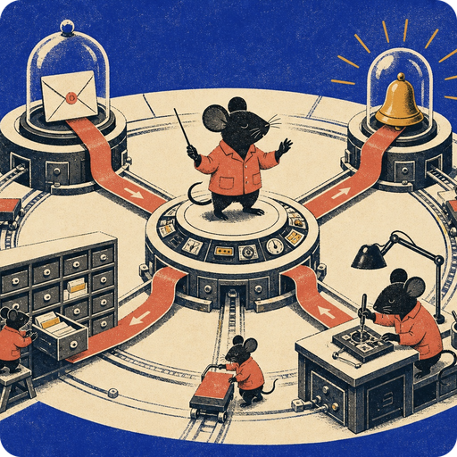
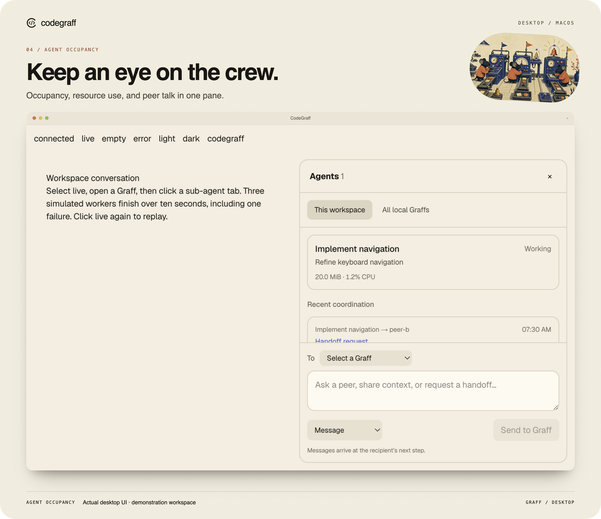
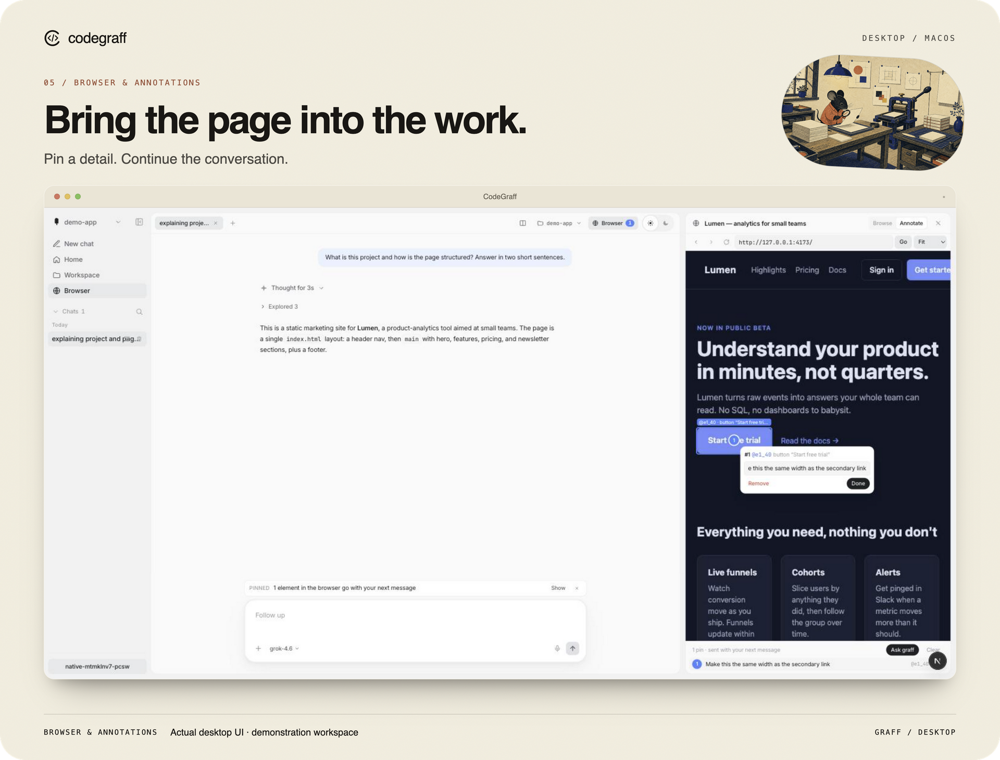
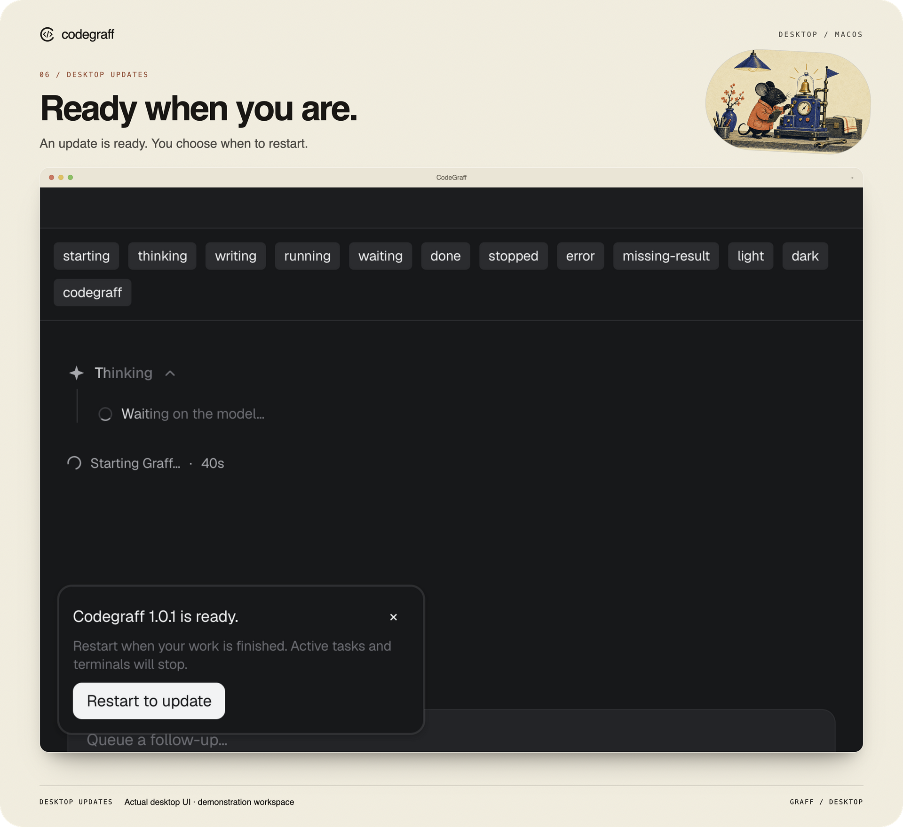

<p align="center">
  
</p>

<h1 align="center">CodeGraff</h1>

<p align="center">An AI agent for coding and computer work, in your terminal or desktop.</p>

<p align="center">
  
  
  
  
</p>

<p align="center">
  <a href="https://trendshift.io/repositories/84216?utm_source=repository-badge&utm_medium=badge&utm_campaign=badge-repository-84216" target="_blank" rel="noopener noreferrer"></a>
</p>

<p align="center">
  <a href="#quick-start">Quick start</a> ·
  <a href="#the-desktop-app">Desktop</a> ·
  <a href="#use-it-from-code">SDKs</a> ·
  <a href="#evaluation-results">Evaluations</a> ·
  <a href="#development">Development</a>
</p>

## Quick start

### Desktop for Mac

Apple Silicon · macOS 14+

1. [Download CodeGraff](https://github.com/justrach/codegraff/releases/latest/download/Codegraff-macos-arm64.dmg).
2. Quit any running copies, open the disk image, and drag **Codegraff.app** to **Applications**.
3. Eject the disk image and open **Codegraff** from Applications.

The signed and notarized app includes its runtime; no developer tools or local
server are needed. [Verify the download checksum](https://github.com/justrach/codegraff/releases/latest/download/Codegraff-DMG-SHA256SUMS).
For a `graff` command in your terminal, install the CLI below.

### Terminal

On macOS or Linux:

```sh
curl -fsSL https://github.com/justrach/codegraff/releases/latest/download/install.sh | sh
```

```sh
graff login                     # sign in
graff                           # start an interactive session
graff -p "Explain this project"  # ask a single question
```

<details>
<summary>Other login options, Windows, and editor integration</summary>

```sh
graff login kimi
graff login codex
graff key set deepseek sk-...
graff --model grok-4.6
```

From a checkout: `./install.sh` (binary in `~/bin`; `HARNESS_NO_PATH=1` skips
PATH edits). Windows: unpack `graff-*-windows.tar.gz` from the latest release
and put `graff.exe` on `PATH`.

`graff acp` is the [Agent Client Protocol](docs/embedding.md) spawn (Zed
External Agents). Recipe: [docs/acp-registry.md](docs/acp-registry.md).

</details>

## What can it do?

Describe a task in plain English. Graff can read and edit files, run commands,
use browser tools, and delegate work to sub-agents.

- **Build:** “Build a small app to track my workouts.”
- **Investigate:** “Find out why this page is slow.”
- **Work with data:** “Turn these CSVs into one clean spreadsheet.”
- **Compare:** “Try three approaches and test which works best.”

## The desktop app

Chat, coordinate agents, review changes, and browse in one workspace.
The desktop and terminal use the same Graff harness.

### Chat and context

[](docs/images/desktop-chat-light.png)

- **Keep track of work:** tabs distinguish running, finished, interrupted, and unread conversations.
- **Control the next step:** choose a model and effort level, or steer a queued follow-up with Cmd+Enter.
- **See what fits:** the composer shows remaining context and attachment previews.
- **Choose an appearance:** White, Black, Website, CodeGraff, or a custom theme through `$gui-theme`.

### Agents

[](docs/images/desktop-agents-codegraff.png)

See who is working, send a message, hand off a task, or stop a peer.
Messages arrive at the recipient’s next step. The Agents pane also shows
occupancy and resource use. [Read the Agents guide](docs/agents-panel.md).

<details>
<summary>View agent occupancy and resource use</summary>

[](docs/images/desktop-occupancy.png)

The optional profiler records anonymous resource measurements without identities
or message contents.

</details>

### Changes and browser

[](docs/images/desktop-review-dark.png)

Review staged, unstaged, and untracked edits alongside the conversation.
Inspect diffs, worktrees, and recent commits; resize the pane for more room.
The browser supports navigation, find, zoom, and pinned page elements.
Optional macOS computer use requires enabling it and granting system permissions.

<details>
<summary>View browser annotations</summary>

[](docs/images/native-browser-annotate.jpg)

Pin a page element and include it in your next message. Background browser work
keeps the focused chat in place.

</details>

<details>
<summary>Updates and restart</summary>

[](docs/images/desktop-update-ready.png)

Desktop builds from v0.0.291 check for updates online and download them in the
background. Choose **Restart to update** when your work is finished, or use
**Codegraff → Check for Updates…**. Automatic downloads can be disabled in that
menu. Earlier builds need one manual installation to enable the updater.
An app update replaces the bundled Graff engine together with the interface.
A CLI installed separately through Quick start has its own update lifecycle;
that command downloads a CLI archive, not the notarized desktop installer.

</details>

<details>
<summary>Sessions, attachments, and integrations</summary>

- Saved sessions are snapshots; navigation stays accessible in narrow windows.
- Sent images use compact thumbnails, while drafts keep a preview.
- Closed Mermaid code blocks render as diagrams.
- Muse Spark supports pasted, dropped, and attached images.
- MCP tools can display an App UI in an isolated result frame.
- `graff mcp install` registers a local HTTP task service for other clients.

</details>

*Images show unchanged GUI captures with scripted demonstration content.
Click an image to open the original capture.*

## How Graff handles work

**Sub-agents** work in parallel with their own context. A `workflow` combines
sequential phases of parallel children, passing results through `{{prev}}`.
Children use a one-level tool set without nested fan-out.

**Context** stays focused by reusing stable setup, running small programs over
working data, and carrying useful results forward. Large tool outputs become
handles you can page with `read_tool_result`. Use `/compact` to shorten the
transcript.

<p align="center">
  
</p>

## Use it from code

```python
from harness_sdk import Harness
with Harness(yolo=True, model="gpt-5.5") as h:
    print(h.ask("what is 2+2?"))
```

```ts
import { runAgent } from "@codegraff/sdk";
for await (const ev of runAgent({ prompt: "summarize README.md", yolo: true })) {
  if (ev.type === "text") process.stdout.write(ev.text);
}
```

`graff --json` / `graff --schema` generate the SDKs ([`sdk/`](sdk/)). Remote:
`graff serve`. MCP clients can delegate small tasks with
[`graff mcp serve`](docs/mcp-server.md). Embedders: `--no-local-tools` + a sandbox MCP —
[Embedding graff](docs/embedding.md).

<details>
<summary><strong>CLI, slash commands, providers, permissions</strong></summary>

<br/>

```
graff [flags]                 REPL
graff -p "prompt"             one-shot (answer on stdout)
graff login [codegraff|codex|kimi]
graff key set <provider> <key>
graff mcp add <name> -- <cmd>
graff learn <command>
graff --schema

--model <name>   --yolo   --json   --no-local-tools
--subagent-model <name>   --max-model-calls N
```

One-shot has no human at the gate: pre-approve in `.harness/settings.json` or
pass `--yolo`. Full flag list: `graff --help`. Learning:
[docs/local-learning.md](docs/local-learning.md). Skills:
[docs/skills.md](docs/skills.md).

```
/model /models /clear /new /goal /loop /review /never
/plan /yolo /strict /effort /compact /rewind /btw
/skills /plugins /mcp /save /resume /sessions /help
```

Bare `/` is a filterable menu. Esc interrupts the turn. `/help` is the live
catalog.

| mode | what it does |
| --- | --- |
| default | ask before writes, MCP, and non-read-only bash |
| `--yolo` / `/yolo` | skip every prompt (CI, `-p`) |
| `/plan` | read-only explore |
| `/strict` | every message is a tool |

Providers: Anthropic, OpenAI, DeepSeek, xAI, Z.AI, Kimi, Codex (ChatGPT login),
Vercel, OpenRouter, MiniMax, Xiaomi, Groq, Cerebras, Mistral, plus one
workspace router in `.graff/.config.router`. `graff models refresh` pulls
catalogs. Claude-subscription OAuth is deliberately not supported.

OpenAI's GPT-5.6 family is `gpt-5.6` (the API alias for `gpt-5.6-sol`),
`gpt-5.6-terra`, and `gpt-5.6-luna`, on the Responses wire via `openai`,
`codex`, or the Codegraff gateway. `/effort` takes `low|medium|high|xhigh`
plus the family's `max` (shown as Ultra; `medium` is the default). Reasoning
replays from local history, so `reasoning.context` is never sent
([ADR 0145](docs/adr/0145-gpt-5-6-reasoning-replays-from-local-history.md));
`reasoning.mode: "pro"` is not exposed yet.

</details>

## Evaluation results

The recorded live evaluation covers 12 PR tasks, with three runs per task.
A task passes when at least two runs pass. See the
[results receipt](artifacts/graff-evals-live/RECEIPT.md) for the recorded evidence.
The live, in-house, and FrontierHarness evaluations use different protocols
and should be read separately.

<details>
<summary>Recorded results and resource measurements</summary>


The recorded comparison below uses the same grok-4.6 SuperGrok seat.
Live PR tasks and distilled in-house fixtures are separate evaluations.
These are historical results, not a claim about every task or model.

<p align="center">
  
</p>

**Live 12 gated PRs** (2026-09-09, n=3, pass ≥2/3). Honest list$ is the official
low band on passing reps of passing tasks. SuperGrok cash is $0. Only graff-195
is G1–G6 certified. A check-green with no tokens does not count (exo’s last two
turbos died in &lt;1s). Receipt: [artifacts/graff-evals-live/RECEIPT.md](artifacts/graff-evals-live/RECEIPT.md).

| harness | tasks | reps | honest list$ | mean wall |
|---|---:|---:|---:|---:|
| **graff** | **12/12** | 35/36 | **$21.48** | 264s |
| Pi | 12/12 | 35/36 | $18.47 | 334s |
| OpenCode | 12/12 | 36/36 | $25.71 | 309s |
| grok | 11/12 | 33/36 | $33.69 | 362s |
| exo | **9/12** | 25/36 | $16.01 | 281s |

Grok drops `#727` (graff still 2/3). exo drops gemini-ix plus two no-token turbos.

**Distilled in-house fixtures** (`--suite inhouse`, repeatable comparison, not live):

| harness | pass | wall | calls | tokens | list$ | RSS |
|---|---:|---:|---:|---:|---:|---:|
| **graff** | **12/12** | **220s** | **53** | **234k** | **$0.32** | **8.7M** |
| grok-build | 12/12 | 490s | 60 | 1.12M | $1.07 | 155M |
| OpenCode | 12/12 | 235s | 77 | 675k | $0.68 | 1.0G |

Graff is the unique frontier on pass, wall, calls, tokens, list$, and RSS
in this measurement. (First-token is not scored — graff's `0.0s` is a boot
mark, not first model SSE. RSS is ReleaseSafe process peak.)

On the 3-task spine (exact-reply + file-ops + fix-fib) graff was **19.9s /
8 calls / $0.048** vs grok 32.3s / 8 / $0.147 and OpenCode 31.2s / 8 / $0.101.

### Footprint

| metric | measured |
| --- | --- |
| binary | **~3 MB**, zero runtime deps |
| cold start | **~1.8 ms** |
| full agentic turn | **~12 MB** peak RSS |
| 8 parallel subagents | **+0.4 MB** each |
| fat tool output | one **4 KB** handle, whatever the result's size |

Same model, same endpoint, the older Rust codegraff used **4.3×** the memory
and **~14×** the disk for a dead-heat turn. Method:
[docs/architecture.md](docs/architecture.md).

</details>

<details>
<summary>How we measure it: methodology, limitations, and reproduction</summary>

<a id="how-we-measure-it"></a>


Three evaluation layers, under `graff-evals/`. They answer different questions; none
is a leaderboard claim.

**Layer 0 — live gated PRs** (`--suite live`). Sparse-checkouts the real
package, pins the test that was red on the parent, holds out a follow-up the
public check does not name. No SPEC.md. Score pass @ n=3. ADR 0095.

**Layer 1 — the in-house runner** (`run.py`, `harnesses.json`, `tasks/`). Every
task is one JSON file: fixture files, a prompt, and a deterministic shell
`check` that decides pass/fail inside a materialized sandbox. Held-out checks
live in `hidden/` and are injected through `$TASK_ROOT` after the harness exits,
so the agent never sees them. Most harnesses take `--model`, so the same task
set can be driven through different harnesses on one model, and each run records
wall time, first-output latency, peak RSS, CPU and token usage alongside the
verdict, as JSONL plus a summary table.

45 tasks in five suites — `core` (12, sequential single-file work), `rlm` (5,
scatter-gather across files), `swe` (6, multi-file bugfixes), `mcp` (10, a
fixture MCP bench), `inhouse` (12, bug shapes distilled from shipped PRs).
`--suite all` is `core+rlm+swe`; `mcp` and `inhouse` are opt-in. 25 harness
configurations are declared, covering this project's variants plus several other
CLI agents. A task that `requires` a capability a harness lacks is skipped, not
scored as a failure. Cost is recomputed from tokens at published list rates,
because a flat-rate subscription prints `$0.0000` and that is a plan, not a
price.

What this layer proves: that a change moved a measured number on a fixed,
deterministic task set. What it does not prove: anything about the live repo —
the `inhouse` fixtures are distilled shapes, not the codebase.

**Layer 2 — `frontier-harness/`.** It runs the same 30 tasks as
[FrontierHarness Eval](https://github.com/frontier-harness-eval/eval)
— 21 from Terminal-Bench 2.1 and 9 from DeepSWE — in Docker, under a protocol
that is deliberately not the same bench seat (see "What these runs are not"
below, and `PROTOCOL.md`). The board side is a pinned snapshot of the published
results, not a live query. TB tasks are graded by running the public
`tests/test_outputs.py` inside the task container after the agent exits — pass
is `pytest` exit 0. The 9 DeepSWE tasks the upstream pack treats as having a
hidden grader are scored out of band by `grade_swe.py` against the tests
`datacurve-ai/deep-swe` actually ships, using the same images and the same
`prepare`/`test.sh` protocol, reading the verifier's `reward.json`. A missing
`reward.json` is recorded as FAIL, never inferred. A competing agent is run
locally on the same images and the same tests.

### What these runs are not

- **Not same seat as the published board.** The later recorded runs used an
  eval-only system-prompt append (`BENCH_APPEND`, passed as
  `--append-system-prompt`). It is task-shaped coaching the board's harnesses did
  not get. It never touched the shipped prompt in `prompt_text.zig`, and an
  appended-prompt result must not be placed next to a board result as a peer.
  The honest number is the un-appended first pass.
- **Different model.** The published board is Kimi K3; the recorded runs are
  mostly a different model. To compare fairly: empty `BENCH_APPEND`, same model,
  TB-21 only, and say so.
- **Different runtime.** The official eval restores a prepared VM. We
  `docker run` the public image and, on stripped images, add a CA bundle and
  install pytest so TLS and the tests can run at all. That is infrastructure,
  not a hint, but it is not bit-identical.
- **Asymmetric cost columns.** The locally run competing agent logged no token
  events, so its list price is missing — a telemetry gap, not zero. It is also
  driven through its own CLI and its own runner, so it shares the images and the
  tests but not the harness path. The chart refuses to place a row with no cost
  data on the frontier.
- **Mixed-model harness rows are a different comparison.** Entries that run
  another agent on its own native default model are not points in a same-model
  series, and `mcp` is always run in one mode because the other is a different
  tool catalog.
- Some recorded misses are environmental — an agent wall-clock cap, a server
  that did not outlive the agent process, a leftover build artifact breaking a
  file-layout constraint — and are written up as such in `FAILURES.md`. On the
  DeepSWE side `apply_failed` is not excused: it is a real failure.

### Reproduce

```sh
cd graff-evals

./run.py --harness graff                       # core+rlm+swe; mcp/inhouse are opt-in
./run.py --harness graff,grok --model grok-4.6 # harness-vs-harness, same model
./run.py --harness grok --task fix-fib --reps 3
zig build && ./run.py --harness graff-dev      # the locally built binary
./run.py --interactive                         # pick a task, watch it live
```

Results land in `results/run-<stamp>.jsonl`; `.sandboxes/` keeps the last run's
working directories for post-mortems. Both are disposable.

```sh
cd graff-evals/frontier-harness
export FH_GRAFF_MODEL=grok-4.6   # or kimi-k3 + MOONSHOT_API_KEY

python3 fh_run.py --suite tb  -j 2 --fresh --out results.jsonl      # TB-21
python3 fh_run.py --suite swe -j 2 --out swe-results.jsonl          # DeepSWE patches
python3 grade_swe.py grok-4.6                                       # grade those patches
python3 plot_tb21.py
```

The competing agent has its own runner, `fh_exo.py`, and its own binary
(`EXO_BIN`); `fh_run.py` does not drive it.

This layer is not turnkey. It needs Docker, a Linux build of the binary, the
upstream task pack, the pinned terminal-bench tests and a clone of
`datacurve-ai/deep-swe`, staged where the scripts expect them — `PROTOCOL.md`
has the locations. Model selection is an environment variable. No credential is
committed here: the metered path reads its key from the environment, and the
subscription path copies an existing local credentials file into the task
container.

</details>

## Development

The repository is organized as follows:

| path | what it is |
|---|---|
| `src/`, `TUI/` | harness + terminal |
| `apps/` | desktop (Electron) and iOS |
| `graff-evals/` | live, in-house, FrontierHarness |
| `docs/` | ADRs, architecture, images, install, embedding |
| `sdk/` | generated TypeScript / Python |
| `scripts/` | tier-1/2, PTY probes, release, desktop launch |

Desktop code lives in `apps/native`; evaluation tooling lives in `graff-evals`.

```bash
scripts/install-hooks.sh          # once
scripts/eval-tier1.sh             # offline checks
python3 scripts/eval-tier2.py     # model-backed, opt-in
```

Tier 1 is `zig fmt`, the 600-line ceiling, test reachability, `zig build test`
(suite count never shrinks), named goal/loop/todo invariants, and SDK drift.
Docs-only pushes skip it. In-house PR fixtures: `graff-evals/`
(`--suite inhouse`).

<details>
<summary>Build and test the desktop from source</summary>

Build on Apple Silicon macOS 14+ with Bun, Zig, and Xcode command-line tools:

```sh
./scripts/build_and_run.sh
```

The development bundle starts its own local server and uses local development
signing. Downloadable releases are signed and notarized.

**Profile and test without a model.** The Performance menu and desktop profiler
tool record bounded, local measurement reports. Startup paint timing, streaming
responsiveness, process resources and acceleration status are measured separately.
No reports are uploaded automatically. From `apps/native`:

```sh
bun run build
bun run test:desktop
bun run test:visual
bun run test:performance
```

The visual and performance scenarios use production GUI components with scripted
inputs and block engine/model API calls. See the [desktop guide](apps/native/electron/README.md)
and [visual test guide](apps/native/electron/VISUAL-TESTS.md) for scope and limitations.

</details>

## License

**Modified GNU AGPL-3.0** ([`LICENSE`](LICENSE)). Network use triggers
Section 13. Authors **Rach Pradhan (justrach)** and **Yu Xi Lim (yxlyx)**
reserve the right to offer proprietary or hosted versions. A recipient's AGPL
licence is perpetual unless they breach it. Commercial permission without
copyleft exists only if **both authors grant it jointly in writing**, and is
revocable.

<p align="center"><sub>Built in Zig 0.17 dev · <a href="LICENSE">AGPL-3.0 (modified)</a> · <a href="docs/architecture.md">architecture</a> · <a href="CHANGELOG.md">CHANGELOG</a> · <a href="docs/uxlog.md">uxlog</a></sub></p>
