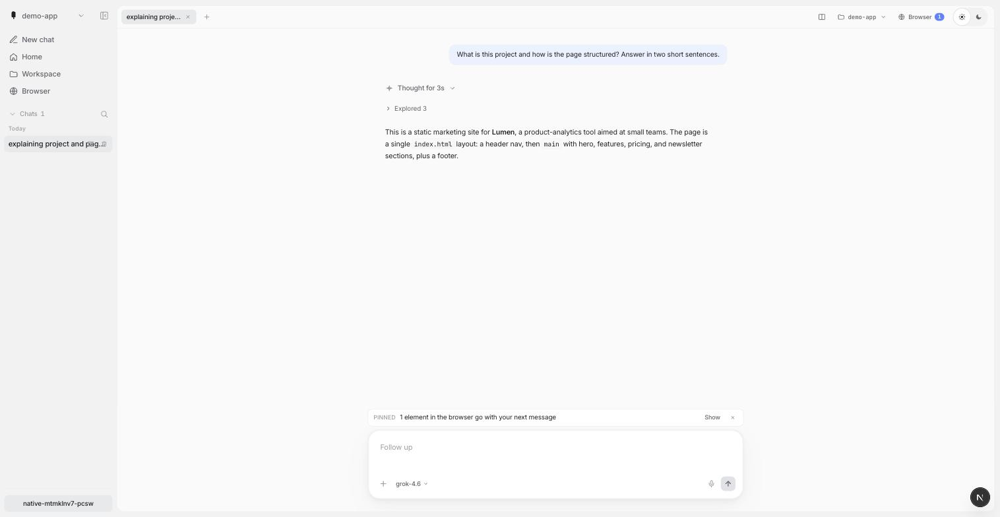
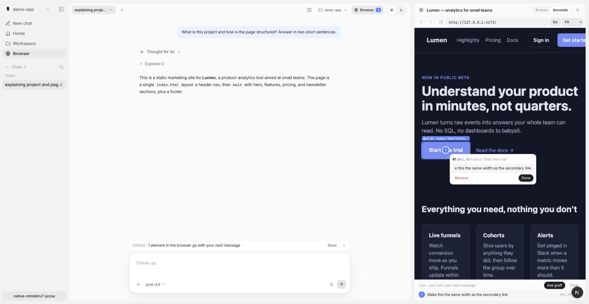

<p align="center">
  
</p>

<h1 align="center">graff</h1>

<p align="center">
  <strong>An AI that actually does the work. Not just talks about it.</strong>
</p>

<p align="center">
  Install it on your Mac, Linux, or Windows machine, sign in with the AI
  subscription you <em>already have</em>, and hand it real tasks. graff writes
  and runs code, automates the boring stuff, digs through your files, researches
  the web, and runs its own experiments until the job is done.<br/>
  <strong>You don't chat with it. You give it work.</strong>
</p>

<p align="center">
  
  
  
  
</p>

<p align="center">
  <a href="https://trendshift.io/repositories/84216?utm_source=repository-badge&utm_medium=badge&utm_campaign=badge-repository-84216" target="_blank" rel="noopener noreferrer"></a>
</p>

```sh
curl -fsSL https://github.com/justrach/codegraff/releases/latest/download/install.sh | sh
```

<p align="center"><sub>Prefer a window? Grab the <a href="#the-desktop-app">desktop app</a>. Then run <code>graff</code> and tell it what you need.</sub></p>

## The desktop app

A native macOS window for graff: chat tabs, each backed by its own `graff acp`
process, in a real app window instead of a browser tab. It is an AppKit
`NSWindow` with a `WKWebView` in it, written in Zig against the ObjC runtime —
no Electron.



The sidebar holds workspaces and the chat library; the footer shows the graff
session name so you can resume the same conversation from the CLI. Thinking and
tool calls collapse into single rows.



The browser pane (experimental) shows a live Chrome tab belonging to the chat.
In Annotate mode you click an element to pin it; the pin carries the element's
role, accessible name, selector and box, plus your note, and rides along with
your next message. The pane is [Kuri](https://github.com/justrach/kuri)'s
managed headless Chrome, so it needs Kuri installed or `KURI_BIN` pointed at
it; nothing starts until a pane is opened, a browser that sees no requests for
`GRAFF_BROWSER_IDLE_MINS` (default 20) is stopped again, and the tree is
restarted when it passes `GRAFF_BROWSER_MAX_RSS_MB` (default 3072).

**What it is, before you download it.** The app is a window, not a bundle of
the product: `Contents/` holds the shell binary and an icon, and nothing else.
It renders the local UI, and that UI spawns `graff acp` per chat tab. So you
need two things running before the window shows anything: the UI
(`npm install && npm run dev` in `apps/native`) and a graff binary at
`zig-out/bin/graff` — `zig build` at the repo root — or `GRAFF_BIN` pointing at
one. With no dev server up, double-clicking the app gives WebKit's
cannot-connect page.

**Download.** Grab `Codegraff-macos.zip` from the
[latest release](https://github.com/justrach/codegraff/releases/latest), unzip
it, and drag `Codegraff.app` to Applications. macOS 13 or newer, Apple Silicon —
the shipped binary is `arm64`-only. It is signed with a Developer ID under the
hardened runtime and notarized and stapled by Apple, so there is no
unidentified-developer block and no right-click-Open workaround; a freshly
downloaded copy still gets macOS's ordinary "downloaded from the Internet"
confirmation on first open.

Launched from Finder the app inherits no environment, so it looks for a dev
server on 127.0.0.1:3777, then 3000. `GRAFF_NATIVE_URL` applies only when the
binary is started from a shell.

**Building the shell.** `zig build` at the repo root builds the CLI, not the
window. The window is `apps/native/desktop/build-app.sh` (icon, `Info.plist`,
signing; `NOTARIZE=1` submits it to Apple, `INSTALL=1` puts it in
`/Applications`), or, for a loose binary with no bundle:

```sh
zig build-exe apps/native/desktop/main.zig -O ReleaseSmall \
  -femit-bin=zig-out/bin/graff-native \
  -framework AppKit -framework WebKit
```

**It updates itself.** Shortly after the window opens, on its own thread, it
asks GitHub for the newest release and compares that tag with its own stamped
version numerically, so 0.0.10 is newer than 0.0.9. It installs only after the
download passes `codesign --verify --deep --strict`, has a Team ID equal to the
running app's own, and is accepted by `spctl -a -t install`; then it asks once,
with "Later" and "Update and restart". Any failure abandons the update and
leaves the installed app alone. Both the API call and the download are under
the same 20-second network timeout. Setting `GRAFF_NATIVE_NO_UPDATE` disables
the check — any value, including empty; `=1` is the readable way to write it.
The mechanism depends on the release carrying an asset whose name starts with
`Codegraff` and ends with `.zip`, uploaded from a Mac: the tag-triggered
workflow cross-compiles on Linux and can neither sign nor notarize. A release
without that asset means installed apps find nothing and do nothing.

**macOS only today.** The shell is AppKit and WebKit — `NSWindow` and
`WKWebView` — and the packaging path uses `iconutil`, `codesign` and
`notarytool` from Xcode's command line tools. On other platforms the same
binary only prints the URL. The CLI runs on macOS, Linux and Windows.

## What can I ask it?

If you could do it at a computer, you can ask graff to do it for you:

- *"Build me a little app to track my workouts."* It writes it, runs it, and shows you.
- *"Turn this folder of messy CSVs into one clean spreadsheet."*
- *"Figure out why my site is slow, then fix it."*
- *"Scrape these five pages and summarize them."*
- *"Run an experiment: try three versions of this and tell me which scores best."*

It works in your real terminal, on your real files, with the real internet, and
it can spin up a team of sub-agents in parallel.

> **Don't write code?** You don't have to. Say what you want in plain English.

## Same model, fewer tokens

Same grok-4.6, same SuperGrok seat, same tasks. graff vs grok-build vs OpenCode.
Lower is better on every named axis. Full tables:
[graff-evals/hillclimb/baseline.md](graff-evals/hillclimb/baseline.md).

**12 shipped-PR fixtures** (`run-20260901-121759-composite` on 284, `--suite inhouse`):

| harness | pass | wall | calls | tokens | list$ | RSS |
|---|---:|---:|---:|---:|---:|---:|
| **graff** | **12/12** | **220s** | **53** | **234k** | **$0.32** | **8.7M** |
| grok-build | 12/12 | 490s | 60 | 1.12M | $1.07 | 155M |
| OpenCode | 12/12 | 235s | 77 | 675k | $0.68 | 1.0G |

Graff is the unique frontier on pass, wall, calls, tokens, list$, and RSS
on this remasure. (First-token is not scored — graff's `0.0s` is a boot
mark, not first model SSE. RSS is ReleaseSafe process peak.)

On the 3-task spine (exact-reply + file-ops + fix-fib) graff was **19.9s /
8 calls / $0.048** vs grok 32.3s / 8 / $0.147 and OpenCode 31.2s / 8 / $0.101.

How: a stable prompt-cache prefix, an RLM + spec-ptc loop that programs over
context instead of pasting it back, and slim tool results (4 KB handles,
learnt MCP shapes). The learn pin is a **hardlink**, not a 127M copy, and
`learn init` is detached so `-p` and the REPL share one path. Hosted `x_search`
stays on (ADR 0031). We do not steal grok-build's heap or a 4-tool catalog
(ADR 0024).

<p align="center">
  
</p>

## Install

**Desktop (macOS Apple Silicon).** Download the latest signed, notarized
[release](https://github.com/justrach/codegraff/releases/latest), drag it to
Applications. First launch puts `graff` and `codegraff <path>` on your PATH.

**CLI (macOS · Linux · Windows).**

```sh
curl -fsSL https://github.com/justrach/codegraff/releases/latest/download/install.sh | sh
```

From a checkout: `./install.sh` (binary in `~/bin`; `HARNESS_NO_PATH=1` skips
PATH edits). Windows: unpack `graff-*-windows.tar.gz` from the latest release
and put `graff.exe` on `PATH`.

```sh
graff login                     # free codegraff key
graff login kimi                # Kimi Code OAuth
graff login codex               # ChatGPT / Codex (or reuse ~/.codex/auth.json)
graff key set deepseek sk-...   # any other provider
graff                           # REPL
graff --model grok-4.6          # pin a model
graff -p "how many TODOs in src/?"
```

`graff acp` is the [Agent Client Protocol](docs/embedding.md) spawn (Zed
External Agents). Recipe: [docs/acp-registry.md](docs/acp-registry.md).

## Why it's small

| metric | measured |
| --- | --- |
| binary | **~3 MB**, zero runtime deps |
| cold start | **~1.8 ms** |
| full agentic turn | **~12 MB** peak RSS |
| 8 parallel subagents | **+0.4 MB** each |
| fat tool output | one **4 KB** handle, whatever the result's size |

Same model, same endpoint, the older Rust codegraff used **4.3×** the memory
and **~14×** the disk for a dead-heat turn. Method:
[architecture.md](architecture.md).

## Script it

```python
from harness_sdk import Harness
with Harness(yolo=True, model="gpt-5.5") as h:
    print(h.ask("what is 2+2?"))
```

```ts
import { runAgent } from "@codegraff/sdk";
for await (const ev of runAgent({ prompt: "summarize README.md", yolo: true })) {
  if (ev.type === "text") process.stdout.write(ev.text);
}
```

`graff --json` / `graff --schema` generate the SDKs ([`sdk/`](sdk/)). Remote:
`graff serve`. Embedders: `--no-local-tools` + a sandbox MCP —
[Embedding graff](docs/embedding.md).

<details>
<summary><strong>CLI, slash commands, providers, permissions</strong></summary>

<br/>

```
graff [flags]                 REPL
graff -p "prompt"             one-shot (answer on stdout)
graff login [codegraff|codex|kimi]
graff key set <provider> <key>
graff mcp add <name> -- <cmd>
graff learn <command>
graff --schema

--model <name>   --yolo   --json   --no-local-tools
--subagent-model <name>   --max-model-calls N
```

One-shot has no human at the gate: pre-approve in `.harness/settings.json` or
pass `--yolo`. Full flag list: `graff --help`. Learning:
[docs/local-learning.md](docs/local-learning.md). Skills:
[docs/skills.md](docs/skills.md).

```
/model /models /clear /new /goal /loop /review /never
/plan /yolo /strict /effort /compact /rewind /btw
/skills /plugins /mcp /save /resume /sessions /help
```

Bare `/` is a filterable menu. Esc interrupts the turn. `/help` is the live
catalog.

| mode | what it does |
| --- | --- |
| default | ask before writes, MCP, and non-read-only bash |
| `--yolo` / `/yolo` | skip every prompt (CI, `-p`) |
| `/plan` | read-only explore |
| `/strict` | every message is a tool |

Providers: Anthropic, OpenAI, DeepSeek, xAI, Z.AI, Kimi, Codex (ChatGPT login),
Vercel, OpenRouter, MiniMax, Xiaomi, Groq, Cerebras, Mistral, plus one
workspace router in `.graff/.config.router`. `graff models refresh` pulls
catalogs. Claude-subscription OAuth is deliberately not supported.

</details>

## How we measure it

Two layers, under `graff-evals/`. They answer different questions and neither
of them is a leaderboard claim.

**Layer 1 — the in-house runner** (`run.py`, `harnesses.json`, `tasks/`). Every
task is one JSON file: fixture files, a prompt, and a deterministic shell
`check` that decides pass/fail inside a materialized sandbox. Held-out checks
live in `hidden/` and are injected through `$TASK_ROOT` after the harness exits,
so the agent never sees them. Most harnesses take `--model`, so the same task
set can be driven through different harnesses on one model, and each run records
wall time, first-output latency, peak RSS, CPU and token usage alongside the
verdict, as JSONL plus a summary table.

45 tasks in five suites — `core` (12, sequential single-file work), `rlm` (5,
scatter-gather across files), `swe` (6, multi-file bugfixes), `mcp` (10, a
fixture MCP bench), `inhouse` (12, bug shapes distilled from shipped PRs).
`--suite all` is `core+rlm+swe`; `mcp` and `inhouse` are opt-in. 25 harness
configurations are declared, covering this project's variants plus several other
CLI agents. A task that `requires` a capability a harness lacks is skipped, not
scored as a failure. Cost is recomputed from tokens at published list rates,
because a flat-rate subscription prints `$0.0000` and that is a plan, not a
price.

What this layer proves: that a change moved a measured number on a fixed,
deterministic task set. What it does not prove: anything about the live repo —
the `inhouse` fixtures are distilled shapes, not the codebase.

**Layer 2 — `frontier-harness/`.** It runs the same 30 tasks as
[runta-dev/frontier-harness-eval](https://github.com/runta-dev/frontier-harness-eval)
— 21 from Terminal-Bench 2.1 and 9 from DeepSWE — in Docker, under a protocol
that is deliberately not the same bench seat (see "What these runs are not"
below, and `PROTOCOL.md`). The board side is a pinned snapshot of the published
results, not a live query. TB tasks are graded by running the public
`tests/test_outputs.py` inside the task container after the agent exits — pass
is `pytest` exit 0. The 9 DeepSWE tasks the upstream pack treats as having a
hidden grader are scored out of band by `grade_swe.py` against the tests
`datacurve-ai/deep-swe` actually ships, using the same images and the same
`prepare`/`test.sh` protocol, reading the verifier's `reward.json`. A missing
`reward.json` is recorded as FAIL, never inferred. A competing agent is run
locally on the same images and the same tests.

### What these runs are not

- **Not same seat as the published board.** The later recorded runs used an
  eval-only system-prompt append (`BENCH_APPEND`, passed as
  `--append-system-prompt`). It is task-shaped coaching the board's harnesses did
  not get. It never touched the shipped prompt in `prompt_text.zig`, and an
  appended-prompt result must not be placed next to a board result as a peer.
  The honest number is the un-appended first pass.
- **Different model.** The published board is Kimi K3; the recorded runs are
  mostly a different model. To compare fairly: empty `BENCH_APPEND`, same model,
  TB-21 only, and say so.
- **Different runtime.** The official eval restores a prepared VM. We
  `docker run` the public image and, on stripped images, add a CA bundle and
  install pytest so TLS and the tests can run at all. That is infrastructure,
  not a hint, but it is not bit-identical.
- **Asymmetric cost columns.** The locally run competing agent logged no token
  events, so its list price is missing — a telemetry gap, not zero. It is also
  driven through its own CLI and its own runner, so it shares the images and the
  tests but not the harness path. The chart refuses to place a row with no cost
  data on the frontier.
- **Mixed-model harness rows are a different comparison.** Entries that run
  another agent on its own native default model are not points in a same-model
  series, and `mcp` is always run in one mode because the other is a different
  tool catalog.
- Some recorded misses are environmental — an agent wall-clock cap, a server
  that did not outlive the agent process, a leftover build artifact breaking a
  file-layout constraint — and are written up as such in `FAILURES.md`. On the
  DeepSWE side `apply_failed` is not excused: it is a real failure.

### Reproduce

```sh
cd graff-evals

./run.py --harness graff                       # core+rlm+swe; mcp/inhouse are opt-in
./run.py --harness graff,grok --model grok-4.6 # harness-vs-harness, same model
./run.py --harness grok --task fix-fib --reps 3
zig build && ./run.py --harness graff-dev      # the locally built binary
./run.py --interactive                         # pick a task, watch it live
```

Results land in `results/run-<stamp>.jsonl`; `.sandboxes/` keeps the last run's
working directories for post-mortems. Both are disposable.

```sh
cd graff-evals/frontier-harness
export FH_GRAFF_MODEL=grok-4.6   # or kimi-k3 + MOONSHOT_API_KEY

python3 fh_run.py --suite tb  -j 2 --fresh --out results.jsonl      # TB-21
python3 fh_run.py --suite swe -j 2 --out swe-results.jsonl          # DeepSWE patches
python3 grade_swe.py grok-4.6                                       # grade those patches
python3 plot_tb21.py
```

The competing agent has its own runner, `fh_exo.py`, and its own binary
(`EXO_BIN`); `fh_run.py` does not drive it.

This layer is not turnkey. It needs Docker, a Linux build of the binary, the
upstream task pack, the pinned terminal-bench tests and a clone of
`datacurve-ai/deep-swe`, staged where the scripts expect them — `PROTOCOL.md`
has the locations. Model selection is an environment variable. No credential is
committed here: the metered path reads its key from the environment, and the
subscription path copies an existing local credentials file into the task
container.

## Working on codegraff

```bash
scripts/install-hooks.sh          # once
scripts/eval-tier1.sh             # offline, ~20s warm
python3 scripts/eval-tier2.py     # model-backed, opt-in
```

Tier 1 is `zig fmt`, the 600-line ceiling, test reachability, `zig build test`
(suite count never shrinks), named goal/loop/todo invariants, and SDK drift.
Docs-only pushes skip it. In-house PR fixtures: `graff-evals/`
(`--suite inhouse`).

## License

**Modified GNU AGPL-3.0** ([`LICENSE`](LICENSE)). Network use triggers
Section 13. Authors **Rach Pradhan (justrach)** and **Yu Xi Lim (yxlyx)**
reserve the right to offer proprietary or hosted versions. A recipient's AGPL
licence is perpetual unless they breach it. Commercial permission without
copyleft exists only if **both authors grant it jointly in writing**, and is
revocable.

<p align="center"><sub>Built in Zig 0.17 dev · <a href="LICENSE">AGPL-3.0 (modified)</a> · <a href="architecture.md">architecture.md</a> · <a href="CHANGELOG.md">CHANGELOG</a> · <a href="uxlog.md">uxlog.md</a></sub></p>
