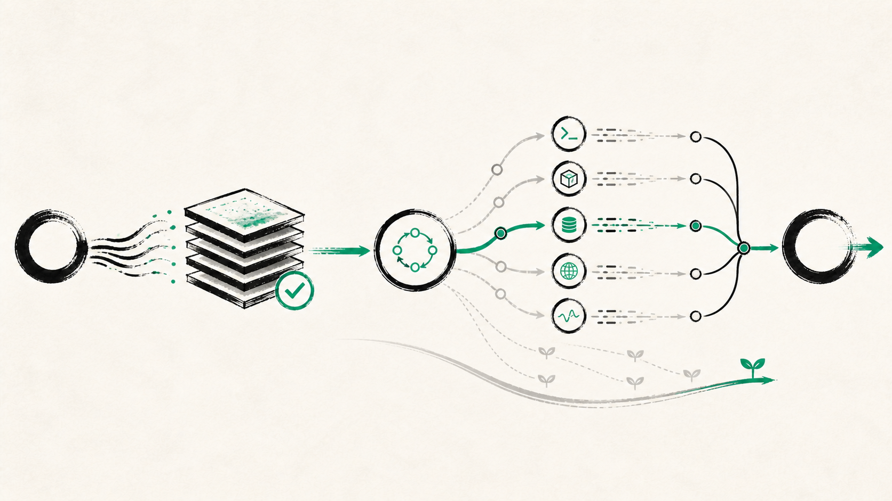

<p align="center">
  
</p>

<h1 align="center">graff</h1>

<p align="center">
  <strong>An AI that actually does the work. Not just talks about it.</strong>
</p>

<p align="center">
  Install it on your Mac, Linux, or Windows machine, sign in with the AI
  subscription you <em>already have</em>, and hand it real tasks. graff writes
  and runs code, automates the boring stuff, digs through your files, researches
  the web, and runs its own experiments until the job is done.<br/>
  <strong>You don't chat with it. You give it work.</strong>
</p>

<p align="center">
  
  
  
  
</p>

<p align="center">
  <a href="https://trendshift.io/repositories/84216?utm_source=repository-badge&utm_medium=badge&utm_campaign=badge-repository-84216" target="_blank" rel="noopener noreferrer"></a>
</p>

```sh
curl -fsSL https://github.com/justrach/codegraff/releases/latest/download/install.sh | sh
```

<p align="center"><sub>Prefer a window? Grab the <a href="#install">desktop app</a>. Then run <code>graff</code> and tell it what you need.</sub></p>

## What can I ask it?

If you could do it at a computer, you can ask graff to do it for you:

- *"Build me a little app to track my workouts."* It writes it, runs it, and shows you.
- *"Turn this folder of messy CSVs into one clean spreadsheet."*
- *"Figure out why my site is slow, then fix it."*
- *"Scrape these five pages and summarize them."*
- *"Run an experiment: try three versions of this and tell me which scores best."*

It works in your real terminal, on your real files, with the real internet, and
it can spin up a team of sub-agents in parallel.

> **Don't write code?** You don't have to. Say what you want in plain English.

## Same model, fewer tokens

Same grok-4.6, same SuperGrok seat, same tasks. graff vs grok-build vs OpenCode.
Lower is better on every named axis. Full tables:
[graff-evals/hillclimb/baseline.md](graff-evals/hillclimb/baseline.md).

**12 shipped-PR fixtures** (`run-20260830-141658`, `--suite inhouse`):

| harness | pass | wall | calls | tokens | list$ | RSS |
|---|---:|---:|---:|---:|---:|---:|
| **graff** | **12/12** | **192s** | **52** | **228k** | **$0.35** | **92M** |
| grok-build | 12/12 | 462s | 63 | 1.18M | $1.12 | 170M |
| OpenCode | 12/12 | 236s | 74 | 675k | $0.79 | 1.1G |

Graff is the unique frontier on pass, wall, calls, tokens, list$, and RSS.
(First-token is not scored on that run — graff's `0.02s` is a boot mark, not
first model SSE.)

On the 3-task spine (exact-reply + file-ops + fix-fib) graff was **19.9s /
8 calls / $0.048** vs grok 32.3s / 8 / $0.147 and OpenCode 31.2s / 8 / $0.101.

How: a stable prompt-cache prefix, an RLM + spec-ptc loop that programs over
context instead of pasting it back, and slim tool results (4 KB handles,
learnt MCP shapes). The learn pin is a **hardlink**, not a 127M copy, and
`learn init` is detached so `-p` and the REPL share one path. Hosted `x_search`
stays on (ADR 0031). We do not steal grok-build's heap or a 4-tool catalog
(ADR 0024).

<p align="center">
  
</p>

## Install

**Desktop (macOS Apple Silicon).** Download the latest signed, notarized
[release](https://github.com/justrach/codegraff/releases/latest), drag it to
Applications. First launch puts `graff` and `codegraff <path>` on your PATH.

**CLI (macOS · Linux · Windows).**

```sh
curl -fsSL https://github.com/justrach/codegraff/releases/latest/download/install.sh | sh
```

From a checkout: `./install.sh` (binary in `~/bin`; `HARNESS_NO_PATH=1` skips
PATH edits). Windows: unpack `graff-*-windows.tar.gz` from the latest release
and put `graff.exe` on `PATH`.

```sh
graff login                     # free codegraff key
graff login kimi                # Kimi Code OAuth
graff login codex               # ChatGPT / Codex (or reuse ~/.codex/auth.json)
graff key set deepseek sk-...   # any other provider
graff                           # REPL
graff --model grok-4.6          # pin a model
graff -p "how many TODOs in src/?"
```

`graff acp` is the [Agent Client Protocol](docs/embedding.md) spawn (Zed
External Agents). Recipe: [docs/acp-registry.md](docs/acp-registry.md).

## Why it's small

| metric | measured |
| --- | --- |
| binary | **~3 MB**, zero runtime deps |
| cold start | **~1.8 ms** |
| full agentic turn | **~12 MB** peak RSS |
| 8 parallel subagents | **+0.4 MB** each |
| fat tool output | one **4 KB** handle, whatever the result's size |

Same model, same endpoint, the older Rust codegraff used **4.3×** the memory
and **~14×** the disk for a dead-heat turn. Method:
[architecture.md](architecture.md).

## Script it

```python
from harness_sdk import Harness
with Harness(yolo=True, model="gpt-5.5") as h:
    print(h.ask("what is 2+2?"))
```

```ts
import { runAgent } from "@codegraff/sdk";
for await (const ev of runAgent({ prompt: "summarize README.md", yolo: true })) {
  if (ev.type === "text") process.stdout.write(ev.text);
}
```

`graff --json` / `graff --schema` generate the SDKs ([`sdk/`](sdk/)). Remote:
`graff serve`. Embedders: `--no-local-tools` + a sandbox MCP —
[Embedding graff](docs/embedding.md).

<details>
<summary><strong>CLI, slash commands, providers, permissions</strong></summary>

<br/>

```
graff [flags]                 REPL
graff -p "prompt"             one-shot (answer on stdout)
graff login [codegraff|codex|kimi]
graff key set <provider> <key>
graff mcp add <name> -- <cmd>
graff learn <command>
graff --schema

--model <name>   --yolo   --json   --no-local-tools
--subagent-model <name>   --max-model-calls N
```

One-shot has no human at the gate: pre-approve in `.harness/settings.json` or
pass `--yolo`. Full flag list: `graff --help`. Learning:
[docs/local-learning.md](docs/local-learning.md). Skills:
[docs/skills.md](docs/skills.md).

```
/model /models /clear /new /goal /loop /review /never
/plan /yolo /strict /effort /compact /rewind /btw
/skills /plugins /mcp /save /resume /sessions /help
```

Bare `/` is a filterable menu. Esc interrupts the turn. `/help` is the live
catalog.

| mode | what it does |
| --- | --- |
| default | ask before writes, MCP, and non-read-only bash |
| `--yolo` / `/yolo` | skip every prompt (CI, `-p`) |
| `/plan` | read-only explore |
| `/strict` | every message is a tool |

Providers: Anthropic, OpenAI, DeepSeek, xAI, Z.AI, Kimi, Codex (ChatGPT login),
Vercel, OpenRouter, MiniMax, Xiaomi, Groq, Cerebras, Mistral, plus one
workspace router in `.graff/.config.router`. `graff models refresh` pulls
catalogs. Claude-subscription OAuth is deliberately not supported.

</details>

## Working on codegraff

```bash
scripts/install-hooks.sh          # once
scripts/eval-tier1.sh             # offline, ~20s warm
python3 scripts/eval-tier2.py     # model-backed, opt-in
```

Tier 1 is `zig fmt`, the 600-line ceiling, test reachability, `zig build test`
(suite count never shrinks), named goal/loop/todo invariants, and SDK drift.
Docs-only pushes skip it. In-house PR fixtures: `graff-evals/`
(`--suite inhouse`).

## License

**Modified GNU AGPL-3.0** ([`LICENSE`](LICENSE)). Network use triggers
Section 13. Authors **Rach Pradhan (justrach)** and **Yu Xi Lim (yxlyx)**
reserve the right to offer proprietary or hosted versions. A recipient's AGPL
licence is perpetual unless they breach it. Commercial permission without
copyleft exists only if **both authors grant it jointly in writing**, and is
revocable.

<p align="center"><sub>Built in Zig 0.17 dev · <a href="LICENSE">AGPL-3.0 (modified)</a> · <a href="architecture.md">architecture.md</a> · <a href="CHANGELOG.md">CHANGELOG</a> · <a href="uxlog.md">uxlog.md</a></sub></p>
