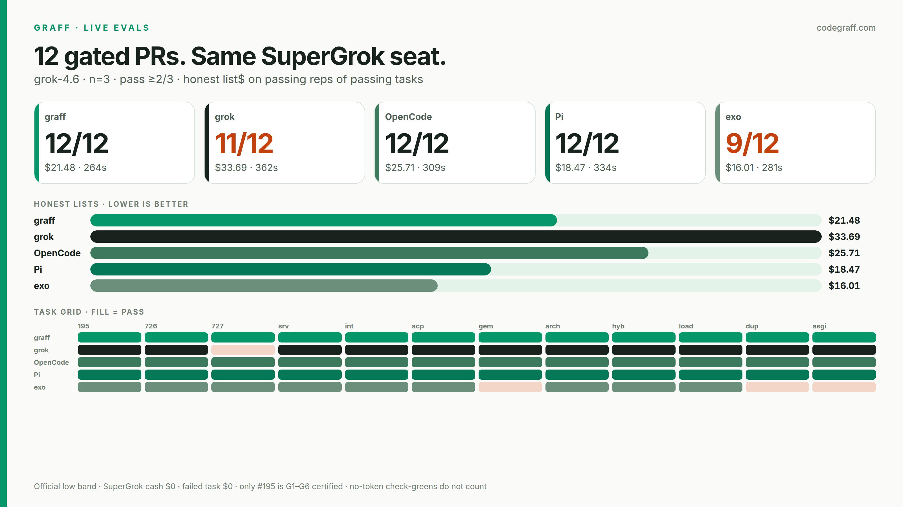

# Live evals · 12 gated PRs · 2026-09-09

Same **grok-4.6** SuperGrok seat. No SPEC.md. n=3. Task pass ≥2/3.
Honest list$ is the official low band (`$2 / $0.50 cached / $6 out` per 1M)
on **passing reps of passing tasks**. Failed tasks contribute $0.
SuperGrok cash is $0. Wall is a hang detector. Do not score Graff
first-token (boot `›`).

Only **graff-195** is G1–G6 certified. The other 11 are published live
tasks, not a second gate pass.

| harness | reps | tasks | honest list$ | mean wall |
|---|---:|---:|---:|---:|
| **graff** | 35/36 | **12/12** | **$21.48** | 264s |
| grok | 33/36 | **11/12** | $33.69 | 362s |
| OpenCode | 36/36 | **12/12** | $25.71 | 309s |
| Pi | 35/36 | **12/12** | $18.47 | 334s |
| exo | 25/36 | **9/12** | $16.01 | 281s |

A check-green with **no tokens does not count**. exo's last two turbo
tasks (`turbo-ws-duplex`, `turbo-asgi`) exited in <1s with no usage —
the public check still passed on the untouched tree. `graff-gemini-ix`
is 1 real pass. Grok still drops `#727`. Stored JSONL `list$` high-bands
the *rep* sum (~2×); do not tweet that column.

Machine-local JSONL (gitignored): `run-20260908-173944` (#195),
`run-20260908-182322` (graff rest), `run-20260909-011118` (grok),
`run-20260909-042501` (OpenCode), `run-20260909-095017` (Pi),
`run-20260909-095016` (exo). Rebuild the card with
`python3 graff-evals/plot_live.py --from-jsonl`.
