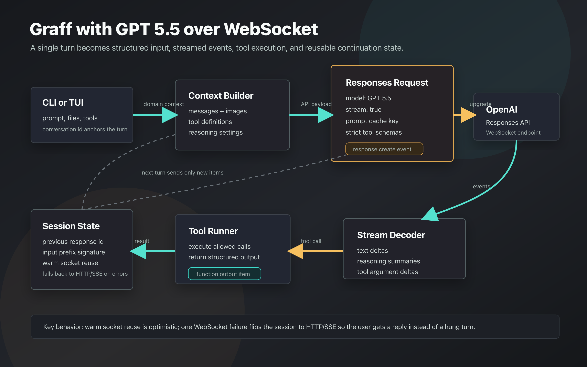
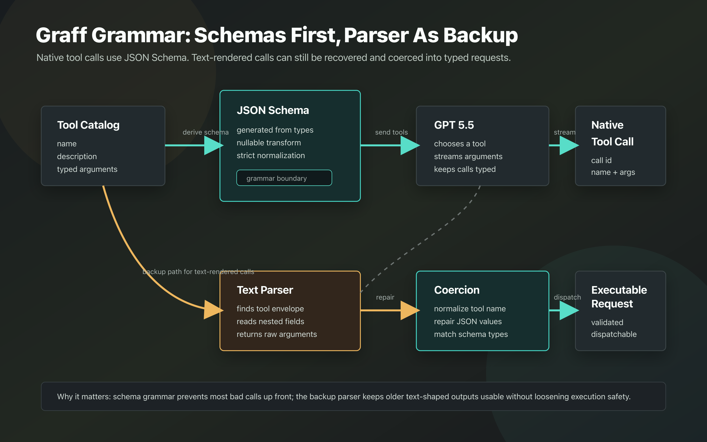
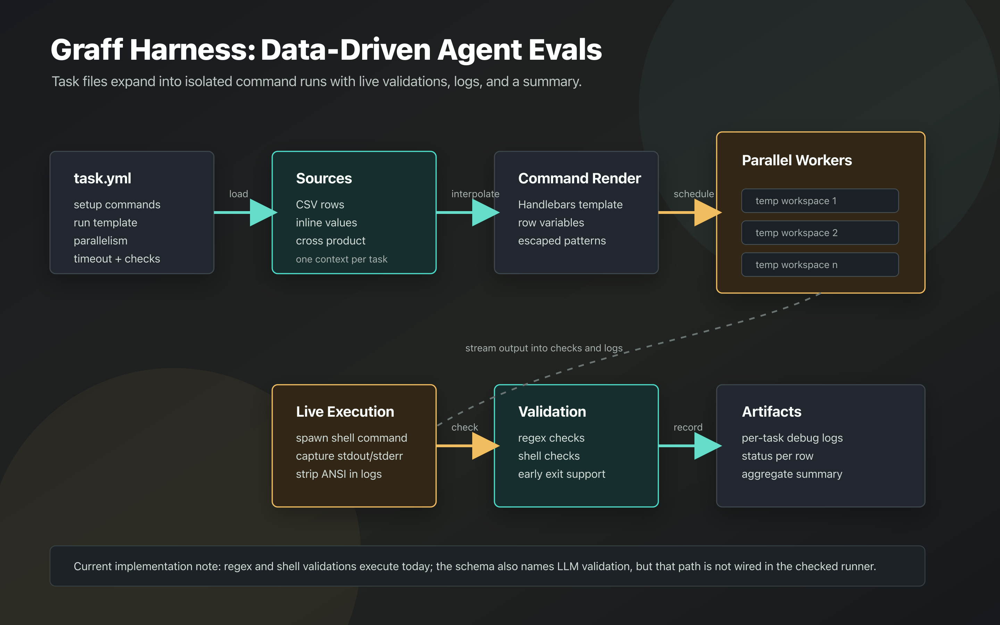

# Graff Showcase: GPT 5.5, WebSockets, Grammar, And The Harness

This is a compact, CodeDB-assisted map of how Graff works around GPT 5.5, the OpenAI Responses API, WebSocket streaming, tool-call grammar, and the evaluation harness.

## The Short Version

Graff is a terminal-first agent stack. The CLI or TUI gathers the prompt, workspace context, tool definitions, model settings, and conversation id. The provider layer turns that domain context into an OpenAI Responses request. For GPT 5.5, Graff can stream over a persistent WebSocket, decode response events as they arrive, dispatch tools, feed tool outputs back into the next request, and reuse continuation state so later turns send less duplicated context.

The model registry includes `gpt-5.5-2026-04-23` as `GPT-5.5` with a 1,050,000 token context window, text and image input, reasoning support, tool support, and parallel tool-call support. There is also a Pro variant with the same context size.

## WebSocket Flow

Graff opts into the Responses WebSocket path when the Responses provider supports it and either config or `GRAFF_OPENAI_RESPONSES_WEBSOCKET` enables it.

The important behavior is:

- Graff builds a Responses request from conversation messages, image inputs, tools, tool choice, max output tokens, reasoning config, and a prompt cache key derived from the conversation id.
- The WebSocket path converts the Responses URL to `ws` or `wss`, sends a `response.create` event, and then consumes streaming events.
- The stream decoder maps text deltas, reasoning deltas, function-call additions, function-call argument deltas, completion, incomplete, and failure events into Graff chat messages.
- On a successful terminal event, Graff records the response id, input length, input signature, and warm socket.
- On the next turn, if the input prefix still matches, Graff sends `previous_response_id` plus only new user messages and tool outputs.
- If WebSocket setup, receiving, or idle waiting fails, Graff flips a process-level switch and falls back to HTTP/SSE for the current and later turns.

That last point is the practical reliability trick: WebSockets are a latency optimization, not a single point of failure.

## Grammar And Tool Calls

Graff has two grammar paths.

The primary path is schema-native. Tool definitions are generated from typed Rust structures into JSON Schema. Those schemas are normalized for provider compatibility, including strict schema handling for Responses tools. GPT 5.5 receives the tool list as native function tools, streams tool-call events, and Graff keeps enough state to join streamed argument chunks back to the right call id and tool name.

The backup path is text-native. If a provider emits a text-shaped tool call instead of native tool events, Graff can parse a legacy XML-style envelope, extract nested argument fields, normalize the tool name, and coerce arguments against the catalog schema before dispatching. This keeps older model styles usable while still landing in the same typed execution path.

The schema coercion step matters because LLM output often gets close but not perfect: numeric strings, booleans, arrays, and nullable shapes can be repaired into the expected schema when safe.

## Harness Flow

The harness is a TypeScript evaluation runner for Graff commands.

It reads a `task.yml`, runs optional setup commands, loads CSV or inline value sources, creates the cross product of all source rows, renders command templates with Handlebars, and executes each task in its own temporary workspace. `parallelism` controls concurrency. `timeout` kills long-running tasks. `early_exit` watches output as it streams and can stop a task once all validations pass.

Validation support in the checked runner is currently regex and shell based. The task schema also names an LLM validation type, but the validation implementation I inspected does not execute that branch yet.

Each task writes a debug log with command, timing, stdout, stderr, and exit metadata. At the end, the runner reports counts for passed tasks, validation failures, timeouts, failed runs, total duration, and validation totals.

## How The Pieces Fit

1. The model registry says GPT 5.5 can reason, see images, and use parallel tools.
2. The app layer assembles a context with messages, tools, workspace inputs, and policy.
3. The Responses request layer translates that context into GPT 5.5 input items and tool schemas.
4. The WebSocket layer streams events and preserves continuation state.
5. The response layer turns streamed model output into Graff messages and tool calls.
6. The tool grammar layer validates or repairs arguments before execution.
7. The harness runs repeatable scenarios against the CLI and checks whether the behavior matches expectations.

## Suggested Demo Script

Use this framing when presenting it:

> Graff treats GPT 5.5 as a streaming reasoning engine with typed tool grammar. WebSockets make tool-heavy turns faster by reusing the live session and sending only deltas after the first successful turn. The grammar layer keeps tool calls typed and recoverable. The harness turns that behavior into repeatable evals, so model and transport changes can be tested instead of guessed.

## Generated Image Prompt

The hero image was generated with the built-in image tool using a text-free editorial prompt: a polished technical illustration of Graff coordinating model reasoning, WebSocket streaming, grammar constraints, and evaluation runs, with no readable UI text, logos, or watermarks.
