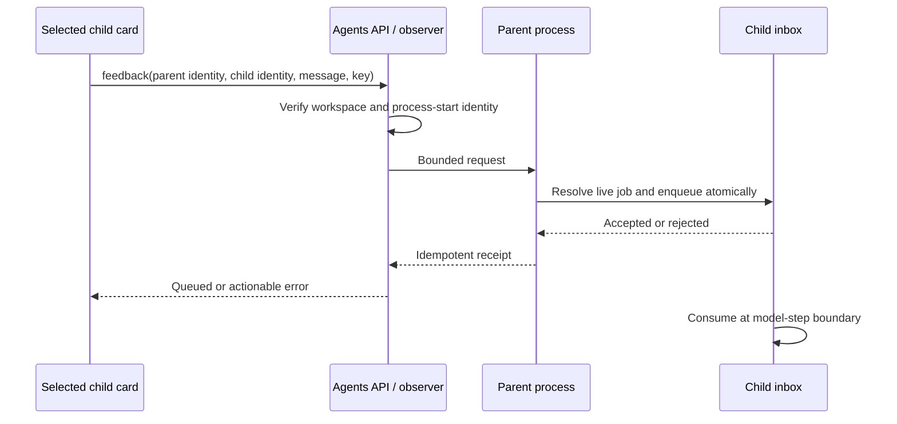

# GUI child feedback integration

Status: investigated; the GUI transport below is not implemented.

## Current behavior

The parent model receives `[agent N started: label]` and uses the numeric handle
with `agent_message`. Labels explain the assignment; they are not routing keys.
Two identical labels remain distinct jobs. Selection from natural language is
model behavior, while delivery to an explicit handle is deterministic.

`SubagentActivity` already selects a child and shows its task, live activity and
Stop control. It calls `/api/agents`, which runs `agent-observer.cjs` in a separate
observer process. `graff/agents` validates parent process-start identity and
workspace scope before reading the child snapshot. The snapshot's `sa-…` id is
created inside `subagent_run.zig`; it is not the numeric background job handle.
The observer has no access to the owning process's in-memory feedback inbox.

Consequently, forwarding a card id to `agent_message`, sending a peer DM, or
matching a label would not implement reliable child feedback.

## Proposed wire contract

1. Publish an explicit association between the activity id and its live job,
   with a feedback capability. Initially advertise it only for direct background
   jobs with an inbox; workflow and foreground children must not show a working
   Send control until they have the same support.
2. Add a `feedback` action to `/api/agents` and `graff/agents`, carrying `target`,
   `startId`, `child`, `message` and an idempotency key. Retain existing scope and
   parent identity validation. Enforce UTF-8 byte limits in the backend.
3. Route the request to the owning process through a bounded local mailbox or
   IPC endpoint. The owner resolves the explicit association and calls the same
   inbox admission used by `agent_message`. It returns a receipt only after
   enqueue succeeds. A file write alone cannot acknowledge inbox acceptance:
   final completion and enqueue must retain their existing atomic ordering.
4. Put a feedback composer under the selected child's task. Keep drafts keyed
   by parent process identity plus child id. Show the destination label and
   task beside Send. Capture that identity on submission; a late response must
   not clear another child's draft or show its receipt on the new selection.
5. Display `Queued — applies after the current operation` on owner admission.
   Distinguish pending transport, rejected/finished, and unavailable owner.
   Never automatically retry a timed-out submission without the same key.

## Parent chat interactivity is a separate integration

`subagent_interactive.configure` is currently enabled by the terminal REPL and
TUI launch paths. The GUI's ACP worker does not opt in. Do not simply toggle the
process-global flag: ACP needs to finish the parent prompt cleanly, preserve
child-owned resources across that response, and schedule completion handling
without overlapping an active prompt or replacing a user's draft. Explicit
client capability negotiation can retain existing headless wait behavior.

## Verification gates

The offline tier-2 `subagent-routing-normal` and `subagent-routing-reversed`
cases run two real child workers against a scripted model. They parse handles
from actual spawn receipts, hold both children in tools, send different notes,
reject an unknown handle, and inspect each child's next model request for
exactly one intended note and no sibling note. These test transport isolation,
not a real model's ability to select a child from a user's description.

Before wiring completion: add owner transport tests for finished/unknown child,
parent restart, duplicate submission and enqueue/final races; GUI tests for
selection changes during Send, per-child drafts, unavailable capability and
queued versus delivered receipts; then an ACP lifecycle eval proving another
parent prompt can complete while children continue, with one completion wake.
Use hidden GUI tests in accordance with ADR 0101.

A real-model selection eval should use two distinct assignments, reversed launch
order, duplicate labels with distinct tasks, and an ambiguous request that
requires clarification. Score the chosen tool arguments and actual recipient
history, not the model's final claim. Report repetitions and model configuration
with results; scripted success is not evidence of semantic routing accuracy.
