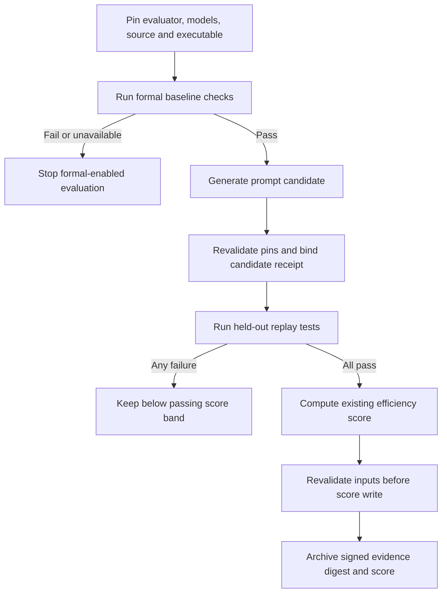

# Formal checks in the evolution loop

Formal evidence is an admission condition, not a fitness reward. Passing a
model check must never compensate for failed task correctness, and neither
formal success nor a smaller prompt establishes a performance improvement.

## Prompt evolution and source evolution

`examples/dgm_loop.py` evolves prompt genomes. Its correctness gate is the
external held-out replay judge. Its current passing score ranks tool economy:
`total / (total + tool_calls)`. Formal checks validate the pinned harness
baseline beneath those prompt candidates; they do not prove prompt behavior.
Keep the reward formula unchanged when adding the gate.

For harness-source evolution, each candidate instead needs an immutable source
identity, a reviewed mapping between its lifecycle changes and formal actions,
model checks, and runtime regressions. Hashing a source tree and an executable
records their identities; it does not prove the executable was built from that
source. A reproducible build or attested build receipt supplies that separate
link.

## Evaluation flow



The same checked baseline can be reused for multiple prompts while every pinned
input remains unchanged. Input drift invalidates admission; it must not silently
trigger a new baseline or allow the candidate to rewrite its own checker.
Keep evaluator copies and pin files outside the editable task workspace. These
integrity checks do not replace OS isolation for adversarial evolution.

A receipt should distinguish source/model identity, finite checked properties,
checker result, candidate prompt identity, held-out suite identity and executable
identity. Preserve the original replay suite hash and bind the formal receipt
into score provenance. Retain formal failure separately from replay failure,
unknown measurement and an ordinary low efficiency score.

## Python example opt-in

Create a new verifier directory outside the candidate checkout using
`examples/dgm_formal_gate.py --pin`, supplying the harness executable, Java,
TLC archive, and explicit mutation and replay model selectors. Set
`GRAFF_DGM_FORMAL_PIN` to the resulting pin file and `GRAFF_SCORE_KEY_FILE`
to the existing signing key before running `examples/dgm_loop.py`. The helper
checks the pinned formal bundle once per unchanged identity. Normal mode remains
unchanged when no formal pin is configured.

Mutation and replay roles may intentionally use different model selectors;
record both rather than silently conflating them. Selectors and binary hashes
are not proof of the provider route actually served during inference. Historical
scores remain possible parents, but do not become formally checked ancestry.
Only new evaluations admitted through formal mode carry its evidence.

```sh
python3 examples/dgm_formal_gate.py --pin "$PIN_DIR" \
  --binary "$HARNESS_BINARY" --java "$JAVA" --jar "$TLA2TOOLS" \
  --main-model "$MAIN_MODEL" --replay-model "$REPLAY_MODEL"
GRAFF_DGM_FORMAL_PIN="$PIN_DIR/pin.json" \
  GRAFF_SCORE_KEY_FILE="$SCORE_KEY_FILE" \
  python3 examples/dgm_loop.py "Your evaluation task" 3
```

The pin directory must be new and outside the source checkout. Set the model
selectors explicitly for the mutation and replay roles. Receipts and bounded
checker logs stay private. To audit an archived signed score, set the same
signing-key environment variable and run:

```sh
python3 examples/dgm_formal_gate.py --verify-row "$SCORE_ROW_JSON" \
  --pin-file "$PIN_DIR/pin.json"
```

Formal score rows resolve to `score-<artifact digest>.json` receipts. Validation
checks the signature, prompt/report hashes, original held-out hash, preflight
receipt, pinned identity and archived checker evidence. It also runs the current
pinned model checks; their raw output need not match an earlier successful log.

## Native learning and remaining promotion paths

Native `graff learn` has a separate opt-in `formal_check` configuration; see
[local learning](../docs/local-learning.md) for setup and its trust boundary.
`src/learn_formal.zig` checks the pinned baseline before mutation and binds
evidence to the parent or selected prompt. The existing tournament and holdout
rules still decide candidate eligibility.

Formal-enabled runs use pending-record version 2 and run-record version 4.
Resume and both manual and automatic promotion recheck the stored evidence and
pinned identity. Legacy records remain readable but cannot satisfy formal-mode
promotion. The manifest's executable must also be a pinned input and argument
to both learning adapters; this records the adapter contract, not a proof that
an arbitrary adapter executes that argument.

Native formal-enabled runs stay local: explicit submission is rejected, and
automatic learning omits contribution. The signed aggregate receipt format
does not yet bind formal evidence. The separate `src/fleet.zig` persona archive
promotion path remains ungated. Historical scores must not be presented as
formally checked merely because a newer evaluation enables this option.

## Performance evidence remains separate

Wall time, input/output tokens, cached input, cache writes and cost need paired
runtime measurements with preserved failures and per-metric completeness.
Unknown usage is not zero, and subscription usage is not a billed-dollar receipt.
The formal gate does not change these measurement requirements or establish
that a candidate is faster, cheaper, or more capable.
