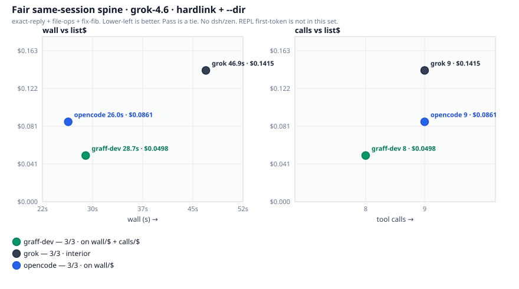
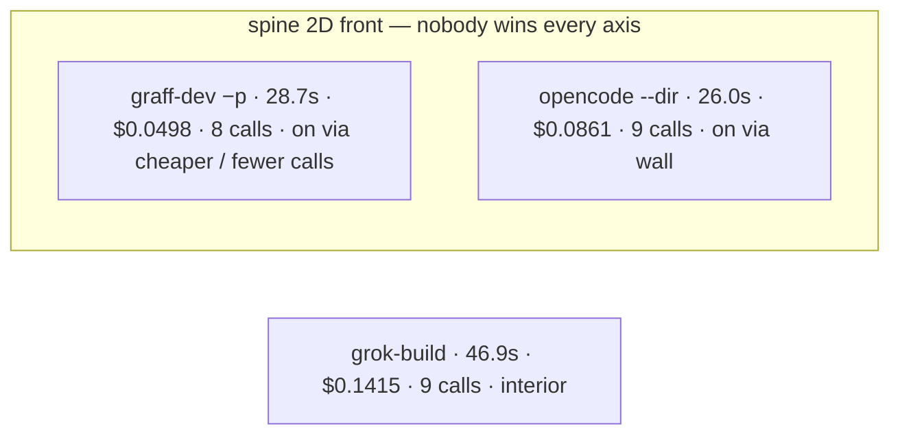
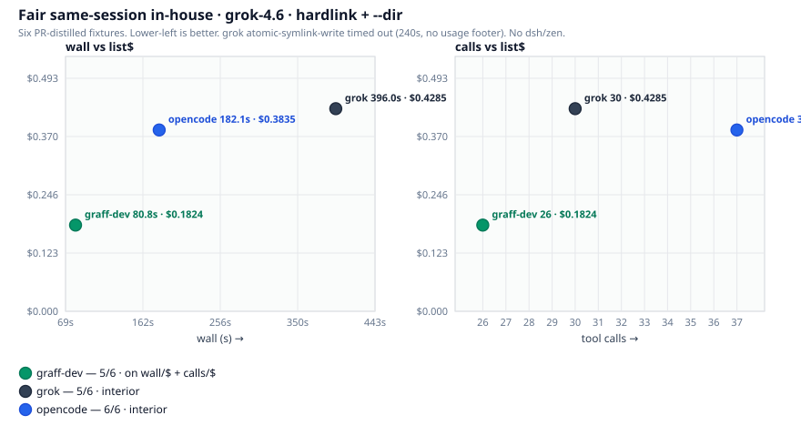
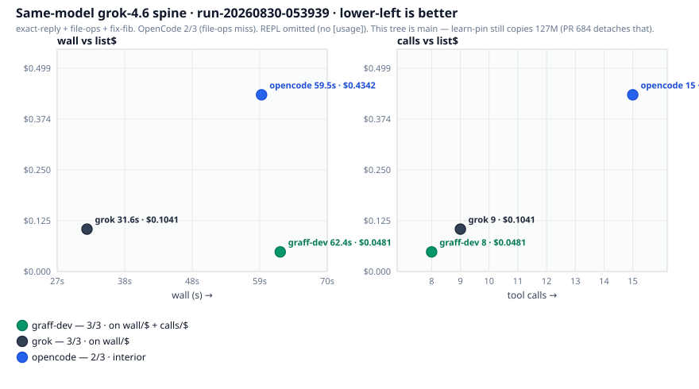
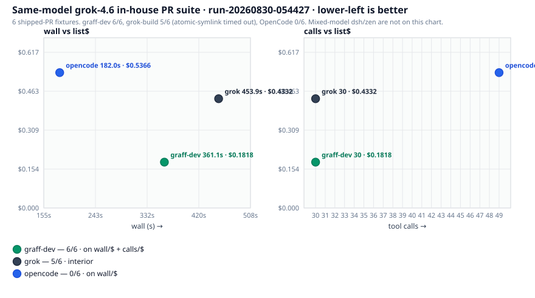
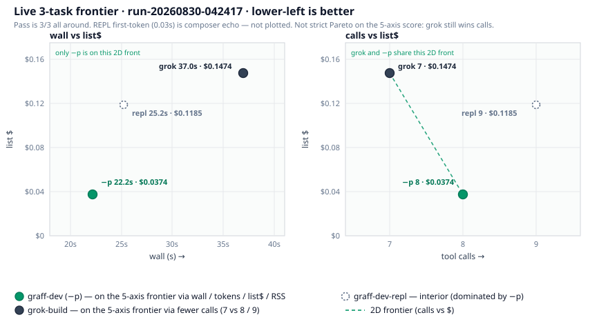
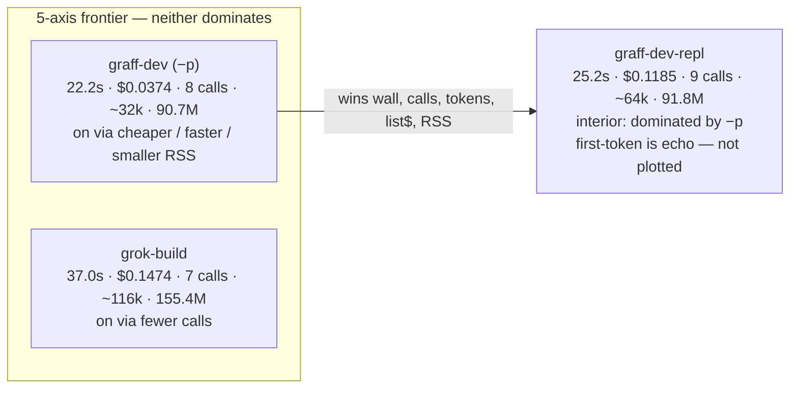

# grok-4.6 list-price baseline: graff vs grok-build

## Standing target — unique Pareto vs grok-build and OpenCode

Named axes: **pass, wall, first-token, calls, tokens, list$, RSS**.
Graff must be ≤ every named axis vs both rivals and strictly better on
at least one. Do not claim Pareto until a new same-session table says so.
Do not regress $, RSS, calls, or tokens to close wall / first-token / pass.

Pinned fair same-session A/B (`run-20260830-101150` spine,
`run-20260830-101332` in-house). SuperGrok grok-4.6, jobs=1, `x_search` on.

Spine (exact-reply + file-ops + fix-fib), all 3/3:

| harness | wall | first | calls | tokens | list$ | RSS |
|---|---:|---:|---:|---:|---:|---:|
| graff-dev | 28.7s | 2.9s | 8 | 32035 | $0.0498 | 101.2M |
| grok | 46.9s | 2.8s | 9 | 149144 | $0.1415 | 167.4M |
| opencode | **26.0s** | **2.6s** | 9 | 91258 | $0.0861 | 1055.2M |

In-house 6 PR fixtures:

| harness | pass | wall | first | calls | tokens | list$ | RSS |
|---|---:|---:|---:|---:|---:|---:|
| graff-dev | 5/6 | 80.8s | 2.4s | 26 | 118819 | $0.1824 | 101.2M |
| grok | 5/6 | 396s | 2.4s | 30 | 535344 | $0.4285 | 157.7M |
| opencode | **6/6** | 182.1s | 2.8s | 37 | 340074 | $0.3835 | 1103.9M |

Gaps to close:

1. Spine wall: 28.7s → **≤26.0s** (OpenCode). Almost all of it is
   exact-reply (6.14s vs 3.22s). Suspect: lean `-p` still handshakes
   imported/global MCP before the first token; oneshot `stream_quiet`
   plus chrome on `g_out` also shift first-stdout.
2. Spine first-token: 2.9s → **≤2.6s** (OpenCode). Grok 2.8s also beats
   us. Do not plot REPL 0.03s echo. Measure with `TUI/sim.zig` `Term`
   for pager work; eval first_out is first stdout **or** stderr line.
3. In-house pass: 5/6 → **6/6**. Miss was `atomic-symlink-write`: 3.53s
   / 1 call; captured answer was turn-pulse chrome `· turn still going ·`;
   tests still fail. Not auth. The model never edited `atomic_write.py`.

Already landed, do not undo: hardlink pin (inode shared, nlink≥2);
detached `learn init`; `-p` and REPL share one learn-auto path (no
oneshot-only skip). `x_search` stays on (ADR 0031). Do not steal grok
heap (~165M). Do not shrink to a 4-tool catalog (ADR 0024).

## Latest climb — `run-20260830-112125` spine (usage-fixed `-p`)

Same SuperGrok seat after the Responses SSE-end fix (`event: response.completed`
no longer drops the `data:` usage payload). **Not Pareto.**

| harness | pass | wall | first | calls | tokens | list$ | RSS |
|---|---:|---:|---:|---:|---:|---:|
| graff-dev | 3/3 | **28.5s** | 3.5s | 9 | 36822 | **$0.0612** | **101.7M** |
| grok | 3/3 | 33.4s | 4.1s | **7** | 116043 | $0.1246 | 156.4M |
| opencode | 3/3 | 30.4s | **2.6s** | 8 | 92176 | $0.1385 | 1057.6M |

This session graff wins wall / $ / RSS / tokens vs both. First-token loses
to OpenCode because file-ops is tool-first (6.55s ≈ wall 7.1s; exact-reply
2.21s and fix-fib 1.71s already beat 2.6s). Calls 9 vs grok 7 / OpenCode 8
is model extra-tool variance (file-ops 3 vs 2, fix-fib 5 vs 4), not a
catalog change. Residual (now on the branch, not in this JSONL): emit one `-p` stderr
progress line at first model SSE (including tool bytes) so first_out is
TTFT, not the late narration. Do not put that line on stdout.

## Latest climb — `run-20260830-112434` in-house (pre-nudge)

Same session as the spine table above. **Not Pareto.** `atomic-symlink-write`
is now a pass (65.7s / 5 calls / real edit). Two new one-shot misses:

| harness | pass | wall | first | calls | tokens | list$ | RSS |
|---|---:|---:|---:|---:|---:|---:|
| graff-dev | 4/6 | **125.9s** | 20.6s | **22** | 109524 | **$0.1704** | **101.6M** |
| grok | **6/6** | 279.4s | 3.2s | 34 | 619382 | $0.6000 | 157.8M |
| opencode | **6/6** | 180.3s | **2.6s** | 52 | 525073 | $0.8313 | 1147.6M |

Misses: `cache-gitroot` and `stall-warn` — 1 call each, answer was
"I'll read SPEC.md…", tests still fail. Same shape as the original
symlink miss. Product fix on the branch: one bounded named-file /
zero-tool nudge (`named_work.zig`), shared by `-p` and the REPL.

Also compared: OpenCode (`opencode run`) and DeepSeek Harness (`dsh`).
Same-model series is grok-4.6. Native-default series (`opencode-zen`,
`dsh-deepseek`) is a **different chart** — do not read those points as
grok-4.6 list price.

In-house suite (`--suite inhouse`): six bug shapes distilled from shipped
CodeGraff PRs (#685/#405 symlink write, oneshot stdout chrome,
cache-affinity git root, #681 stall widen, rlm-empty-tools catalog,
stall-bus-silent warn). Fixtures live under `graff-evals/tasks/` +
`fixtures/`; they are not the live repo.

Axes: wall, first-token latency, tool calls, tokens (uncached + cached + out),
xAI list-price USD (`$2/$0.50/$6` per 1M under 200k prompt tokens; `$4/$1/$12`
for the whole request at or above). SuperGrok's `[usage]` `$0.0000` is ignored.

Graff `[usage] in` includes cache reads. grok-build `input_tokens` does not —
ADR 0024's "185k in" column was uncached-only and undercounted grok-build.

## Fair same-session A/B (2026-08-30, hardlink + `--dir`)

Same SuperGrok seat, one session, grok-4.6, jobs=1, one rep, hosted
`x_search` on. SuperGrok OAuth was force-refreshed before the 27 runs
(`expires_at` can look fresh while xAI rejects). JSONL:
`run-20260830-101150.jsonl` (spine) and `run-20260830-101332.jsonl`
(in-house). Do not plot dsh/zen here.

| harness | model | ran? | note |
|---|---|---|---|
| graff-dev (`-p`, this tree) | grok-4.6 | yes | debug binary ~127M. Pin is a **hardlink** (inode 1480190, nlink=7, `same_inode=true`). No pin when calls < 5. |
| grok-build 1.0.5 | grok-4.6 | yes | — |
| opencode 1.18.25 | xai/grok-4.6 | yes | `opencode run --dir {sandbox}` |
| graff-dev-repl / dsh / zen | — | not this set | REPL first-token is echo; dsh/zen are mixed-model |

### Hardlink proof (this session only)

Six graff-dev sandboxes crossed the 5-call learn-auto threshold
(fix-fib, oneshot-chrome, cache-gitroot, stall-widen, empty-catalog,
stall-warn). Each left `.graff/learn-kit/graff-pinned` on **inode
1480190, nlink=7, same inode as `zig-out/bin/graff`**. No extra 127M
copy. exact-reply (1), file-ops (2), and atomic-symlink-write (1) have
no pin — under the threshold. Older leftover sandboxes from earlier
days still show nlink=1 copies; they are not this run.

### Spine — exact-reply + file-ops + fix-fib

| harness | pass | wall | first | calls | tokens | list$ | RSS |
|---|---:|---:|---:|---:|---:|---:|---:|
| graff-dev (`-p`) | **3/3** | 28.7s | 2.9s | **8** | **32,035** | **$0.0498** | **101.2M** |
| grok-build | **3/3** | 46.9s | 2.8s | 9 | 149,144 | $0.1415 | 167.4M |
| **opencode (`--dir`)** | **3/3** | **26.0s** | **2.6s** | 9 | 91,258 | $0.0861 | 1055.2M |

| task | graff wall / $ / calls | grok wall / $ / calls | opencode wall / $ / calls |
|---|---:|---:|---:|
| exact-reply | 6.14s / $0.0074 / 1 | **3.34s** / $0.0320 / 1 | **3.22s** / $0.0158 / 1 |
| file-ops | 7.94s / **$0.0106** / **2** | 9.79s / $0.0533 / 3 | **7.93s** / $0.0280 / **2** |
| fix-fib | **14.58s** / **$0.0317** / **5** | 33.74s / $0.0563 / 5 | 14.86s / $0.0424 / 6 |

**Not Pareto.** OpenCode wins wall and first-token. Graff wins calls /
tokens / list$ / RSS. Pass is a tie. Grok wins no named axis on this
spine.

### In-house PR suite — six fixtures

| harness | pass | wall | first | calls | tokens | list$ | RSS |
|---|---:|---:|---:|---:|---:|---:|---:|
| graff-dev | 5/6 | **80.8s** | **2.4s** | **26** | **118,819** | **$0.1824** | **101.2M** |
| grok-build | 5/6 | 396.0s | **2.4s** | 30 | 535,344 | $0.4285 | 157.7M |
| **opencode (`--dir`)** | **6/6** | 182.1s | 2.8s | 37 | 340,074 | $0.3835 | 1103.9M |

graff-dev missed `atomic-symlink-write` (1 call, 3.53s; captured answer
was turn-pulse chrome `· turn still going ·`, tests still fail). grok
hit the 240s budget on the same task with pipes still open — a real
timeout, no usage footer, so that row's list$ is $0 and **undercounts**
grok spend. OpenCode solved it in 107.6s / 6 calls.

**Not Pareto.** OpenCode wins pass. Graff wins wall / calls / tokens /
list$ / RSS. First-token is a graff/grok tie (2.4s).

## Prior spine — copy-tax graff + first OpenCode wiring (`run-20260830-053939.jsonl`)

Not a fair same-session A/B. graff-dev still **byte-copied** 132MB
`graff-pinned` (nlink=1). OpenCode first wiring lacked `--dir`; the
`--dir` row is a later rerun only.

| harness | pass | wall | first | calls | tokens | list$ | RSS |
|---|---:|---:|---:|---:|---:|---:|---:|
| graff-dev (`-p`, copy-tax) | **3/3** | 62.4s | 3.1s | **8** | ~32k | **$0.0481** | **91.2M** |
| grok-build | **3/3** | **31.6s** | 3.2s | 9 | ~149k | $0.1041 | 167.9M |
| opencode (bad `--dir`) | 2/3 | 59.5s | **2.9s** | 15 | ~267k | $0.4342 | 584.6M |
| opencode (`--dir` only, `run-20260830-095006`) | **3/3** | **29.3s** | **2.8s** | 10 | ~62k | $0.1397 | 1025.7M |

The first OpenCode row is **our harness**, not OpenCode. `opencode run`
binds a project root; Popen cwd was not enough. After `--dir {sandbox}`
+ a 1.5s flush then process-group reap: **3/3**.

## Prior in-house — copy-tax graff + first OpenCode wiring (`run-20260830-054427.jsonl`)

graff-dev 5-call tasks each paid the 132MB pin (~38s CPU). OpenCode
`--dir` is a later rerun.

| harness | pass | wall | first | calls | list$ | RSS |
|---|---:|---:|---:|---:|---:|---:|
| graff-dev (copy-tax) | **6/6** | 361.1s | **2.2s** | **30** | **$0.1818** | **91.3M** |
| grok-build | 5/6 | 453.9s | 3.2s | 30 | $0.4332 | 157.5M |
| opencode (bad `--dir`) | 0/6 | 182.0s | 3.5s | 49 | $0.5366 | 1086.7M |
| opencode (`--dir` only, `run-20260830-095035`) | **6/6** | **151.9s** | 2.7s | 38 | $0.3961 | 1077.9M |

## Mixed-model spine (`run-20260830-054332.jsonl`) — not the grok-4.6 chart

| harness | model | pass | wall | note |
|---|---|---:|---:|---|
| dsh-xai | grok-4.5 | 3/3 | 20.3s | no usage footer; $ unknown; **not grok-4.6** |
| opencode-zen | big-pickle | 1/3 | 34.5s | harness-reported tokens; not xAI list$ |

## We are not strict Pareto vs grok-build or OpenCode

On the fair same-session spine, OpenCode wins wall and first-token;
graff-dev wins calls / tokens / list$ / RSS. On the fair in-house set,
OpenCode wins pass; graff-dev wins wall / calls / tokens / list$ / RSS.
Do not claim a strict axis win. The
[fair spine graph](#spine--exact-reply--file-ops--fix-fib) is the
honest picture from this run.

On the earlier #684 post-fix 3-task set grok still won **calls**. We
won wall, tokens, list$, and RSS. Pass was a tie.

## Live 2026-08-30 hardlink pin, `-p` + scripted REPL (`run-20260830-042417.jsonl`)

Same SuperGrok / grok OAuth, grok-4.6, one rep, three core tasks.
**x_search stays on.** `-p` (`graff-dev`) and piped `graff repl`
(`graff-dev-repl`) share one learn-auto path. Pin is a hardlink
(same inode; copy only if hardlink fails). Session-end `learn init`
is detached (ADR 0045) so teardown does not wait ~38s on suite gen.

REPL is fatter than `-p` because it is not lean-oneshot (more tokens,
one extra call on this set). REPL `first_out_s` is echo (0.03s) —
ignore it; it is not time-to-first-model-token.

This run's fix-fib used 4 API calls, so learn-auto did **not** fire
(threshold is 5). No pin in those sandboxes. The hardlink was proven
separately: `graff learn init` in `/tmp/graff-pin-proof` left pin and
`zig-out/bin/graff` on **inode 1478920, nlink=2**; init wall was
**37.7s**, almost all CPU on suite generation.

| harness | pass | wall | first | calls | tokens | list$ | RSS |
|---|---:|---:|---:|---:|---:|---:|---:|
| **graff-dev (`-p`)** | 3/3 | **22.2s** | **2.8s** | 8 | **~32k** | **$0.0374** | **90.7M** |
| grok-build | 3/3 | 37.0s | 3.9s | **7** | ~116k | $0.1474 | 155.4M |
| graff-dev-repl | 3/3 | 25.2s | 0.03s (echo) | 9 | ~64k | $0.1185 | 91.8M |

| task | graff `-p` wall / $ / calls | grok wall / $ / calls |
|---|---:|---:|
| exact-reply | **2.55s / $0.0067 / 1** | 2.68s / $0.0322 / 1 |
| fix-fib | **10.63s / $0.0170 / 4** | 26.90s / $0.0708 / 4 |
| file-ops | 8.99s / $0.0137 / 3 | **7.39s** / $0.0444 / **2** |

**Not Pareto:** grok-build still has fewer calls (7 vs 8 on `-p`, 7 vs 9
on repl) and won file-ops wall. We win the other named axes on this
set. Heap still theirs (155M vs 91M) — not stolen.

Interactive TUI (`graff tui --yolo --model grok-4.6`, PTY, Ctrl+Q) of
the same fix-fib prompt: test printed OK at **5.9s**, turn loop 7.4s,
session wall 9.3s including boot/quit. `.graff` was **52K**. No
`graff-pinned`, no extra 127M inode. Four API-call traces (we quit
during the fourth after the test already passed), so learn-auto did
not fire — same threshold miss as the `-p` row. First model token
2.6s. In the 11–15s band (under it).

`x-search-off` dropped: not what grok-build does.

## Frontier graph (live 3-task, two 2D projections)

The 5-axis score is wall / first-token / calls / tokens / list$ (ADR 0044).
Pass is a tie. RSS is extra. REPL `first_out_s` is composer echo — it is
not an axis and is not plotted.

Neither harness dominates the other on all five: **grok-build is on the
frontier via fewer calls**; **graff-dev (`-p`) is on it via cheaper /
faster / fewer tokens / smaller RSS**. `graff-dev-repl` is interior —
`-p` beats it on wall, calls, tokens, list$, and RSS.

Numbers on the figure are the live JSONL sums (`run-20260830-042417.jsonl`).
Lower-left is better on both panels.

| point | 5-axis | wall vs $ | calls vs $ |
|---|---|---|---|
| **graff-dev (`-p`)** | on (cheaper / faster) | **on** (best both) | **on** (cheaper) |
| grok-build | on (fewer calls) | interior | **on** (fewer calls) |
| graff-dev-repl | interior | interior | interior |

Left panel (wall vs $): only `-p` is non-dominated. Right panel (calls vs
$): the dashed segment is the 2D front between grok (7 calls) and `-p`
($0.0374). REPL sits above and to the right of `-p` on both projections.

## Earlier same-day after oneshot-skip (`run-20260830-035954.jsonl`) — superseded

Same SuperGrok / grok OAuth, grok-4.6, one rep, three core tasks.
**x_search stays on** (grok-build 1.0.5 still lists `web_search` / `web_fetch`).
The steal was: `-p` no longer pins `zig-out/bin/graff` into
`.graff/learn-kit/graff-pinned` (that was 127M + 38s CPU on fix-fib).

| harness | pass | wall | first | calls | tokens | list$ | RSS |
|---|---:|---:|---:|---:|---:|---:|---:|
| **graff-dev** | 3/3 | **21.8s** | 1.9s | 8 | **32,583** | **$0.0479** | **90.8M** |
| grok-build | 3/3 | 27.3s | 1.9s | **7** | 116,283 | $0.1424 | 154.3M |

| task | graff wall / $ / calls | grok wall / $ / calls |
|---|---:|---:|
| exact-reply | **2.18s / $0.0074 / 1** | 2.30s / $0.0149 / 1 |
| file-ops | **4.75s / $0.0143 / 2** | 7.94s / $0.0492 / 2 |
| fix-fib | **14.82s / $0.0263 / 5** | 17.09s / $0.0783 / 4 |

fix-fib sandbox is 76K (no learn-kit). Earlier the same task was 127M / 47s
because learn-auto copied the debug binary after the 5th API call.

**Yes, we are cheaper** at grok-4.6 list price: $0.048 vs $0.142 on this set
(~3×). Tokens 33k vs 116k. Wall now ours too. grok still has one fewer call
and a slightly faster first token on fix-fib (1.44s vs 1.86s). Heap still
theirs (154M vs 91M) — not stolen.

`x-search-off` dropped: not what grok-build does.

Earlier same-day file `run-20260830-034621.jsonl` is the pre-fix A/B
(x_search on vs off vs grok) and is superseded for wall.

## Historical rescore (same-day paired JSONL)

### SWE, 2026-08-25 (`run-20260825-061731.jsonl`) — the ADR 0024 grok-inclusive file

| harness | pass | wall | first | calls | tokens | uncached | cached | out | list$ | RSS |
|---|---:|---:|---:|---:|---:|---:|---:|---:|---:|---:|
| graff-dev | 4/6 | 742.7s | 4.9s | 96 | 1,307,858 | 250,788 | 1,008,640 | 48,430 | $1.9527 | 9.1M |
| grok-build | **5/6** | **500.2s** | **3.4s** | **39** | **1,062,104** | 184,880 | 845,184 | 32,040 | **$1.4561** | 164.6M |

Grok-build wins every named axis except RSS (18×). The old "185k vs 1.3M in"
headline was an accounting mismatch; honest totals are 1.06M vs 1.31M.

### After prompt/subagent cuts — 2026-08-28

Shared tasks only. `cookie-store` on graff-dev that day has no `[usage]` line
(fail / empty tally) so its list$ is $0 and understates graff spend.

**core** (`run-20260828-021606.jsonl`, 11 tasks)

| harness | pass | wall | first | calls | tokens | list$ | RSS |
|---|---:|---:|---:|---:|---:|---:|---:|
| graff-dev | 11/11 | **89.4s** | **1.9s** | 38 | **147,831** | **$0.1812** | **9.1M** |
| grok-build | 11/11 | 140.9s | 2.9s | **33** | 536,768 | $0.4591 | 155.7M |

**rlm** (`run-20260828-021008.jsonl`, 5 tasks)

| harness | pass | wall | first | calls | tokens | list$ | RSS |
|---|---:|---:|---:|---:|---:|---:|---:|
| graff-dev | 5/5 | **45.6s** | **3.6s** | **18** | **71,991** | **$0.0908** | **8.6M** |
| grok-build | 5/5 | 119.8s | 4.5s | 22 | 445,201 | $0.5042 | 159.5M |

**swe** (`run-20260828-020830.jsonl`, 6 tasks)

| harness | pass | wall | first | calls | tokens | list$ | RSS |
|---|---:|---:|---:|---:|---:|---:|---:|
| graff-dev | 4/6 | **224.9s** | **1.8s** | **25** | **135,455** | **$0.2209** | 62.9M |
| grok-build | **5/6** | 330.2s | 2.7s | 27 | 533,397 | $0.5576 | 156.1M |

## What the hillclimb is allowed to chase

On 2026-08-25 SWE, grok-build still wins pass / wall / latency / calls / USD.
On the fair 2026-08-30 3-harness spine, OpenCode wins wall / first-token
and graff-dev wins calls / tokens / list$ / RSS — **not Pareto**.
On 2026-08-28 we still lose a SWE pass
(`cookie-store` / historically `json-stream` / `label-sort`).
Do not steal the 165M heap or a 4-tool catalog to close the remaining gap
(ADR 0024). `x-search-off` was dropped (not what grok-build does).
Kept: hardlink pin + detached session-end `learn init` (ADR 0044 / 0045).
