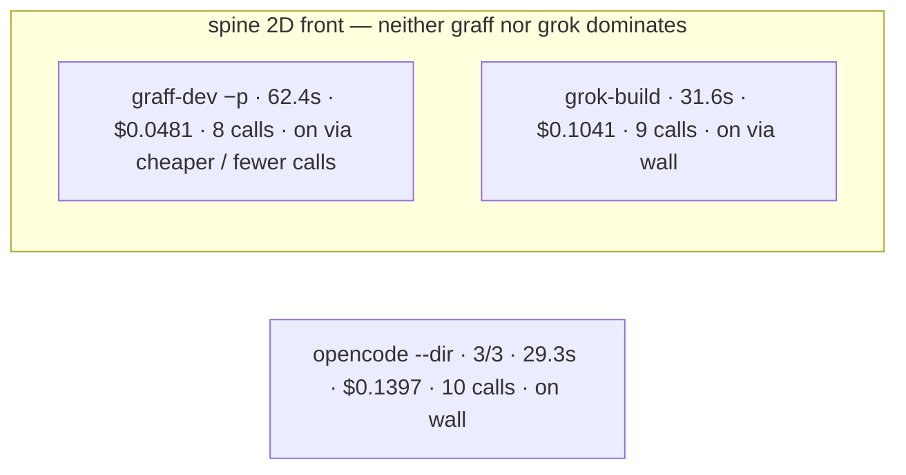
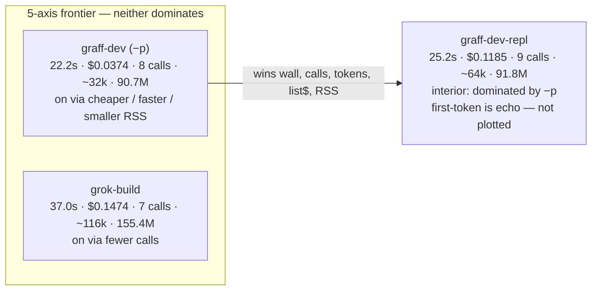

# grok-4.6 list-price baseline: graff vs grok-build

Also compared: OpenCode (`opencode run`) and DeepSeek Harness (`dsh`).
Same-model series is grok-4.6. Native-default series (`opencode-zen`,
`dsh-deepseek`) is a **different chart** — do not read those points as
grok-4.6 list price.

In-house suite (`--suite inhouse`): six bug shapes distilled from shipped
CodeGraff PRs (#685/#405 symlink write, oneshot stdout chrome,
cache-affinity git root, #681 stall widen, rlm-empty-tools catalog,
stall-bus-silent warn). Fixtures live under `graff-evals/tasks/` +
`fixtures/`; they are not the live repo.

Axes: wall, first-token latency, tool calls, tokens (uncached + cached + out),
xAI list-price USD (`$2/$0.50/$6` per 1M under 200k prompt tokens; `$4/$1/$12`
for the whole request at or above). SuperGrok's `[usage]` `$0.0000` is ignored.

Graff `[usage] in` includes cache reads. grok-build `input_tokens` does not —
ADR 0024's "185k in" column was uncached-only and undercounted grok-build.

## Who actually ran (2026-08-30 eval-frontier)

| harness | model | ran? | blocker |
|---|---|---|---|
| graff-dev (`-p`) | grok-4.6 | yes | this tree is `main` — learn-auto still **byte-copies** `graff-pinned` (132MB, nlink=1). PR #684 detaches that. |
| grok-build 1.0.5 | grok-4.6 | yes | — |
| opencode 1.18.25 | xai/grok-4.6 | yes | SuperGrok access token as OpenCode `xai` api auth |
| graff-dev-repl | grok-4.6 | yes | **no `[usage]` footer** this run — do not plot $0 / first-token echo |
| dsh-xai | **grok-4.5** | yes | mixed-model. Catalog has no grok-4.6. No usage footer. Node must be ≥22.15 (zstd). |
| dsh-grok | grok-4.6 | **no** | `UNKNOWN_MODEL: pi-ai provider "xai" has no configured model "grok-4.6"` |
| dsh-deepseek | deepseek-v4-flash | **no** | no `DEEPSEEK_API_KEY` in this environment |
| opencode-zen | opencode/big-pickle | yes | mixed-model / 1/3 spine. list$ is not xAI list price |

Do not read dsh-xai or opencode-zen as grok-4.6 list-price points.

## Live spine — same-model grok-4.6 (`run-20260830-053939.jsonl`)

exact-reply + file-ops + fix-fib. x_search on. One rep, jobs=1.

| harness | pass | wall | first | calls | tokens | list$ | RSS |
|---|---:|---:|---:|---:|---:|---:|---:|
| graff-dev (`-p`) | **3/3** | 62.4s | 3.1s | **8** | ~32k | **$0.0481** | **91.2M** |
| grok-build | **3/3** | **31.6s** | 3.2s | 9 | ~149k | $0.1041 | 167.9M |
| opencode (first wiring) | 2/3 | 59.5s | **2.9s** | 15 | ~267k | $0.4342 | 584.6M |
| **opencode (`--dir` rerun, `run-20260830-095006`)** | **3/3** | **29.3s** | **2.8s** | 10 | ~62k | $0.1397 | 1025.7M |

The first OpenCode row is **our harness**, not OpenCode. `opencode run` binds a project root; Popen cwd was not enough, so file-ops wrote nowhere the check could see, and we SIGKILL'd a leftover JSON server (false `timed_out`). After `--dir {sandbox}` + a 1.5s flush then process-group reap: **3/3**. graff-dev fix-fib on this tree still pays the 132MB pin copy (#684 removes that; post-fix spine was 22.2s / $0.0374).

**Not Pareto.** OpenCode now wins spine wall. Graff wins calls / tokens / list$ / RSS. Grok is in the middle on wall and $. Pass is a tie.

## Live in-house PR suite — same-model grok-4.6 (`run-20260830-054427.jsonl`)

Six fixtures distilled from shipped PRs. Same SuperGrok seat. graff-dev 5-call tasks each paid the 132MB pin (~38s CPU).

| harness | pass | wall | first | calls | list$ | RSS |
|---|---:|---:|---:|---:|---:|---:|
| **graff-dev** | **6/6** | 361.1s | **2.2s** | **30** | **$0.1818** | **91.3M** |
| grok-build | 5/6 | 453.9s | 3.2s | 30 | $0.4332 | 157.5M |
| opencode (first wiring) | 0/6 | 182.0s | 3.5s | 49 | $0.5366 | 1086.7M |
| **opencode (`--dir` rerun, `run-20260830-095035`)** | **6/6** | **151.9s** | 2.7s | 38 | $0.3961 | 1077.9M |

grok-build timed out on `atomic-symlink-write` (240s). The first OpenCode 0/6 was the same cwd miss: it printed `OK` while edits landed outside the sandbox. After `--dir`: **6/6**.

On this suite OpenCode wins wall; graff-dev wins $ / calls / RSS and matches pass. Grok is 5/6.

## Mixed-model spine (`run-20260830-054332.jsonl`) — not the grok-4.6 chart

| harness | model | pass | wall | note |
|---|---|---:|---:|---|
| dsh-xai | grok-4.5 | 3/3 | 20.3s | no usage footer; $ unknown; **not grok-4.6** |
| opencode-zen | big-pickle | 1/3 | 34.5s | harness-reported tokens; not xAI list$ |

## We are not strict Pareto vs grok-build

On the #684 post-fix 3-task set they still win **calls**. We win wall, tokens,
list$, and RSS. Pass is a tie. Do not claim a strict 5-axis win. The
[frontier graph](#frontier-graph-live-3-task-two-2d-projections) is the
honest picture from that run: grok sits on it via fewer calls; graff-dev (`-p`) sits
on it via cheaper / faster. On **this** branch (`main` + evals, pin still a copy)
grok-build also wins spine wall.

## Live 2026-08-30 hardlink pin, `-p` + scripted REPL (`run-20260830-042417.jsonl`)

Same SuperGrok / grok OAuth, grok-4.6, one rep, three core tasks.
**x_search stays on.** `-p` (`graff-dev`) and piped `graff repl`
(`graff-dev-repl`) share one learn-auto path. Pin is a hardlink
(same inode; copy only if hardlink fails). Session-end `learn init`
is detached (ADR 0045) so teardown does not wait ~38s on suite gen.

REPL is fatter than `-p` because it is not lean-oneshot (more tokens,
one extra call on this set). REPL `first_out_s` is echo (0.03s) —
ignore it; it is not time-to-first-model-token.

This run's fix-fib used 4 API calls, so learn-auto did **not** fire
(threshold is 5). No pin in those sandboxes. The hardlink was proven
separately: `graff learn init` in `/tmp/graff-pin-proof` left pin and
`zig-out/bin/graff` on **inode 1478920, nlink=2**; init wall was
**37.7s**, almost all CPU on suite generation.

| harness | pass | wall | first | calls | tokens | list$ | RSS |
|---|---:|---:|---:|---:|---:|---:|---:|
| **graff-dev (`-p`)** | 3/3 | **22.2s** | **2.8s** | 8 | **~32k** | **$0.0374** | **90.7M** |
| grok-build | 3/3 | 37.0s | 3.9s | **7** | ~116k | $0.1474 | 155.4M |
| graff-dev-repl | 3/3 | 25.2s | 0.03s (echo) | 9 | ~64k | $0.1185 | 91.8M |

| task | graff `-p` wall / $ / calls | grok wall / $ / calls |
|---|---:|---:|
| exact-reply | **2.55s / $0.0067 / 1** | 2.68s / $0.0322 / 1 |
| fix-fib | **10.63s / $0.0170 / 4** | 26.90s / $0.0708 / 4 |
| file-ops | 8.99s / $0.0137 / 3 | **7.39s** / $0.0444 / **2** |

**Not Pareto:** grok-build still has fewer calls (7 vs 8 on `-p`, 7 vs 9
on repl) and won file-ops wall. We win the other named axes on this
set. Heap still theirs (155M vs 91M) — not stolen.

Interactive TUI (`graff tui --yolo --model grok-4.6`, PTY, Ctrl+Q) of
the same fix-fib prompt: test printed OK at **5.9s**, turn loop 7.4s,
session wall 9.3s including boot/quit. `.graff` was **52K**. No
`graff-pinned`, no extra 127M inode. Four API-call traces (we quit
during the fourth after the test already passed), so learn-auto did
not fire — same threshold miss as the `-p` row. First model token
2.6s. In the 11–15s band (under it).

`x-search-off` dropped: not what grok-build does.

## Frontier graph (live 3-task, two 2D projections)

The 5-axis score is wall / first-token / calls / tokens / list$ (ADR 0044).
Pass is a tie. RSS is extra. REPL `first_out_s` is composer echo — it is
not an axis and is not plotted.

Neither harness dominates the other on all five: **grok-build is on the
frontier via fewer calls**; **graff-dev (`-p`) is on it via cheaper /
faster / fewer tokens / smaller RSS**. `graff-dev-repl` is interior —
`-p` beats it on wall, calls, tokens, list$, and RSS.

Numbers on the figure are the live JSONL sums (`run-20260830-042417.jsonl`).
Lower-left is better on both panels.

| point | 5-axis | wall vs $ | calls vs $ |
|---|---|---|---|
| **graff-dev (`-p`)** | on (cheaper / faster) | **on** (best both) | **on** (cheaper) |
| grok-build | on (fewer calls) | interior | **on** (fewer calls) |
| graff-dev-repl | interior | interior | interior |

Left panel (wall vs $): only `-p` is non-dominated. Right panel (calls vs
$): the dashed segment is the 2D front between grok (7 calls) and `-p`
($0.0374). REPL sits above and to the right of `-p` on both projections.

## Earlier same-day after oneshot-skip (`run-20260830-035954.jsonl`) — superseded

Same SuperGrok / grok OAuth, grok-4.6, one rep, three core tasks.
**x_search stays on** (grok-build 1.0.5 still lists `web_search` / `web_fetch`).
The steal was: `-p` no longer pins `zig-out/bin/graff` into
`.graff/learn-kit/graff-pinned` (that was 127M + 38s CPU on fix-fib).

| harness | pass | wall | first | calls | tokens | list$ | RSS |
|---|---:|---:|---:|---:|---:|---:|---:|
| **graff-dev** | 3/3 | **21.8s** | 1.9s | 8 | **32,583** | **$0.0479** | **90.8M** |
| grok-build | 3/3 | 27.3s | 1.9s | **7** | 116,283 | $0.1424 | 154.3M |

| task | graff wall / $ / calls | grok wall / $ / calls |
|---|---:|---:|
| exact-reply | **2.18s / $0.0074 / 1** | 2.30s / $0.0149 / 1 |
| file-ops | **4.75s / $0.0143 / 2** | 7.94s / $0.0492 / 2 |
| fix-fib | **14.82s / $0.0263 / 5** | 17.09s / $0.0783 / 4 |

fix-fib sandbox is 76K (no learn-kit). Earlier the same task was 127M / 47s
because learn-auto copied the debug binary after the 5th API call.

**Yes, we are cheaper** at grok-4.6 list price: $0.048 vs $0.142 on this set
(~3×). Tokens 33k vs 116k. Wall now ours too. grok still has one fewer call
and a slightly faster first token on fix-fib (1.44s vs 1.86s). Heap still
theirs (154M vs 91M) — not stolen.

`x-search-off` dropped: not what grok-build does.

Earlier same-day file `run-20260830-034621.jsonl` is the pre-fix A/B
(x_search on vs off vs grok) and is superseded for wall.

## Historical rescore (same-day paired JSONL)

### SWE, 2026-08-25 (`run-20260825-061731.jsonl`) — the ADR 0024 grok-inclusive file

| harness | pass | wall | first | calls | tokens | uncached | cached | out | list$ | RSS |
|---|---:|---:|---:|---:|---:|---:|---:|---:|---:|---:|
| graff-dev | 4/6 | 742.7s | 4.9s | 96 | 1,307,858 | 250,788 | 1,008,640 | 48,430 | $1.9527 | 9.1M |
| grok-build | **5/6** | **500.2s** | **3.4s** | **39** | **1,062,104** | 184,880 | 845,184 | 32,040 | **$1.4561** | 164.6M |

Grok-build wins every named axis except RSS (18×). The old "185k vs 1.3M in"
headline was an accounting mismatch; honest totals are 1.06M vs 1.31M.

### After prompt/subagent cuts — 2026-08-28

Shared tasks only. `cookie-store` on graff-dev that day has no `[usage]` line
(fail / empty tally) so its list$ is $0 and understates graff spend.

**core** (`run-20260828-021606.jsonl`, 11 tasks)

| harness | pass | wall | first | calls | tokens | list$ | RSS |
|---|---:|---:|---:|---:|---:|---:|---:|
| graff-dev | 11/11 | **89.4s** | **1.9s** | 38 | **147,831** | **$0.1812** | **9.1M** |
| grok-build | 11/11 | 140.9s | 2.9s | **33** | 536,768 | $0.4591 | 155.7M |

**rlm** (`run-20260828-021008.jsonl`, 5 tasks)

| harness | pass | wall | first | calls | tokens | list$ | RSS |
|---|---:|---:|---:|---:|---:|---:|---:|
| graff-dev | 5/5 | **45.6s** | **3.6s** | **18** | **71,991** | **$0.0908** | **8.6M** |
| grok-build | 5/5 | 119.8s | 4.5s | 22 | 445,201 | $0.5042 | 159.5M |

**swe** (`run-20260828-020830.jsonl`, 6 tasks)

| harness | pass | wall | first | calls | tokens | list$ | RSS |
|---|---:|---:|---:|---:|---:|---:|---:|
| graff-dev | 4/6 | **224.9s** | **1.8s** | **25** | **135,455** | **$0.2209** | 62.9M |
| grok-build | **5/6** | 330.2s | 2.7s | 27 | 533,397 | $0.5576 | 156.1M |

## What the hillclimb is allowed to chase

On 2026-08-25 SWE, grok-build still wins pass / wall / latency / calls / USD.
On the live 2026-08-30 3-task set we win wall / tokens / list$ / RSS and
lose calls — **not Pareto**. On 2026-08-28 we still lose a SWE pass
(`cookie-store` / historically `json-stream` / `label-sort`).
Do not steal the 165M heap or a 4-tool catalog to close the remaining gap
(ADR 0024). `x-search-off` was dropped (not what grok-build does).
Kept: hardlink pin + detached session-end `learn init` (ADR 0044 / 0045).
