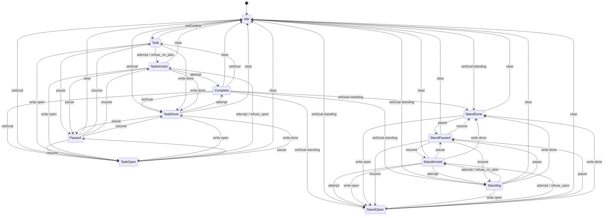

# Kernel: goal / completion

Source of truth: `lean-proofs/Graff/GoalLoop.lean`.

Process kernel, not a cube and not a Turing machine: finite `Event` / `step`,
no tape, no halt state. The 360-cell cube is the snapshot of that machine.
GoalLoop is the worked example. Standing has no retire edge. Harness-done
is unreachable without a `write allCompleted`. World-done is not an event.

The diagram is the root-seat projection of the live Python `step`
(same function `check_properties` walks). Emit it with
`python3 spec/conformance.py --diagram goal_loop`. `--export` rewrites
the fence below from that function; do not hand-edit the arrows.

