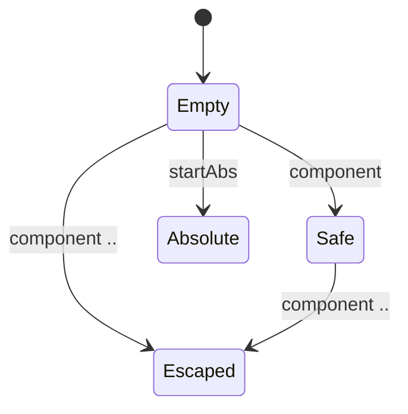

# Kernel: path confine / lease

Source of truth: `lean-proofs/Graff/PathConfine.lean`.

Process kernel, not a Turing machine: finite `Event` / `step`, no tape.
A file-tool path is a walk over components. Empty / Safe / Escaped /
Absolute. Escaped and Absolute absorb — a subagent does not recover a
jail break by taking another component. The 16 lexical paths + 80 lease
cells are the snapshot. `--yolo` does not free a sub. Fleet topology is
not a Shape cell; Shape stays the observation ladder of one turn.

The diagram is the projection of the live Python `step`. Emit it with
`python3 spec/conformance.py --diagram path_confine`.

