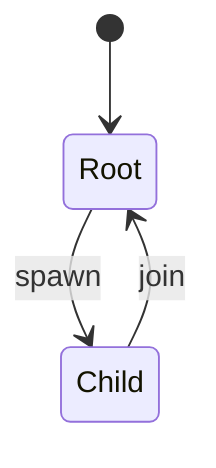

# Kernel: prompt cache / spawn

Source of truth: `lean-proofs/Graff/PromptCache.lean`.

Process kernel, not a cube-only table and not a Turing machine: finite
`Event` / `step`, no tape. Seat is who may spawn. Label is the cache
predicate (`main` is the only sticky root partition). Isolation does
not mint a key. Sub never spawns. Join restores the root partition.

The diagram is the projection of the live Python `step` (same function
`check_properties` walks). Emit it with
`python3 spec/conformance.py --diagram prompt_cache`. The maximizing
walk (sticky key + join restores) is
`python3 spec/conformance.py --showcase prompt_cache`.

