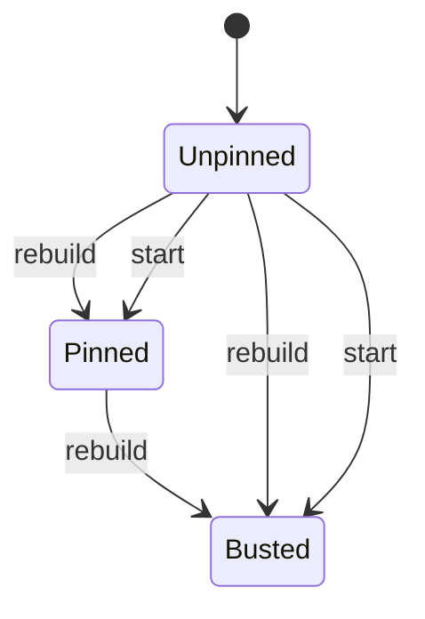

# Kernel: prompt prefix (cache HIT)

Source of truth: `lean-proofs/Graff/PromptPrefix.lean`.

Process kernel next to PromptCache. PromptCache is the key and the
spawn gate. This kernel is the bytes under that key: names + triggers
only, pinned once. Bodies and `file:` paths are illegal in the prefix.
`skill` load / list / rescan / turn do not rewrite it. A mid-session
rebuild that changes the catalog busts the prefix (Codex: the old
prompt must be an exact prefix of the new one).

Wording is out of Lean. The 6-cell cube is catalog kind × pin policy;
exactly one cell is cacheable (`names_only` × `once`).

