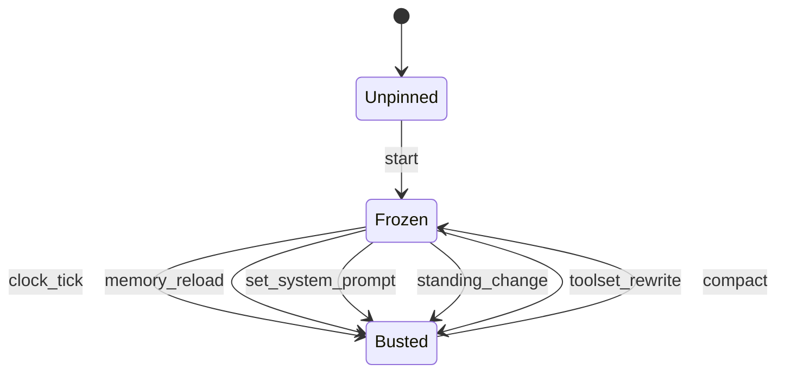

# Kernel: prompt stable (OpenGauss must-nots)

Source of truth: `lean-proofs/Graff/PromptStable.lean`.

Process kernel next to PromptCache / PromptPrefix. PromptCache is
the key. PromptPrefix is the catalog bytes. This kernel is what
may touch the prefix after pin — OpenGauss's "Prompt Caching Must
Not Break": no past-context rewrite, no toolset rewrite, no memory
reload or system-prompt rebuild mid-session. Compression is the
allowed rewrite. Skills and folded schemas land in history.

graff keeps two explicit busts (`set_system_prompt`, `/goal` line)
and one append-only tools tail (#476). Mid-array rewrite is still
illegal. Anthropic `cache_control` placement is out of Lean.

20 cells (event × land). Exactly 5 keep. Showcase with
`python3 spec/conformance.py --showcase`.

