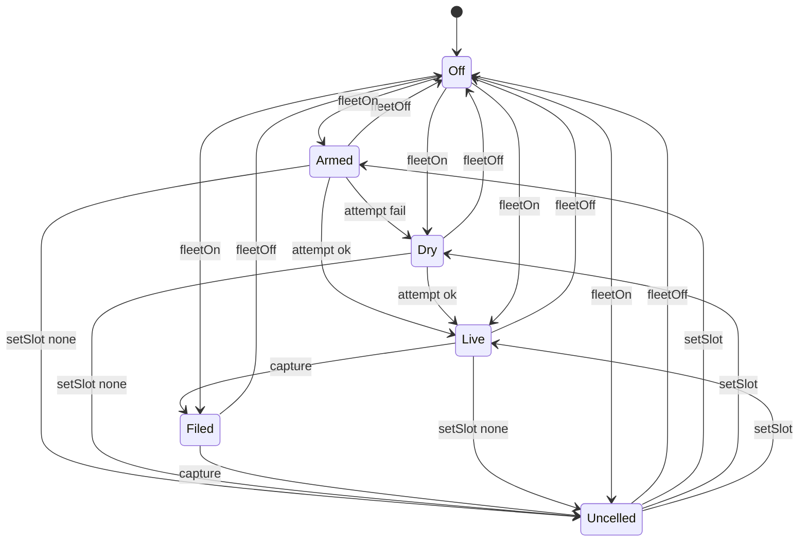

# Kernel: score maintenance

Source of truth: `lean-proofs/Graff/Score.lean`.

Process kernel, not a Turing machine: finite `Event` / `step`, no tape.
The honest unit is the STAGE, never the item. N children do not mint N
rows. `attempt` never files; `capture` (the post-join gate) files only
when fleet is on, the slot is canonical, and `stageScore` is some.
Unreached / all-fail / overflow stay silent — a 0 would poison the mean.
The 1210-cell cube (240 filed) is the snapshot. Shape stays the
observation ladder of one turn.

The diagram is the projection of the live Python `step`. Emit it with
`python3 spec/conformance.py --diagram score`.

