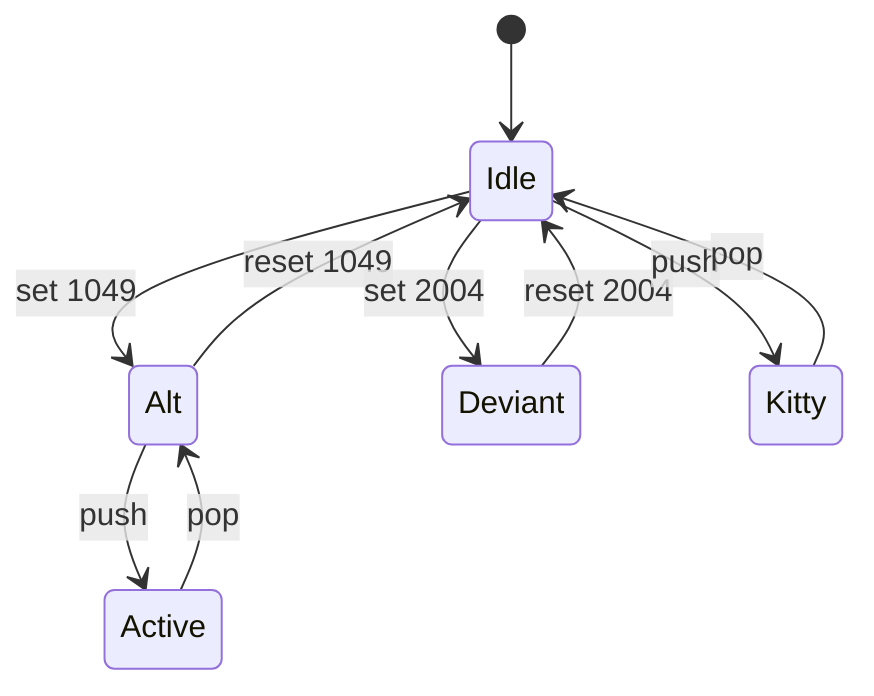

# Kernel: terminal modes

Source of truth: `lean-proofs/Graff/TerminalModes.lean`.

Process kernel, not a Turing machine: `Op` / `step` is the mode map
plus kitty depth. The 14 named sequences are the snapshot. Enable then
restore returns to Idle; restore leaves the alt-screen last; pop floors
at zero. TUI layout, glyphs, and the font stay never.

The diagram is the projection of the live Python `step`. Emit it with
`python3 spec/conformance.py --diagram terminal_modes`.

