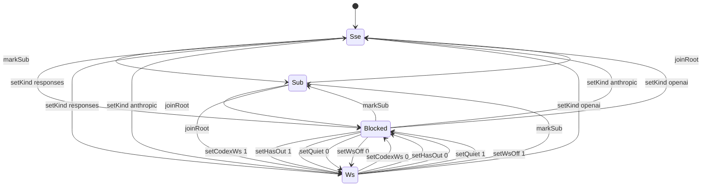

# Kernel: transport

Source of truth: `lean-proofs/Graff/Transport.lean`.

Process kernel, not a Turing machine: finite `Event` / `step`, no tape.
The 96-cell cube is the snapshot. A sub never takes WS; only one cell is
WS (a live root Responses turn). PromptCache isolates the child key; this
kernel is the pipe that child is forbidden from opening. Shape stays a
cube of one observation — fleet topology is not a Shape cell.

The diagram is the projection of the live Python `step`. Emit it with
`python3 spec/conformance.py --diagram transport`.

